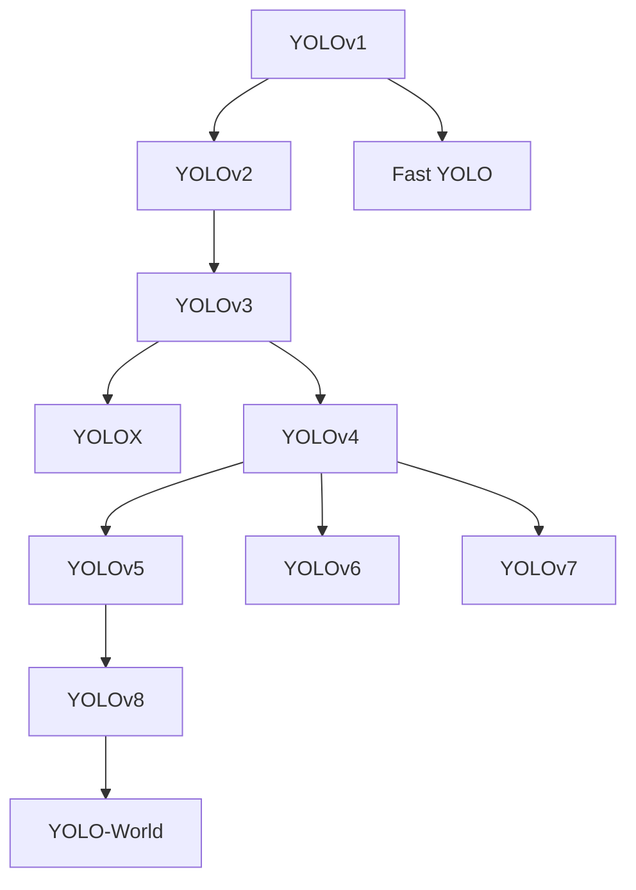

[인공지능 (Artificial Intelligence, AI)](../index.md)
# YOLO 객체 탐지 모델

- [YOLO의 역설 왜 비전문가들은 '상업적 성능' 이상의 가치를 보는가](YOLO의 역설 왜 비전문가들은 상업적 성능 이상의 가치를 보는가.md)
- [YOLO 버전별 비교](YOLO 버전별 비교.md)
- [YOLO v1부터 v12까지](YOLO v1부터 v12까지.md)

- [YOLOv1 (2015)](2015 YOLOv1.md)
- [Fast YOLO (2015)](2015 Fast YOLO.md)
- [YOLOv2 (2016)](2016 YOLOv2.md)
- [YOLOv3 (2018)](2018 YOLOv3.md)
- [YOLOv4 (2020)](2020 YOLOv4.md)
- [YOLOv5 (2020)](2020 YOLOv5.md)
- [YOLOX (2021)](2021 YOLOX.md)
- [YOLOv6 (2022)](2022 YOLOv6.md)
- [YOLOv7 (2022)](2022 YOLOv7.md)
- [YOLOv8 (2023)](2023 YOLOv8.md)
- [YOLOv9 (2024)](2024 YOLOv9.md)
- [YOLOv10 (2024)](2024 YOLOv10.md)
- [YOLOv11 (2024)](2024 YOLOv11.md)
- [YOLO-World (2024)](2024 YOLO-World.md)
