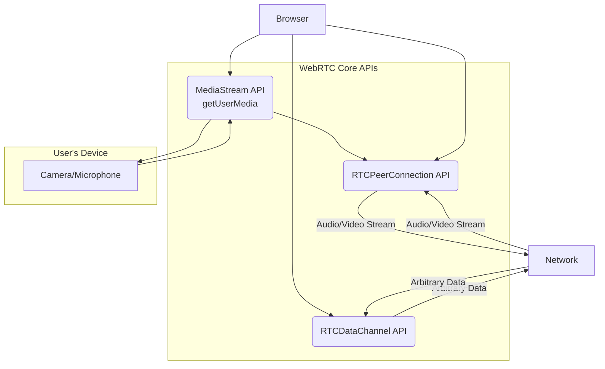
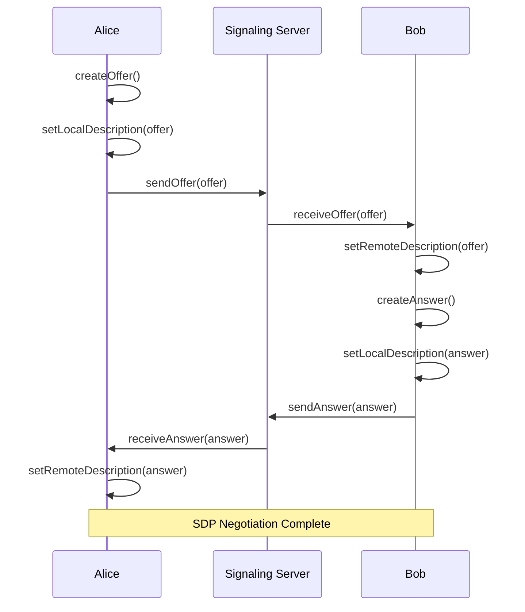
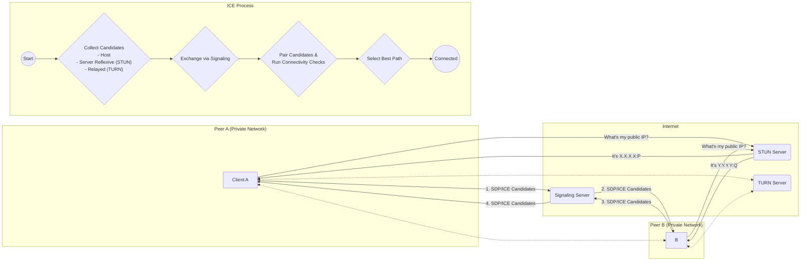

# WebRTC에 대한 심층 고찰

## 1. I. WebRTC의 본질: 플러그인 없는 실시간 통신의 서막

### 1.1  정의와 목표: 왜 WebRTC가 등장했는가?

WebRTC(Web Real-Time Communications)는 구글이 주도하여 시작한 오픈 소스 프로젝트로, 웹 브라우저 간에 별도의 플러그인이나 소프트웨어 설치 없이 오디오, 비디오, 그리고 임의의 데이터를 실시간으로 통신할 수 있도록 설계된 자바스크립트 API의 집합이다.1 이 기술이 등장하기 이전, 웹에서의 실시간 통신은 Adobe Flash, Microsoft ActiveX 또는 별도의 네이티브 애플리케이션 설치와 같은 독점적이고 파편화된 기술에 의존해야만 했다.3 이러한 방식은 사용자에게 불편한 설치 과정을 강요하고, 보안 취약점을 노출하며, 개발자에게는 비싼 라이선스 비용과 플랫폼 종속성 문제를 안겨주었다.4

WebRTC의 탄생은 이러한 문제를 근본적으로 해결하려는 시도에서 비롯되었다. 프로젝트의 핵심 목표는 브라우저, 모바일 플랫폼, 그리고 사물 인터넷(IoT) 장치에 이르기까지 모든 플랫폼에서 풍부하고 고품질의 실시간 통신(RTC) 애플리케이션을 개발하고, 공통된 프로토콜 세트를 통해 이들 모두가 원활하게 통신할 수 있는 환경을 구축하는 것이다.1 즉, 특정 기업의 기술에 종속되지 않는 개방형 표준을 통해 실시간 통신 기술의 장벽을 허무는 것이 WebRTC의 궁극적인 비전이다.

이러한 비전의 이면에는 기술 자체의 혁신을 넘어선 '접근성의 혁명'이라는 더 큰 의미가 내포되어 있다. 과거 RTC 기술은 통신사나 소수의 전문 벤더가 독점하던 고도의 전문 분야였다. 그러나 WebRTC는 `getUserMedia`, `RTCPeerConnection`, `RTCDataChannel`과 같은 표준 자바스크립트 API를 통해 이 복잡한 기술을 모든 웹 개발자에게 개방했다.2 이는 실시간 통신 기술을 '민주화'한 사건으로 평가할 수 있으며, 이로 인해 화상 회의나 P2P 데이터 공유 기능이 더 이상 특별한 서비스가 아닌, 일반적인 웹 애플리케이션의 기본 기능(feature)으로 자리 잡게 되는 패러다임의 전환을 이끌었다.7 결과적으로 WebRTC는 실시간 통신을 소수의 전문 산업에서 웹의 근간을 이루는 핵심 빌딩 블록으로 변모시켰고, 오늘날 우리가 경험하는 수많은 협업 및 인터랙티브 애플리케이션의 폭발적인 성장을 견인하는 기술적 토대가 되었다.9

### 1.2  핵심 장점과 명백한 한계

WebRTC는 여러 강력한 장점을 기반으로 빠르게 웹 표준으로 자리 잡았으나, 동시에 명확한 기술적 한계 또한 가지고 있다.

**핵심 장점:**

- **초저지연 (Ultra-Low Latency):** WebRTC의 가장 큰 특징은 1초 미만, 일반적으로 500ms 이하의 매우 낮은 지연 시간이다.11 이는 미디어 서버를 거쳐 여러 단계로 전송되는 RTMP(Real Time Messaging Protocol)와 같은 기존 스트리밍 프로토콜과 비교했을 때 압도적인 성능이며, 실시간 상호작용이 필수적인 화상 통화나 라이브 커머스에 최적화된 환경을 제공한다.7
- **플러그인 불필요 (No Plugins):** 모든 기능이 브라우저에 내장되어 있어 사용자는 별도의 소프트웨어를 설치할 필요 없이 웹 페이지에 접속하는 것만으로 실시간 통신을 시작할 수 있다.1 이는 사용자 경험을 획기적으로 개선하고 서비스 도입의 장벽을 크게 낮춘다.
- **오픈 소스 및 무료 (Open Source & Free):** 구글, 모질라, 마이크로소프트, 애플 등 주요 기업들이 지원하는 오픈 소스 프로젝트로, 누구나 무료로 사용할 수 있어 라이선스 비용에 대한 부담이 없다.1
- **표준 기술 (Standardized):** 세계 와이드 웹 컨소시엄(W3C)과 국제 인터넷 표준화 기구(IETF)가 표준화를 주도하여 Chrome, Firefox, Safari, Edge 등 대부분의 최신 브라우저에서 안정적으로 지원된다.5 이는 개발자가 특정 플랫폼에 종속되지 않고 폭넓은 호환성을 확보할 수 있음을 의미한다.

**명백한 한계:**

- **확장성 문제 (Scalability):** 순수한 P2P(Peer-to-Peer) 방식인 Mesh 아키텍처는 구조적으로 확장성에 한계를 가진다. 참여자 수가 증가할수록 각 클라이언트가 처리해야 하는 연결의 수가 기하급수적으로 늘어나 CPU와 네트워크 대역폭에 심각한 부담을 준다.15 이 때문에 4-5명 이상의 그룹 통화에서는 P2P 방식이 비현실적이며, 대규모 서비스를 위해서는 SFU나 MCU와 같은 서버 기반 아키텍처가 필수적이다.17
- **브라우저 파편화 (Browser Fragmentation):** WebRTC가 표준 기술이기는 하지만, 브라우저 제조사별로 구현 방식이나 지원하는 기능에 미세한 차이가 존재한다. 또한, 구형 브라우저 버전에서는 API가 다르게 동작하거나 아예 지원되지 않는 경우가 있어, `adapter.js`와 같은 shim 라이브러리를 사용하여 이러한 차이를 보정하는 작업이 종종 필요하다.7
- **내재된 복잡성 (Inherent Complexity):** API 자체는 간단해 보일 수 있으나, 실제 프로덕션 환경에서 안정적인 서비스를 구축하는 것은 전혀 다른 문제다. 개발자는 시그널링 서버 구축, 다양한 네트워크 환경(NAT, 방화벽)을 통과하기 위한 NAT Traversal 문제 해결, 동적인 대역폭 변화에 대응하는 미디어 품질 관리 등 복잡하고 까다로운 문제들을 직접 다루어야 한다.15

### 1.3  주요 구성 요소: 3대 핵심 API 개괄

WebRTC의 강력한 기능은 크게 세 가지 핵심 자바스크립트 API를 통해 개발자에게 제공된다. 이들은 각각 미디어 획득, 피어 간 연결, 데이터 전송이라는 명확한 역할을 수행한다.

- **`MediaStream` (`getUserMedia`):** 사용자의 로컬 미디어 장치(카메라, 마이크, 화면 공유 등)에 접근하여 오디오 및 비디오 데이터를 스트림 형태로 획득하는 역할을 담당한다.2

  `navigator.mediaDevices.getUserMedia()` 메서드를 통해 사용자에게 권한을 요청하고, 승인 시 미디어 트랙들을 포함하는 `MediaStream` 객체를 반환한다.19

- **`RTCPeerConnection`:** 두 피어(peer) 간의 실시간 연결을 설정하고 관리하는 WebRTC의 심장부다.3 이 인터페이스는 신호 처리, 코덱 협상, P2P 통신 경로 설정(ICE), 보안(DTLS-SRTP), 대역폭 관리 등 연결의 생성부터 유지, 종료에 이르는 전 과정을 총괄한다.2

- **`RTCDataChannel`:** 오디오나 비디오 스트림과 별개로, 임의의 데이터를 P2P 방식으로 직접 교환할 수 있는 양방향 채널을 제공한다.3 텍스트 채팅, 파일 공유, 게임의 상태 동기화, 원격 제어 등 미디어 외의 모든 실시간 데이터 전송에 사용된다.2

이 세 가지 API는 유기적으로 연동하여 플러그인 없는 실시간 통신을 완성한다. `getUserMedia`로 미디어를 얻고, `RTCPeerConnection`으로 피어와 연결한 뒤, 미디어 스트림과 `RTCDataChannel`을 통해 데이터를 교환하는 것이 WebRTC 애플리케이션의 기본적인 흐름이다.

## 2. II. 연결의 시작: 시그널링과 P2P 커넥션 수립

### 2.1  시그널링: WebRTC의 범위를 벗어난 필수 과정

WebRTC는 두 브라우저 간에 미디어를 직접 주고받는 P2P 프로토콜을 정의하지만, 정작 두 브라우저가 서로의 존재를 인지하고 통신을 시작하기 위해 필요한 초기 메타데이터 교환 과정, 즉 '시그널링(Signaling)'에 대해서는 아무것도 규정하지 않는다.11 이는 WebRTC의 가장 중요한 특징 중 하나이자, 개발자들이 처음 마주하는 가장 큰 허들이다.

시그널링은 P2P 연결이 수립되기 전에 다음과 같은 핵심 정보를 교환하는 과정이다 8:

1. **세션 제어 메시지:** 통신을 시작하고, 종료하며, 오류를 보고하는 등의 제어 신호.
2. **네트워크 구성 정보:** 각 피어가 인터넷에서 서로를 찾을 수 있는 주소 정보. 여기에는 로컬 IP 주소뿐만 아니라 방화벽이나 NAT 뒤에 있는 피어의 공인 IP 주소와 포트 정보(ICE Candidates)가 포함된다.
3. **미디어 기능 정보:** 각 피어가 지원하는 코덱, 해상도, 비트레이트 등 미디어 관련 역량 정보(SDP).

WebRTC가 시그널링을 표준화하지 않은 것은 의도적인 설계 결정이다. 만약 특정 시그널링 프로토콜(예: SIP over WebSocket)을 강제했다면, 모든 WebRTC 애플리케이션은 해당 프로토콜에 종속되었을 것이다. 이는 기존 시스템과의 통합을 어렵게 하고 기술적 혁신을 저해할 수 있다. 대신 WebRTC는 시그널링을 '대역 외(out-of-band)' 프로세스로 남겨둠으로써, 개발자가 자신의 애플리케이션 요구사항에 가장 적합한 기술을 자유롭게 선택할 수 있는 '유연성'을 부여했다.26 예를 들어, 간단한 채팅 앱은 HTTP 롱폴링으로 시그널링을 구현할 수 있고, 복잡한 인터넷 전화 시스템은 기존 SIP 인프라를 활용할 수 있다.11

하지만 이 유연성은 개발자에게 시그널링 서버를 직접 설계, 구현하고 확장해야 하는 '복잡성'이라는 비용을 전가한다. 개발자는 WebSocket, 서버 전송 이벤트(SSE), 또는 다른 양방향 통신 채널을 이용해 안정적이고 확장 가능한 시그널링 서버를 구축해야 한다.11 많은 개발자들이 WebRTC의 P2P 기능에만 집중하다가 이 시그널링 서버 구축의 복잡성을 과소평가하여 실제 서비스 개발에 어려움을 겪는 경우가 많다.20 결국 '시그널링에 구애받지 않는(signaling agnostic)' 특성은 WebRTC를 매우 다재다능하게 만들지만, 동시에 견고한 시그널링 계층을 구축하는 것이 성공적인 WebRTC 서비스의 선결 과제임을 명확히 보여준다.

### 2.2  SDP Offer/Answer 모델 심층 분석

WebRTC의 연결 협상 과정은 IETF RFC 8866에 표준으로 정의된 SDP(Session Description Protocol)를 사용하는 'Offer/Answer' 모델을 기반으로 한다.3 이 모델은 두 피어가 서로의 미디어 및 네트워크 사양을 교환하고 합의에 이르는 체계적인 절차를 제공한다.

전체 과정은 통화를 시작하는 'Caller'와 전화를 받는 'Callee' 사이에서 다음과 같이 진행된다 27:

1. **Caller의 Offer 생성:** 통화를 시작하려는 피어 A(Caller)는 `RTCPeerConnection.createOffer()` 메서드를 호출한다. 이를 통해 자신의 미디어 스트림 정보, 지원하는 코덱 목록, 해상도, 암호화 방식 등이 기술된 SDP 형식의 'Offer' 문자열을 생성한다.
2. **Caller의 로컬 설명 설정:** 생성된 Offer를 `setLocalDescription()` 메서드를 통해 자신의 '로컬 설명(local description)'으로 설정한다. 이로써 피어 A의 `RTCPeerConnection` 인스턴스는 자신의 상태를 인지하게 된다.
3. **Offer 전송:** 피어 A는 구축된 시그널링 채널(예: WebSocket)을 통해 이 SDP Offer를 피어 B(Callee)에게 전송한다.
4. **Callee의 원격 설명 설정:** Offer를 수신한 피어 B는 `setRemoteDescription()` 메서드를 사용해 수신된 Offer를 자신의 '원격 설명(remote description)'으로 설정한다. 이제 피어 B는 피어 A의 미디어 사양을 알게 된다.
5. **Callee의 Answer 생성:** 피어 B는 수신한 Offer를 바탕으로, 자신이 수용할 수 있는 미디어 사양을 담은 'Answer'를 `createAnswer()` 메서드를 통해 생성한다. 예를 들어, 피어 A가 VP8과 H.264 코덱을 모두 제안했다면, 피어 B는 자신이 선호하거나 지원하는 H.264만 사용하겠다는 내용의 Answer를 만들 수 있다.
6. **Callee의 로컬 설명 설정:** 생성된 Answer를 `setLocalDescription()`을 통해 자신의 로컬 설명으로 설정한다.
7. **Answer 전송:** 피어 B는 시그널링 채널을 통해 이 SDP Answer를 다시 피어 A에게 전송한다.
8. **Caller의 원격 설명 설정:** Answer를 수신한 피어 A는 `setRemoteDescription()`으로 이를 자신의 원격 설명으로 설정한다.

이 과정이 완료되면 양측 피어는 상호 호환되는 미디어 세션에 대한 완전한 합의에 도달하게 되며, 이후 ICE 프로세스를 통해 실제 미디어 스트림을 교환할 경로를 찾기 시작한다. 이 Offer/Answer 모델은 최초 연결 설정뿐만 아니라, 통화 중에 해상도를 변경하거나 화면 공유를 추가하는 등 세션의 구성을 변경해야 할 때마다 반복적으로 사용된다.

### 2.3  NAT Traversal의 기술적 해부: STUN, TURN, ICE

현대의 인터넷 환경에서 대부분의 개인용 컴퓨터나 모바일 장치는 공유기나 통신사 장비 뒤에 위치하며, 사설 IP 주소를 할당받는다. 이러한 네트워크 주소 변환(NAT, Network Address Translation) 환경은 외부에서 내부 장치로 직접 접근하는 것을 차단하기 때문에, P2P 연결을 구축하는 데 있어 가장 큰 기술적 장애물이다.1 WebRTC는 이 문제를 해결하기 위해 STUN, TURN, ICE라는 세 가지 핵심 기술을 유기적으로 활용한다.

- **STUN (Session Traversal Utilities for NAT):** STUN 서버의 역할은 간단하다. NAT 뒤에 있는 클라이언트가 "인터넷에서 나를 보려면 어떤 주소로 찾아와야 하는가?"라고 물었을 때, 그 답을 알려주는 것이다.7 클라이언트는 STUN 서버에 간단한 요청 패킷을 보내고, STUN 서버는 그 패킷의 발신지 IP 주소와 포트를 그대로 응답에 담아 돌려준다. 이 주소가 바로 해당 클라이언트의 공인 IP 주소와 포트, 즉 '서버 리플렉시브 후보(Server Reflexive Candidate)'다.31 클라이언트는 이 주소를 상대방 피어에게 전달하여 직접 연결을 시도할 수 있다. STUN 서버는 단순히 주소 정보만 제공하므로 서버에 가해지는 트래픽 부하가 매우 낮다. 이 때문에 구글 등이 무료로 운영하는 공개 STUN 서버를 사용하는 경우가 많다.7
- **TURN (Traversal Using Relays around NAT):** 하지만 일부 네트워크 환경, 특히 보안이 엄격한 기업 방화벽이나 '대칭형 NAT(Symmetric NAT)' 환경에서는 STUN으로 알아낸 공인 주소로도 직접적인 P2P 연결이 불가능하다.3 이때 최후의 수단으로 사용되는 것이 TURN 서버다. TURN 서버는 이름 그대로 모든 미디어 트래픽을 '중계(Relay)'하는 역할을 한다.14 즉, 피어 A와 피어 B는 직접 통신하는 대신, 모든 미디어 패킷을 TURN 서버로 보내고, TURN 서버가 이 패킷을 상대방에게 전달해준다. 이는 P2P 연결 실패를 막아주지만, 모든 트래픽이 서버를 경유하므로 지연 시간이 증가하고 서버에 막대한 대역폭 비용을 발생시킨다.3 따라서 TURN은 다른 모든 방법이 실패했을 때만 사용되는 비상 탈출구와 같다.
- **ICE (Interactive Connectivity Establishment):** ICE는 STUN과 TURN을 조화롭게 사용하여 두 피어 간 최적의 통신 경로를 찾아내는 프레임워크다.3 ICE의 작동 방식은 다음과 같다:
  1. **후보 수집(Candidate Gathering):** 각 피어는 연결 가능한 모든 네트워크 주소, 즉 'ICE 후보(Candidate)'를 수집한다. 여기에는 자신의 사설 IP 주소(Host Candidate), STUN 서버를 통해 알아낸 공인 IP 주소(Server Reflexive Candidate), 그리고 TURN 서버의 중계 주소(Relay Candidate)가 포함된다.
  2. **후보 교환(Candidate Exchange):** 수집된 ICE 후보 목록을 시그널링 서버를 통해 상대방 피어와 교환한다.
  3. **연결성 검사(Connectivity Checks):** 양측 피어는 교환된 후보 목록을 바탕으로 가능한 모든 주소 쌍에 대해 STUN 패킷을 주고받으며 연결을 테스트한다.
  4. **경로 선택(Path Selection):** 연결성 검사를 통해 성공적으로 통신이 확인된 경로 중 가장 우선순위가 높은 경로(일반적으로 Host -> Server Reflexive -> Relay 순)를 최종 통신 경로로 선택한다.

이러한 ICE 프로세스를 통해 WebRTC는 거의 모든 네트워크 환경에서 안정적으로 P2P 연결을 수립할 수 있다.

WebRTC 연결 성공률의 이면을 들여다보면 흥미로운 패턴이 발견된다. STUN을 이용한 직접 P2P 연결, 즉 UDP 홀 펀칭(UDP hole punching)은 약 75-80%의 경우에 성공적으로 이루어진다.31 이는 대부분의 일반적인 네트워크 환경에서는 추가 비용 없이 효율적인 통신이 가능하다는 것을 의미한다. 문제는 나머지 20-25%의 '까다로운' 연결이다. 주로 대기업의 엄격한 방화벽이나 일부 통신사의 대칭형 NAT 환경에서 발생하는 이 연결 실패를 구제하기 위해 TURN 서버가 동원된다. 결국, 전체 사용자 중 소수에 불과한 이들을 위해 막대한 대역폭 비용을 유발하는 TURN 서버 인프라를 유지해야 하는 상황이 발생한다. 이는 WebRTC 서비스의 가용성을 99% 이상으로 끌어올리기 위해서는 소수의 사용자를 위해 전체 인프라 비용의 상당 부분을 투자해야 함을 시사한다. 따라서 대규모 서비스의 비용 최적화 전략은 필연적으로 TURN 서버의 사용을 최소화하는 방향으로 집중될 수밖에 없다.32

## 3. III. 아키텍처의 선택: P2P를 넘어 대규모 서비스로

WebRTC의 순수한 P2P 모델은 1:1 통신에는 이상적이지만, 참여자가 늘어나는 순간 한계에 부딪힌다. 대규모 다자간 통신 서비스를 구축하기 위해서는 중앙 미디어 서버를 도입한 아키텍처를 선택해야 한다. 대표적인 모델로는 Mesh, SFU, MCU가 있으며, 각각의 장단점과 기술적 트레이드오프가 뚜렷하다.

### 3.1  Mesh (P2P): 단순함의 대가

Mesh는 WebRTC의 가장 기본적인 형태로, 별도의 미디어 서버 없이 모든 참여자가 다른 모든 참여자와 직접 P2P 연결을 맺는 '완전 연결(Full-mesh)' 구조다.7 N명의 참여자가 있다면, 각 참여자는 N-1개의 업스트림(송신)과 N-1개의 다운스트림(수신)을 동시에 관리해야 한다.

이 방식의 가장 큰 장점은 단순함과 비용이다. 초기 연결을 위한 시그널링 서버 외에는 미디어 트래픽을 중계하는 서버가 필요 없으므로 서버 운영 비용이 매우 낮다.7 또한 모든 미디어가 참여자 간에 직접 전송되므로 지연 시간이 가장 짧고,天然적으로 종단간 암호화(End-to-End Encryption)가 보장된다.

하지만 이 단순함은 치명적인 확장성 문제를 대가로 치른다. 참여자 수가 증가함에 따라 각 클라이언트가 처리해야 할 스트림의 수가 선형적으로 증가(N−1)하고, 전체 네트워크의 연결 수는 기하급수적으로 증가(N×(N−1)/2)한다. 이는 각 클라이언트의 CPU와 업로드 대역폭에 엄청난 부담을 주며, 보통 4-5명을 넘어서는 순간부터 급격한 성능 저하를 유발한다.16 이른바 'N 제곱 문제(N-squared problem)'로 알려진 이 한계 때문에, Mesh 아키텍처는 1:1 통화나 3-4명 이내의 소규모 그룹 채팅에만 제한적으로 사용된다.

### 3.2  중앙 서버 모델: SFU와 MCU의 기술적 비교 분석

Mesh 아키텍처의 확장성 한계를 극복하기 위해 등장한 것이 중앙 미디어 서버를 활용하는 모델이다. 이 모델은 크게 SFU와 MCU 방식으로 나뉜다.

SFU (Selective Forwarding Unit):

SFU는 '선택적 전달 장치'라는 이름처럼, 각 참여자로부터 수신한 미디어 스트림을 다른 참여자들에게 그대로 '전달'해주는 역할을 한다.7 SFU 아키텍처에서 각 참여자는 자신의 오디오/비디오 스트림을 SFU 서버로 단 한 번만 업로드한다. 그러면 SFU 서버가 이 스트림을 복제하여 다른 모든 참여자에게 전송해준다.37

- **장점:**
  - **클라이언트 업로드 부담 감소:** 클라이언트는 오직 하나의 업스트림만 관리하면 되므로 Mesh 방식에 비해 업로드 대역폭과 CPU 부하가 현저히 줄어든다.7
  - **낮은 서버 CPU 부하:** SFU는 미디어 스트림을 디코딩하거나 믹싱하는 복잡한 작업을 수행하지 않고 단순히 라우팅만 하므로, MCU에 비해 서버의 CPU 요구사항이 매우 낮다.17
  - **유연성:** 각 참여자는 다른 모든 참여자의 스트림을 개별적으로 수신하기 때문에, 클라이언트 측에서 자유롭게 화면 레이아웃을 구성하거나 특정 사용자의 스트림만 선택적으로 볼 수 있다.
  - **낮은 지연 시간:** 미디어 처리 과정이 없어 MCU보다 지연 시간이 짧다.7
- **단점:**
  - **클라이언트 다운로드 부담:** 클라이언트는 여전히 다른 모든 참여자(N-1명)의 스트림을 다운로드하고 각각 디코딩해야 하므로, 다운로드 대역폭과 CPU 부담은 여전히 상당하다.7
  - **높은 서버 대역폭:** 서버는 모든 참여자에게 개별 스트림을 전달해야 하므로, 전체적인 서버 네트워크 대역폭 사용량이 크다.37

MCU (Multi-point Control Unit):

MCU는 '다지점 제어 장치'로, SFU보다 훨씬 더 중앙 집중적인 방식으로 미디어를 처리한다.7 각 참여자가 자신의 스트림을 MCU 서버로 보내면, MCU는 수신된 모든 스트림을 디코딩하여 하나의 비디오 레이아웃으로 합성(mixing/composing)하고, 오디오를 믹싱한다. 그 후, 이 단일화된 스트림을 다시 인코딩하여 모든 참여자에게 전송한다.39

- **장점:**
  - **최소한의 클라이언트 부담:** 클라이언트는 자신의 스트림을 업로드하고, 단 하나의 합성된 스트림만 다운로드하여 디코딩하면 된다. 이는 저사양 기기나 네트워크 환경이 좋지 않은 참여자에게 매우 유리하다.39
  - **레거시 시스템 호환성:** SIP 기반의 기존 화상회의 시스템과 연동하기 용이하다. MCU가 표준 형식의 스트림을 생성해주기 때문이다.41
- **단점:**
  - **매우 높은 서버 CPU 부하:** 모든 스트림을 실시간으로 디코딩, 믹싱, 리사이징, 재인코딩하는 과정은 막대한 서버 컴퓨팅 자원을 소모한다. 이로 인해 서버 운영 비용이 매우 비싸다.7
  - **높은 지연 시간:** 복잡한 미디어 처리 과정 때문에 SFU에 비해 지연 시간이 더 길다.41
  - **유연성 부족:** 모든 참여자가 동일한 레이아웃의 비디오를 수신하므로, 클라이언트 측에서 화면 구성을 변경할 수 없다.
  - **종단간 암호화 불가:** 미디어를 서버에서 복호화해야 하므로, 진정한 의미의 종단간 암호화(E2EE)가 불가능하다.

MCU는 과거 하드웨어 기반 화상회의 시스템에서 주로 사용되던 방식이며, 레거시 시스템과의 호환성이나 극도로 제한된 클라이언트 환경 지원과 같은 특수한 요구사항이 있을 때 여전히 유효한 선택지다. 하지만 현대적인 대규모 실시간 통신 서비스의 아키텍처는 대부분 SFU를 채택하고 있다. 이는 SFU가 확장성(scalability), 유연성(flexibility), 비용 효율성(cost-effectiveness) 사이에서 가장 합리적인 균형점을 제공하기 때문이다. 최신 클라이언트 장치들은 여러 개의 비디오 스트림을 동시에 디코딩할 수 있을 만큼 충분히 강력해졌고(일반적으로 4-9개 스트림 처리 가능) 36, MCU의 막대한 트랜스코딩 비용보다는 SFU의 네트워크 대역폭 비용이 상대적으로 저렴하기 때문이다. Discord, Google Meet과 같은 대부분의 현대적인 서비스들이 SFU 아키텍처를 기반으로 구축된 것은 이러한 기술적, 경제적 트레이드오프를 반영한 결과다.42

### 3.3 WebRTC 아키텍처 비교

| 기능                    | Mesh (P2P)                        | SFU (Selective Forwarding Unit)       | MCU (Multipoint Control Unit)         |
| ----------------------- | --------------------------------- | ------------------------------------- | ------------------------------------- |
| **확장성**              | 낮음 (2-4명)                      | 좋음 (수백 명)                        | 좋음 (수백 명)                        |
| **지연 시간**           | 가장 낮음                         | 낮음                                  | 중간 (트랜스코딩 지연)                |
| **서버 CPU 부하**       | 없음 (시그널링 전용)              | 낮음 (라우팅 전용)                    | 매우 높음 (트랜스코딩)                |
| **서버 대역폭**         | 없음 (시그널링 전용)              | 높음 (N×(N−1) 스트림)                 | 중간 (N 스트림 입력, N 스트림 출력)   |
| **클라이언트 CPU 부하** | 높음 (N-1개 스트림 인코딩/디코딩) | 중간 (1개 인코딩, N-1개 디코딩)       | 낮음 (1개 인코딩, 1개 디코딩)         |
| **클라이언트 업링크**   | 높음 (N-1개 스트림)               | 낮음 (1개 스트림)                     | 낮음 (1개 스트림)                     |
| **클라이언트 다운링크** | 높음 (N-1개 스트림)               | 높음 (N-1개 스트림)                   | 낮음 (1개 스트림)                     |
| **종단간 암호화(E2EE)** | 기본 지원                         | 가능 (Insertable Streams/SFrame 사용) | 불가능                                |
| **주요 사용 사례**      | 1:1 통화, 소규모 그룹             | 그룹 화상 회의, 웨비나                | 레거시 시스템 연동, 저사양 클라이언트 |

### 3.4  글로벌 확장을 위한 아키텍처: Cascading SFUs

단일 지역에 위치한 SFU 서버는 전 세계 사용자를 대상으로 서비스를 제공할 때 물리적 거리로 인한 지연 시간(latency) 문제에 직면한다.44 예를 들어, 미국에 있는 서버에 호주 사용자가 접속하면 왕복 시간(RTT)만으로도 200ms 이상이 소요되어 원활한 실시간 통신이 어렵다.

이 문제를 해결하기 위한 아키텍처가 'Cascading SFUs' 또는 'Geo-distributed SFUs'다.36 이 구조는 전 세계 여러 주요 거점(region)에 SFU 서버를 분산 배치하고, 이 서버들을 서로 계층적으로 연결하는 방식이다.

- **작동 원리:**
  1. 사용자는 지리적으로 가장 가까운 'Branch SFU'(엣지 서버)에 접속한다. 이는 지연 시간 기반 DNS 라우팅(예: AWS Route 53)과 같은 기술을 통해 자동으로 이루어진다.44
  2. 같은 지역의 사용자들은 해당 Branch SFU를 통해 미디어를 교환한다.
  3. 다른 지역의 사용자와 통신해야 할 경우, Branch SFU는 상위 계층의 'Root SFU' 또는 다른 지역의 Branch SFU와 연결된 백본 네트워크를 통해 스트림을 교환한다.45
- **기대 효과:**
  - **지연 시간 최소화:** 사용자는 항상 가장 가까운 서버와 통신하므로 RTT를 크게 줄일 수 있다.
  - **비용 절감:** 값비싼 대륙 간 데이터 전송(egress) 비용을 최소화하고, 각 지역 내에서 트래픽을 처리함으로써 전체 네트워크 비용을 획기적으로 절감할 수 있다 (한 사례에서는 약 70%의 비용 절감 효과를 보았다).44
  - **안정성 및 확장성 향상:** 특정 지역의 서버에 장애가 발생하더라도 다른 지역의 서버를 통해 서비스를 계속 유지할 수 있으며, 지역별로 독립적인 확장이 가능하다.

Cascading SFU는 단순히 서버를 여러 곳에 복제하는 것을 넘어, 사용자를 최적의 엣지 서버로 지능적으로 라우팅하고('geo-sticky' 세션 관리) 44, 서버 간의 효율적인 스트림 교환을 관리하는 정교한 시스템이다. 이는 현대적인 글로벌 실시간 통신 서비스를 구축하기 위한 필수적인 아키텍처 패턴으로 자리 잡았다.

## 4. IV. 미디어 파이프라인과 데이터 채널 심층 탐구

WebRTC의 핵심 기능은 미디어와 데이터를 실시간으로 처리하고 전송하는 파이프라인에 있다. 이 파이프라인은 `MediaStream`, `RTCPeerConnection`, `RTCDataChannel`이라는 세 가지 API를 중심으로 구성되며, 코덱과 대역폭 적응 기술이 그 효율성을 결정한다.

### 4.1  `MediaStream` API: 미디어 소스 제어

`MediaStream` API는 WebRTC 미디어 파이프라인의 출발점이다. 이 API의 핵심은 `navigator.mediaDevices.getUserMedia()` 메서드로, 웹 애플리케이션이 사용자의 카메라와 마이크에 접근할 수 있도록 해준다.19

- **작동 방식:** `getUserMedia()`를 호출하면 브라우저는 사용자에게 명시적인 권한 요청 대화상자를 표시한다. 사용자가 허용하면, 이 메서드는 요청된 미디어 트랙(audio track, video track)을 포함하는 `MediaStream` 객체로 확인(resolve)되는 `Promise`를 반환한다.4 이 

  `MediaStream` 객체는 비디오 요소(`<video>`)의 `srcObject` 속성에 할당하여 화면에 표시하거나, `RTCPeerConnection`에 추가하여 원격 피어에게 전송할 수 있다.

- **제약 조건(Constraints):** 개발자는 `getUserMedia()` 호출 시 `constraints` 객체를 전달하여 미디어 스트림의 세부 속성을 제어할 수 있다.4 예를 들어, 비디오의 해상도(

  `width`, `height`), 프레임률(`frameRate`), 전면/후면 카메라 선택(`facingMode`) 등을 지정할 수 있다.47

- **보안:** 사용자의 개인정보 보호를 위해 `getUserMedia()`는 보안 컨텍스트(HTTPS 또는 localhost)에서만 작동하도록 엄격히 제한된다.46

`MediaStream`은 하나 이상의 `MediaStreamTrack`을 담는 컨테이너 역할을 한다.21 각 트랙은 독립적인 미디어 소스를 나타내며, 개발자는 이 트랙 단위로 음소거(mute), 활성화(enable) 등의 제어를 할 수 있다. 이처럼 `MediaStream` API는 WebRTC 통신의 원재료인 미디어 데이터를 안전하고 유연하게 획득하는 관문 역할을 수행한다.

### 4.2  `RTCPeerConnection` API: 연결 생명주기 관리

`RTCPeerConnection`은 WebRTC 연결의 생성부터 협상, 유지, 종료에 이르는 전체 생명주기를 관리하는 핵심 인터페이스다.5 이는 ICE, DTLS, SRTP와 같은 복잡한 하위 프로토콜들을 추상화하여 개발자가 상대적으로 간단하게 P2P 연결을 제어할 수 있도록 돕는다.

- **생성 및 설정:** `new RTCPeerConnection(configuration)` 생성자를 통해 인스턴스를 만든다. `configuration` 객체에는 연결에 사용할 ICE 서버(STUN/TURN) 목록을 지정할 수 있다.5
- **미디어 추가:** `getUserMedia()`로 얻은 `MediaStream`의 트랙들을 `addTrack()` 메서드를 통해 `RTCPeerConnection`에 추가한다.
- **협상:** 앞서 설명한 SDP Offer/Answer 모델에 따라 `createOffer()`, `setLocalDescription()`, `setRemoteDescription()`, `createAnswer()` 등의 메서드를 순차적으로 호출하여 미디어 세션을 협상한다.50
- **이벤트 기반 상태 관리:** 연결 과정은 비동기적으로 진행되며, `RTCPeerConnection`은 다양한 이벤트를 통해 현재 상태를 외부에 알린다.
  - `onicecandidate`: 로컬 ICE 에이전트가 새로운 네트워크 후보를 발견할 때마다 발생한다. 개발자는 이 이벤트 핸들러 내에서 후보를 시그널링 서버를 통해 상대방에게 전송해야 한다.19
  - `onconnectionstatechange`: ICE, DTLS 연결 상태가 변경될 때마다(`new`, `connecting`, `connected`, `failed`, `disconnected`, `closed`) 발생하여 연결의 전체적인 상태를 모니터링할 수 있게 해준다.23
  - `ontrack`: 원격 피어가 미디어 트랙을 추가했을 때 발생하는 이벤트로, 수신된 스트림을 화면에 표시하는 등의 작업을 처리하는 데 사용된다.51

이러한 메서드와 이벤트의 조합을 통해 개발자는 복잡한 P2P 연결 과정을 체계적으로 관리할 수 있다. 특히 연결 과정의 모든 단계가 비동기 `Promise` 기반으로 작동하므로, `async/await` 구문을 활용하면 코드를 더 명확하고 간결하게 작성할 수 있다.50

### 4.3  `RTCDataChannel` API: 단순 메시징을 넘어서

`RTCDataChannel`은 WebRTC의 또 다른 강력한 기능으로, 오디오/비디오 스트림과 독립적으로 임의의 데이터를 P2P로 직접 전송할 수 있는 채널을 제공한다.3

`RTCDataChannel`은 단순한 채팅 기능 구현을 넘어, 웹 개발자에게 강력하고 유연한 P2P 전송 계층을 제공한다는 점에서 그 진정한 가치가 있다. 이 API는 전통적인 웹 통신에서 개발자가 TCP(신뢰성, 순서 보장)와 UDP(비신뢰성, 순서 무관) 중 하나를 선택해야 했던 제약에서 벗어나게 해준다. `RTCDataChannel`은 내부적으로 SCTP(Stream Control Transmission Protocol)를 기반으로 동작하는데, SCTP는 TCP와 UDP의 특징을 모두 아우르는 전송 프로토콜이다.24

개발자는 `createDataChannel()` 메서드를 호출할 때 간단한 옵션을 통해 채널의 동작 방식을 세밀하게 제어할 수 있다 25:

- `ordered`: 메시지의 순서 보장 여부를 결정한다. `true`(기본값)로 설정하면 TCP처럼 메시지가 보낸 순서대로 도착하며, `false`로 설정하면 UDP처럼 순서에 상관없이 도착한다.
- `maxRetransmits` / `maxPacketLifeTime`: 신뢰성을 제어한다. 이 옵션들을 설정하지 않으면 TCP처럼 손실된 패킷을 무한정 재전송하여 신뢰성을 보장한다. `maxRetransmits: 0`과 같이 설정하면 UDP처럼 재전송을 시도하지 않아 지연 시간을 최소화할 수 있다.

이러한 유연성은 하나의 `RTCPeerConnection` 내에서 다양한 목적의 데이터 채널을 동시에 운영할 수 있게 한다. 예를 들어, 파일 전송을 위해서는 신뢰성과 순서가 보장되는 채널(`ordered: true`)을 생성하고, 동시에 실시간 멀티플레이어 게임의 플레이어 위치 데이터를 전송하기 위해서는 지연 시간을 최소화한 비신뢰성, 비순차 채널(`ordered: false, maxRetransmits: 0`)을 생성하여 사용할 수 있다.53 이는 별도의 WebSocket 연결과 UDP 소켓을 함께 사용해야 했던 기존의 복잡한 구조를 단일 P2P 연결로 통합할 수 있음을 의미한다. 모든 

`RTCDataChannel` 통신은 `RTCPeerConnection`의 DTLS 세션을 통해 의무적으로 암호화되므로, 별도의 보안 계층을 구현할 필요 없이 안전한 데이터 전송이 보장된다.55

### 4.4  코덱 전쟁: VP8/H.264에서 AV1으로의 전환과 그 의미

코덱(Codec)은 아날로그 미디어 신호를 디지털 데이터로 압축(인코딩)하고, 다시 원래 신호로 복원(디코딩)하는 알고리즘이다. WebRTC의 통신 품질과 효율성은 어떤 코덱을 사용하느냐에 따라 크게 좌우된다.

WebRTC 표준은 모든 브라우저가 의무적으로 지원해야 하는 코덱을 명시하고 있다. 비디오의 경우 구글이 개발한 로열티 없는 코덱인 **VP8**이, 오디오의 경우 뛰어난 음질과 낮은 지연 시간을 자랑하는 **Opus**가 기본 코덱으로 지정되었다.1 이와 더불어, 하드웨어 가속 지원이 폭넓게 이루어져 모바일 기기에서 효율적으로 동작하는 **H.264** 역시 사실상의 표준으로 널리 사용된다.56

최근 WebRTC 생태계의 가장 큰 변화는 차세대 비디오 코덱인 **AV1**의 부상이다.56 AV1은 구글, 아마존, 넷플릭스, 메타 등이 참여한 AOMedia(Alliance for Open Media)에서 개발한 로열티 없는 오픈 코덱으로, 기존의 VP9이나 H.264에 비해 약 30% 이상 뛰어난 압축 효율을 자랑한다.57 이는 동일한 화질의 비디오를 훨씬 낮은 비트레이트로 전송할 수 있음을 의미하며, 특히 네트워크 대역폭이 제한적인 모바일 환경에서 사용자 경험을 획기적으로 개선할 수 있다.58

하지만 AV1으로의 전환은 단순한 코덱 업그레이드 이상의 복잡한 트레이드오프를 수반한다. 높은 압축 효율은 그만큼 복잡한 연산을 필요로 하므로, 인코딩 및 디코딩 과정에서 상당한 CPU 자원을 소모한다.58 이는 구형 기기나 저사양 모바일 장치에서 오히려 성능 저하와 배터리 소모 증가를 유발할 수 있다.

이러한 문제를 해결하기 위해 메타(구 페이스북)와 같은 선도 기업들은 정교한 적응형 전략을 사용한다. 이들은 단순히 AV1을 기본 코덱으로 설정하는 대신, 통화 시작 시 H.264와 AV1을 모두 협상하는 '하이브리드 인코더' 방식을 도입했다.58 통화 중에 클라이언트의 장치 성능과 실시간 네트워크 상태를 지속적으로 모니터링하여, 장치 성능이 충분하고 네트워크 상태가 좋지 않을 때는 AV1으로 전환하여 대역폭을 절약하고, 장치 성능이 부족할 때는 하드웨어 가속이 가능한 H.264를 사용하여 CPU 부담을 줄이는 동적 최적화를 수행한다.

결론적으로 AV1으로의 전환은 WebRTC 애플리케이션이 더욱 지능적이고 상황 인지적인 미디어 파이프라인 관리 능력을 갖추어야 함을 의미한다. 이는 더 이상 '하나의 코덱으로 모든 상황에 대응'하는 방식이 아니라, 실시간으로 변화하는 환경에 맞춰 최적의 균형점을 찾아가는 동적 최적화 문제로 진화하고 있음을 보여준다.

### 4.5 주요 코덱 비교

| 기능               | VP8              | H.264                       | VP9                              | AV1                               |
| ------------------ | ---------------- | --------------------------- | -------------------------------- | --------------------------------- |
| **라이선스**       | 로열티 없음      | 로열티 있음 (MPEG LA)       | 로열티 없음                      | 로열티 없음 (AOMedia)             |
| **압축 효율**      | 양호             | 양호                        | 매우 좋음 (H.264 대비 ~50% 향상) | 탁월함 (VP9 대비 ~30% 향상)       |
| **CPU 부하**       | 낮음             | 낮음 (하드웨어 가속 보편화) | 중간-높음                        | 높음                              |
| **호환성**         | WebRTC 필수 지원 | 폭넓게 지원 (하드웨어 가속) | 양호 (Chrome, Firefox)           | 성장 중 (Chrome, Firefox, Safari) |
| **주요 사용 사례** | 기본 호환성 확보 | 모바일 기기 (하드웨어 가속) | 고화질 스트리밍                  | 저대역폭 환경, 화면 공유          |

### 4.6  대역폭 적응 기술: Simulcast와 SVC

SFU 아키텍처를 사용하는 다자간 통화에서는 참여자들의 네트워크 환경이 각기 다르다. 고성능 데스크톱 사용자와 저속의 3G 네트워크를 사용하는 모바일 사용자가 동시에 통화에 참여할 수 있다. 이처럼 이기종 네트워크 환경에서 모든 참여자에게 최적의 통화 품질을 제공하기 위해 대역폭 적응 기술이 필수적이다. WebRTC에서는 주로 Simulcast와 SVC가 사용된다.

- **Simulcast (동시 전송):** Simulcast는 송신자(publisher)가 동일한 비디오 소스를 서로 다른 해상도와 비트레이트를 가진 여러 개의 독립적인 스트림(예: 고화질 1080p, 중간 화질 720p, 저화질 360p)으로 동시에 인코딩하여 SFU 서버로 전송하는 방식이다.60 SFU는 각 수신자(subscriber)의 네트워크 상태와 디스플레이 크기 등을 고려하여 이들 중 가장 적합한 스트림 하나를 선택하여 전달한다. 예를 들어, 네트워크 상태가 좋은 수신자에게는 1080p 스트림을, 좋지 않은 수신자에게는 360p 스트림을 보내주는 식이다. Simulcast는 구현이 비교적 간단하고 각 스트림이 독립적이어서 안정적이지만, 송신자가 여러 스트림을 동시에 인코딩하고 전송해야 하므로 업로드 대역폭과 CPU 자원 소모가 크다는 단점이 있다.60
- **SVC (Scalable Video Coding, 확장 가능 비디오 코딩):** SVC는 Simulcast의 비효율성을 개선하기 위해 고안된 더 진보된 기술이다. SVC를 지원하는 코덱(VP9, AV1 등)은 비디오를 단일 스트림으로 인코딩하되, 이 스트림 내부에 여러 '계층(layer)'을 포함시킨다.62 가장 기본적인 화질을 담고 있는 '기본 계층(Base Layer)'과, 이 위에 추가될수록 해상도(공간적 확장성, Spatial Scalability)나 프레임률(시간적 확장성, Temporal Scalability)을 높여주는 '강화 계층(Enhancement Layers)'으로 구성된다.63 SFU는 수신자의 상태에 따라 이 스트림의 일부 계층을 제거하고 전달할 수 있다. 예를 들어, 최상위 계층을 제거하면 해상도가 낮아지고, 특정 시간적 계층을 제거하면 프레임률이 낮아진다. 이 방식은 송신자가 단 하나의 스트림만 인코딩 및 전송하면 되므로 Simulcast에 비해 자원 효율성이 훨씬 높다.60 하지만 SVC는 코덱 자체에서 계층화 구조를 지원해야 하고, 이를 처리하는 SFU와 수신 측 디코더의 구현이 더 복잡하다는 기술적 장벽이 있다.62

현재는 구현의 용이성 때문에 Simulcast가 널리 사용되고 있지만, 코덱 지원과 기술 성숙도가 높아짐에 따라 장기적으로는 더 효율적인 SVC가 대세가 될 것으로 예상된다. 이 두 기술은 SFU가 다양한 네트워크 환경에 동적으로 대응하여 서비스 품질(QoE)을 유지하는 데 핵심적인 역할을 수행한다.

## 5. V. 보안 모델: 왜 모든 것이 암호화되어야 하는가

WebRTC는 설계 초기부터 보안을 최우선 과제로 삼았다. 웹 페이지가 사용자의 카메라와 마이크라는 매우 민감한 자원에 접근할 수 있는 강력한 권한을 갖게 되면서, 이에 따르는 개인정보 침해 및 도감청 위협을 원천적으로 차단할 필요가 있었기 때문이다.

### 5.1  의무적 암호화: DTLS와 SRTP의 역할

WebRTC의 보안 모델은 '기본적으로 안전하게(Secure by Default)'라는 철학에 기반한다. 이는 보안을 개발자의 선택 사항으로 남겨두지 않고, 프로토콜 스택의 모든 계층에서 암호화를 의무화하는 방식으로 구현되었다.66 암호화되지 않은 WebRTC 통신은 IETF 표준에 의해 명시적으로 금지되며, 브라우저는 암호화 설정이 없는 연결 시도를 거부한다.5

이 의무적 암호화는 두 가지 핵심 프로토콜을 통해 이루어진다:

- **DTLS (Datagram Transport Layer Security):** DTLS는 TCP 기반의 웹 통신을 보호하는 TLS(Transport Layer Security, SSL의 후속 표준)를 UDP와 같은 데이터그램 기반 프로토콜에 맞게 수정한 것이다.68 WebRTC에서는 두 피어 간의 연결 설정 과정(handshake)을 보호하고, 이 과정에서 미디어 스트림 암호화에 사용될 키를 안전하게 교환하는 역할을 한다. 또한, 

  `RTCDataChannel`을 통해 전송되는 모든 데이터는 DTLS를 통해 암호화된다.55

- **SRTP (Secure Real-time Transport Protocol):** SRTP는 실시간 미디어 전송 프로토콜인 RTP(Real-time Transport Protocol)에 암호화와 인증 기능을 추가한 프로토콜이다.68

  `RTCPeerConnection`을 통해 교환되는 모든 오디오 및 비디오 미디어 스트림은 SRTP를 통해 패킷 단위로 암호화된다. SRTP 세션을 암호화하고 복호화하는 데 필요한 마스터 키는 앞서 설명한 DTLS 핸드셰이크 과정을 통해 안전하게 생성되고 교환된다.67

이처럼 DTLS와 SRTP가 유기적으로 결합된 DTLS-SRTP 방식은 WebRTC 통신의 모든 구성 요소(시그널링 메타데이터 교환, 데이터 채널, 미디어 스트림)가 강력한 암호화로 보호되도록 보장한다. WebRTC가 암호화를 선택이 아닌 필수로 규정한 것은, 개발자의 실수나 무지로 인해 발생할 수 있는 보안 허점을 근본적으로 차단하고, 모든 사용자가 기본적으로 안전한 통신 환경을 누릴 수 있도록 하기 위한 핵심적인 설계 결정이었다.

### 5.2  SFU 환경에서의 종단간 암호화(E2EE) 과제와 해결책

1:1 P2P 통신에서는 DTLS-SRTP가 두 참여자 사이의 통신을 직접 암호화하므로 완벽한 종단간 암호화(E2EE, End-to-End Encryption)를 제공한다. 하지만 다자간 통신을 위해 SFU 서버를 도입하는 순간, 이 E2EE 모델은 깨지게 된다.16

SFU 아키텍처에서는 각 참여자와 SFU 서버 사이에 개별적인 보안 채널(DTLS-SRTP 세션)이 설정된다. 참여자 A가 보낸 미디어 스트림은 A와 SFU 사이의 키로 암호화된다. SFU는 이 스트림을 다른 참여자 B에게 전달하기 위해 먼저 A의 키로 복호화한 뒤, 다시 B와 SFU 사이에 설정된 키로 재암호화하여 전송해야 한다. 이 과정에서 SFU 서버는 일시적으로 암호화되지 않은 미디어 데이터에 접근할 수 있게 된다.72 이는 SFU 운영 주체를 신뢰해야만 통신의 기밀성이 보장된다는 것을 의미하며, 진정한 의미의 E2EE는 아니다.

이러한 'hop-by-hop' 암호화의 한계를 극복하고 SFU 환경에서도 E2EE를 구현하기 위해 W3C와 IETF는 새로운 기술 표준을 도입했다.

- **Insertable Streams API:** 이 API는 개발자가 WebRTC의 미디어 처리 파이프라인에 직접 개입할 수 있는 통로를 열어준다.72 구체적으로, 인코딩된 비디오/오디오 프레임이 SRTP로 패킷화되기 직전 단계와, 수신 측에서 SRTP 패킷이 디코딩되기 직전 단계에 접근할 수 있다. 개발자는 이 지점에서 

  `TransformStream`을 사용하여 프레임 데이터에 대해 추가적인 암호화 계층을 적용할 수 있다.75 즉, 애플리케이션 레벨에서 미디어를 한 번 더 암호화하고, 이 암호화된 데이터를 WebRTC의 기본 DTLS-SRTP 암호화로 감싸서 전송하는 '이중 암호화'가 가능해진다.

- **SFrame (Secure Frame):** SFrame은 Insertable Streams API를 활용하여 E2EE를 구현하기 위해 제안된 IETF 표준 프로토콜이다.77 SFrame은 각 미디어 프레임 전체를 애플리케이션 레벨의 공유 키로 암호화한다. 이때 SFU가 스트림을 라우팅하는 데 필요한 최소한의 정보(예: 비디오 키프레임 여부, SSRC 등)는 암호화하지 않고 메타데이터로 노출시킨다.78 덕분에 SFU는 미디어의 실제 내용(영상, 음성)을 복호화하지 않고도 패킷을 효율적으로 전달할 수 있으며, 종단간 기밀성을 완벽하게 보장할 수 있다.

Insertable Streams와 SFrame의 등장은 확장성을 위해 SFU를 사용하면서도 최고 수준의 개인정보 보호를 달성하고자 하는 현대 RTC 서비스의 요구를 충족시키는 핵심적인 발전이다. 이는 WebRTC가 단순한 통신 도구를 넘어, 의료, 금융, 법률 등 민감한 정보를 다루는 엔터프라이즈급 보안 솔루션으로 진화하는 데 필수적인 기술적 기반이 되고 있다.

## 6. VI. 실제 적용 사례 및 개발 전략

WebRTC는 이론적인 기술을 넘어 구글 미트, 페이스북 메신저, 디스코드 등 수많은 글로벌 서비스의 핵심 기술로 자리 잡았다.9 이러한 성공적인 서비스들은 WebRTC를 단순히 사용하는 것을 넘어, 자사의 요구사항에 맞게 최적화하고 확장하는 정교한 개발 전략을 적용했다.

### 6.1  사례 연구: Discord는 어떻게 수백만 동시 접속자를 처리하는가

게이머를 위한 음성 채팅 플랫폼으로 시작한 Discord는 수백만 명의 동시 접속자를 안정적으로 지원하며 WebRTC의 확장성을 증명한 대표적인 사례다.43 Discord의 성공 비결은 표준 WebRTC 기술을 그대로 사용하지 않고, 자사의 특수한 요구사항에 맞춰 핵심 구성 요소를 재설계하고 최적화한 데 있다.

- **SFU 기반의 클라이언트-서버 아키텍처:** Discord는 대규모 음성 채널(수십, 수백 명이 참여)을 지원하기 위해 초기부터 P2P(Mesh) 아키텍처를 포기하고, 자체적으로 구축한 글로벌 분산 SFU인 'Discord Voice Server'를 도입했다.43 이를 통해 클라이언트의 업로드 부담을 최소화하고, 서버에서 중앙 집중적으로 트래픽을 관리하여 확장성을 확보했다.
- **네이티브 C++ 라이브러리 활용:** Discord는 브라우저에서 제공하는 표준 자바스크립트 API의 한계를 극복하기 위해, 데스크톱 및 모바일 네이티브 애플리케이션에서는 WebRTC의 핵심인 C++ 네이티브 라이브러리(`libwebrtc`)를 직접 활용하여 미디어 엔진을 커스터마이징했다.43 이를 통해 다음과 같은 독자적인 기능을 구현했다:
  - **OS 레벨 오디오 제어:** 게임 플레이 중 Discord 통화로 인해 게임 사운드가 작아지는 윈도우의 '오디오 더킹(ducking)' 현상을 회피하고, 시스템 전체 볼륨이 아닌 Discord 앱 내에서만 독립적으로 볼륨을 제어할 수 있게 했다.
  - **고급 음성 감지(VAD):** 원시 오디오 데이터에 직접 접근하여, 대화가 없는 구간에는 데이터 전송을 최소화하는 정교한 음성 활동 감지 알고리즘을 구현했다. 이는 대규모 채널에서 불필요한 대역폭과 CPU 소모를 크게 줄이는 핵심 최적화다.
  - **시스템 전역 Push-to-Talk:** 게임이 활성화된 상태에서도 작동하는 시스템 전역 단축키 기능을 구현했다.
- **시그널링 및 ICE 프로세스 최적화:** Discord의 클라이언트는 항상 자체 SFU 서버에 연결되므로, 불특정 다수의 피어와 연결 경로를 찾아야 하는 복잡한 표준 ICE 절차가 불필요했다.43 대신, 클라이언트와 서버 간의 연결에 필요한 최소한의 정보(서버 주소, 암호화 키, 코덱 등)만을 담은 약 1KB 크기의 경량화된 시그널링 프로토콜을 자체적으로 설계했다. 이는 수십 KB에 달할 수 있는 표준 SDP Offer/Answer 교환 방식에 비해 연결 설정 속도를 획기적으로 단축하고 안정성을 높였다.

Discord의 사례는 WebRTC의 진정한 잠재력이 브라우저 API를 넘어, 그 근간을 이루는 강력하고 유연한 네이티브 미디어 엔진에 있음을 보여준다. 그들은 WebRTC를 단순한 '웹 기술'로 국한하지 않고, 핵심 '미디어 엔진'으로 접근하여 자사 서비스의 특수성에 맞게 '해킹'하고 최적화함으로써 경쟁 우위를 확보했다. 이는 대규모 고성능 애플리케이션을 구축하려는 개발자들에게 표준 API의 한계를 넘어 네이티브 스택을 활용하는 것의 중요성을 시사하는 중요한 교훈이다.

### 6.2  모니터링과 디버깅: `getStats()` API와 `webrtc-internals` 활용법

안정적인 WebRTC 서비스를 운영하기 위해서는 통화 품질을 지속적으로 측정하고 문제가 발생했을 때 신속하게 원인을 파악할 수 있는 '관측 가능성(Observability)' 확보가 필수적이다. 이를 위해 WebRTC는 강력한 내장 도구를 제공한다.

- **`RTCPeerConnection.getStats()` API:** 이 API는 WebRTC 세션의 내부 상태와 성능에 대한 방대한 데이터를 실시간으로 조회할 수 있는 핵심적인 수단이다.81 이 API는 비동기적으로 호출되며, 호출 시점의 스냅샷 데이터를 담은 

  `RTCStatsReport` 객체를 반환한다. 이 보고서에는 수십 가지 유형의 통계 객체가 포함되어 있으며, 각각은 연결의 특정 측면에 대한 상세한 정보를 담고 있다.83

  - **주요 모니터링 지표:** 통화 품질(QoE)을 진단하기 위해 특히 중요한 지표들은 다음과 같다 85:
    - `packetsLost`: 수신 측에서 손실된 패킷의 누적 수. 패킷 손실률은 통화 품질 저하의 직접적인 원인이다.
    - `jitter`: 패킷 도착 시간의 변동성. 지터 값이 높으면 오디오가 끊기거나 비디오가 불안정해진다.
    - `roundTripTime`: 패킷이 상대방에게 도달했다가 돌아오는 데 걸리는 시간. RTT가 높으면 대화 지연이 발생한다.
    - `bytesSent` / `bytesReceived`: 송수신된 데이터 양으로, 비트레이트를 계산하는 데 사용된다.
    - `frameWidth` / `frameHeight` / `framesPerSecond`: 현재 비디오의 해상도와 프레임률.
    - `qualityLimitationReason`: 비디오 품질이 제한되는 이유('cpu', 'bandwidth', 'other')를 알려주어 문제의 원인이 클라이언트 측인지 네트워크 측인지 판단하는 데 도움을 준다.

- **`chrome://webrtc-internals`:** 크롬 계열 브라우저에 내장된 강력한 디버깅 도구다.88 주소창에 

  `chrome://webrtc-internals`를 입력하면 현재 활성화된 모든 WebRTC 연결에 대한 상세 정보를 실시간으로 확인할 수 있다. 이 페이지는 `createOffer`, `setLocalDescription` 등 모든 API 호출 로그, ICE 연결 과정, 그리고 `getStats()` API를 통해 수집된 모든 통계 지표를 시계열 그래프 형태로 시각화하여 보여준다.82 통화 중 문제가 발생했을 때 이 페이지의 데이터를 덤프 파일로 저장하여 분석하면, 연결 실패의 원인이나 품질 저하의 근본적인 원인을 찾는 데 결정적인 단서를 얻을 수 있다.

성공적인 WebRTC 서비스 운영을 위해서는 `getStats()` API를 주기적으로(보통 1초 간격) 호출하여 핵심 지표들을 수집하고, 이를 분석 서버로 전송하여 시계열 데이터베이스(예: Prometheus)에 저장한 뒤, 대시보드(예: Grafana)를 통해 시각화하는 모니터링 파이프라인을 구축하는 것이 표준적인 접근 방식이다.32

### 6.3  대규모 배포를 위한 비용 최적화 전략

WebRTC 서비스를 대규모로 운영할 때 가장 큰 과제 중 하나는 비용 관리다. 주요 비용은 미디어 서버 운영에 필요한 '컴퓨팅' 자원과 데이터를 전송하는 데 드는 '대역폭'에서 발생한다. 효과적인 비용 최적화는 이 두 가지 요소를 지능적으로 관리하는 데서 시작된다.

- **올바른 아키텍처 선택:** 비용 구조는 초기에 어떤 아키텍처를 선택하느냐에 따라 크게 달라진다. 1:1 통화가 주를 이룬다면 서버 비용이 거의 들지 않는 Mesh가 가장 효율적이다. 하지만 다자간 통화가 필요하다면, 막대한 트랜스코딩 비용을 유발하는 MCU보다는 라우팅만 수행하는 SFU가 대부분의 경우 훨씬 비용 효율적이다.18
- **TURN 서버 사용 최적화:** TURN 서버를 경유하는 트래픽은 WebRTC 인프라에서 가장 큰 대역폭 비용을 발생시키는 주범이다.32 통계적으로 전체 연결의 약 20-25%가 TURN 서버를 필요로 하는데, 이 소수의 트래픽이 전체 비용의 상당 부분을 차지할 수 있다.33 비용을 절감하기 위해서는 다음 전략이 필요하다:
  - **STUN 우선 정책:** ICE 설정을 통해 P2P 직접 연결(STUN)을 최대한 시도하도록 유도한다.
  - **지역별 분산 배치:** 전 세계 주요 거점에 TURN 서버를 분산 배치하여 사용자가 가장 가까운 서버를 사용하도록 한다. 이는 지연 시간을 줄일 뿐만 아니라, 비싼 대륙 간 데이터 전송 비용을 최소화한다.32
- **지능적인 대역폭 관리:**
  - **동적 비트레이트 조절:** 네트워크 상태를 실시간으로 모니터링하여 가용 대역폭에 맞춰 비디오 비트레이트를 동적으로 조절한다.
  - **최적 코덱 선택:** 최신 코덱인 AV1은 압축 효율이 높아 대역폭을 크게 절약할 수 있지만, CPU 사용량이 높다. 따라서 클라이언트의 장치 성능을 고려하여 H.264, VP9, AV1 등 최적의 코덱을 동적으로 선택하는 전략이 필요하다.32
  - **오디오 우선 정책:** 네트워크 상태가 악화되면 비디오를 비활성화하고 오디오 전용 모드로 전환하여 최소한의 통화 품질을 유지하면서 대역폭 사용을 최소화한다.91
- **클라우드 인프라 자동 확장(Auto-Scaling):** SFU나 TURN 서버를 24시간 최대 용량으로 운영하는 것은 막대한 비용 낭비다. Kubernetes나 서버리스 플랫폼을 활용하여 실제 트래픽 양에 따라 서버 인스턴스의 수를 동적으로 늘리거나 줄이는 자동 확장 정책을 구현해야 한다. 이를 통해 유휴 자원으로 인한 불필요한 비용을 크게 줄일 수 있다.32

결론적으로, 대규모 WebRTC 서비스의 비용 최적화는 기술적 문제의 총합이다. 올바른 아키텍처 선택, TURN 트래픽 최소화, 동적인 대역폭 관리, 그리고 탄력적인 인프라 운영이 조화를 이룰 때 지속 가능한 서비스 운영이 가능하다.

### 6.4  개발 시 흔히 저지르는 실수와 회피 방안

WebRTC 개발은 "시작은 쉽지만, 완성은 어렵다"는 말로 요약할 수 있다. 간단한 1:1 비디오 채팅 데모는 금방 만들 수 있지만, 실제 인터넷 환경의 복잡성과 WebRTC 생태계의 동적인 특성을 고려하지 않으면 수많은 함정에 빠지기 쉽다.

- **관리되지 않는 오픈 소스 시그널링 서버 사용:** GitHub에는 수많은 WebRTC 시그널링 서버 예제 코드가 존재한다. 하지만 대부분은 학습용으로 만들어져 수년 간 업데이트되지 않았거나, 실제 프로덕션 환경의 확장성과 안정성을 전혀 고려하지 않은 경우가 많다.20 이러한 코드를 그대로 가져와 사용하는 것은 서비스 장애의 지름길이다. 반드시 최근까지 활발하게 유지보수되고 있으며, 커뮤니티가 활성화된 프로젝트를 선택하거나, 자체적으로 구축할 역량을 갖춰야 한다.
- **부실한 NAT Traversal 설정:** "내 컴퓨터에서는 잘 되는데"라는 말은 WebRTC 개발에서 가장 흔한 착각이다. STUN/TURN 서버 설정은 로컬 테스트에서는 그 중요성이 드러나지 않는다.
  - **공개 STUN 서버 의존:** 구글이 제공하는 공개 STUN 서버는 테스트 용도로는 유용하지만, 프로덕션 서비스의 가용성을 보장해주지는 않는다. 안정적인 서비스를 위해서는 자체 STUN 서버를 운영하는 것이 좋다.28
  - **TURN 서버 부재:** "우리 서비스는 P2P니까 TURN 서버는 필요 없겠지"라고 생각하는 것은 큰 오산이다. 앞서 언급했듯, 약 20%의 사용자는 TURN 서버 없이는 아예 연결조차 할 수 없다. 높은 연결 성공률을 원한다면 TURN 서버는 필수다.20
  - **TURN 서버 보안 미비:** TURN 서버는 막대한 대역폭을 소모하므로, 인증 없이 외부에 노출되면 악의적인 사용자에 의해 막대한 비용 폭탄을 맞을 수 있다. 반드시 임시 자격증명(temporary credentials)과 같은 강력한 인증 메커니즘으로 보호해야 한다.20
- **로컬 환경에서의 제한된 테스트:** 두 개의 브라우저 탭을 띄워놓고 로컬호스트에서 테스트하는 것은 실제 환경을 전혀 대변하지 못한다. 실제 인터넷은 다양한 종류의 NAT, 기업 방화벽, 불안정한 네트워크 등 예측 불가능한 변수로 가득하다. 반드시 다양한 실제 네트워크 환경에서 테스트를 진행해야 한다.20
- **`adapter.js` 미사용:** WebRTC API는 표준화되었지만, 브라우저별로 접두사(prefix)가 다르거나 구현상의 미묘한 차이가 여전히 존재한다. `adapter.js`는 이러한 브라우저 간의 차이를 추상화하여 일관된 API를 사용할 수 있도록 해주는 필수적인 shim 라이브러리다. 이를 사용하지 않으면 각 브라우저와 버전에 맞는 분기 코드로 가득 찬, 유지보수가 불가능한 코드를 작성하게 될 것이다.20
- **지속적인 유지보수 계획 부재:** WebRTC는 살아있는 표준이다. 브라우저는 수시로 업데이트되며, 이때마다 WebRTC 구현에 작은 변화나 버그 수정, 혹은 큰 변경 사항이 포함될 수 있다. 한번 개발하고 끝나는 프로젝트가 아니라, 변화하는 브라우저 생태계에 맞춰 지속적으로 코드를 유지보수해야 하는 장기적인 노력이 필요하다는 점을 인지해야 한다.20

## 7. VII. WebRTC의 미래: 차세대 프로토콜과 AI의 융합

WebRTC는 지난 10년간 웹 실시간 통신의 표준으로 자리 잡았지만, 그 진화는 멈추지 않고 있다. 현재 WebRTC 생태계는 더 효율적인 전송 프로토콜의 등장과 인공지능(AI) 기술의 깊숙한 통합이라는 두 가지 거대한 흐름을 중심으로 빠르게 재편되고 있다.

### 7.1  WebTransport: RTCDataChannel의 대안인가, 보완재인가?

WebTransport는 HTTP/3의 기반이 되는 QUIC 프로토콜을 활용하여 클라이언트와 서버 간의 저지연 양방향 통신을 지원하는 새로운 웹 API다.92 이는 `RTCDataChannel`과 마찬가지로 신뢰성 있는 스트림(streams)과 신뢰성 없는 데이터그램(datagrams)을 모두 지원하여, WebRTC의 데이터 채널과 유사한 기능을 제공한다.94

하지만 두 기술의 근본적인 설계 철학과 목표 시장은 명확히 다르다.

- **`RTCDataChannel`:** 본질적으로 **P2P(Peer-to-Peer)** 통신을 위해 설계되었다. 두 클라이언트가 서버 중계 없이 직접 데이터를 교환하는 것이 목표이며, 이를 위해 복잡한 ICE, STUN, TURN 프로토콜을 사용하여 NAT 환경을 통과한다.93
- **`WebTransport`:** 명확하게 **클라이언트-서버(Client-Server)** 모델을 겨냥한다. QUIC 프로토콜의 빠른 핸드셰이크를 통해 서버와 신속하게 연결을 수립하며, P2P 연결을 위한 복잡한 절차가 필요 없다.93

이러한 차이점 때문에 WebTransport는 `RTCDataChannel`의 '대체재'가 아니라 '보완재'로 보는 것이 타당하다. 두 기술은 서로 다른 통신 토폴로지(topology)에 특화되어 있다. 1:1 파일 공유나 P2P 멀티플레이어 게임처럼 클라이언트 간 직접 통신이 필수적인 시나리오에서는 여전히 `RTCDataChannel`이 유일한 해답이다.

반면, SFU 아키텍처 기반의 화상 회의에서 클라이언트가 서버와 채팅 메시지나 실시간 투표 데이터를 교환하는 경우를 생각해보자. 현재 이 역할은 주로 WebSocket이 담당하고 있다. 하지만 WebTransport는 단일 연결 내에서 여러 독립적인 스트림을 지원하여 TCP의 'Head-of-Line Blocking' 문제를 해결하고, 신뢰성 없는 데이터그램 전송도 가능하므로, WebSocket보다 더 효율적이고 유연한 대안이 될 수 있다.93 또한, WebRTC와 달리 Web Worker 내에서도 작동하여 메인 스레드의 부하를 줄일 수 있다는 장점도 있다.97

미래의 복합적인 RTC 애플리케이션은 두 기술을 함께 사용하는 하이브리드 모델로 발전할 가능성이 높다. 즉, P2P 미디어 및 데이터 전송에는 WebRTC를 사용하고, 클라이언트와 미디어 서버 간의 시그널링 및 보조 데이터 전송에는 WebTransport를 활용하는 것이다.

### 7.2 WebRTC DataChannel vs. WebTransport

| 기능                | WebRTC DataChannel                | WebTransport                                                 |
| ------------------- | --------------------------------- | ------------------------------------------------------------ |
| **주요 모델**       | Peer-to-Peer (P2P)                | Client-Server                                                |
| **기반 프로토콜**   | SCTP over DTLS over UDP           | QUIC (HTTP/3) over UDP                                       |
| **연결 설정**       | 복잡함 (시그널링, ICE, STUN/TURN) | 상대적으로 단순함 (QUIC Handshake)                           |
| **주요 사용 사례**  | P2P 파일 공유, P2P 게임, 채팅     | 저지연 클라이언트-서버 메시징, 게임 상태 동기화, WebSocket 대체 |
| **서버 복잡성**     | 높음 (시그널링 + STUN/TURN 서버)  | 중간 (HTTP/3 서버 필요)                                      |
| **Web Worker 지원** | 불가능                            | 가능                                                         |

### 7.3  WHIP/WHEP: 방송 표준화의 길

WebRTC는 본래 양방향 상호작용을 위해 설계되었지만, 초저지연 특성 덕분에 라이브 스트리밍 및 방송 분야에서도 큰 주목을 받고 있다. 하지만 WebRTC에는 표준화된 시그널링 프로토콜이 없어, OBS와 같은 방송 소프트웨어나 CDN(콘텐츠 전송 네트워크)과 같은 기존 방송 인프라와 연동하는 데 어려움이 있었다.

이러한 문제를 해결하기 위해 IETF에서 **WHIP**과 **WHEP**이라는 두 가지 표준 프로토콜이 제안되었다.

- **WHIP (WebRTC-HTTP Ingestion Protocol):** 방송 송출자(예: 웹 브라우저, 스트리밍 소프트웨어)가 미디어 서버로 WebRTC 스트림을 '송출(Ingest)'할 때 사용하는 시그널링 프로토콜이다.98 WHIP은 복잡한 WebSocket 기반 시그널링 대신, 단일 HTTP POST 요청을 통해 SDP Offer를 보내고, 서버로부터 HTTP 201 응답으로 SDP Answer를 받는 단순한 방식으로 연결을 수립한다.100
- **WHEP (WebRTC-HTTP Egress Protocol):** 시청자가 미디어 서버로부터 WebRTC 스트림을 '수신(Egress)'할 때 사용하는 프로토콜로, WHIP과 대칭적인 구조를 가진다.100 클라이언트는 HTTP GET 요청을 보내 스트림을 요청하고, 서버와 SDP를 교환하여 WebRTC 연결을 맺는다.103

WHIP/WHEP은 WebRTC를 기존 방송 생태계에 통합하는 표준화된 '접착제' 역할을 한다. 이를 통해 개발자들은 특정 벤더에 종속되지 않고 다양한 방송 솔루션을 자유롭게 조합하여 초저지연 라이브 스트리밍 서비스를 구축할 수 있게 되었다. 이는 WebRTC가 양방향 통신을 넘어 대규모 일대다(one-to-many) 방송의 영역으로 확장되는 중요한 전환점이 되고 있다.

### 7.4  AI의 통합: 노이즈 캔슬링, 배경 흐림부터 지능형 대역폭 예측까지

인공지능(AI) 및 머신러닝(ML) 기술은 더 이상 WebRTC의 부가 기능이 아니라, 핵심적인 사용자 경험(UX)과 서비스 품질(QoE)을 결정하는 요소로 깊숙이 통합되고 있다.

- **미디어 품질 향상:** AI 기술은 실시간 미디어 스트림을 직접 처리하여 품질을 향상시키는 데 널리 사용된다.
  - **AI 노이즈 제거 및 에코 캔슬링:** 주변 소음이나 상대방의 목소리가 다시 마이크로 입력되는 에코 현상을 AI 모델을 통해 지능적으로 제거하여 명료한 음성 통화를 가능하게 한다.105
  - **배경 흐림(Blur) 및 가상 배경:** MediaPipe, TensorFlow.js와 같은 머신러닝 프레임워크를 사용하여 비디오 프레임에서 인물을 실시간으로 분할(segmentation)하고, 배경을 흐리게 처리하거나 다른 이미지로 대체한다.108 이는 사용자의 프라이버시를 보호하고 통화에 대한 몰입도를 높여준다.
- **콘텐츠 접근성 및 이해 증진:**
  - **실시간 자막(Live Transcription) 및 번역:** AI 음성-텍스트 변환(STT) 기술을 WebRTC 스트림에 적용하여 실시간으로 자막을 생성하거나, 다른 언어로 자동 번역하여 제공한다. 이는 언어 장벽을 허물고 청각 장애가 있는 사용자의 접근성을 높이는 데 기여한다.10
- **지능형 네트워크 관리 및 QoE 최적화:** AI의 가장 혁신적인 적용 분야는 네트워크 성능을 예측하고 통화 품질을 선제적으로 관리하는 것이다.
  - **예측적 대역폭 추정:** 기존의 WebRTC 폭주 제어 알고리즘(예: GCC)은 패킷 손실이나 지연 증가와 같은 문제가 발생한 '후에' 비트레이트를 조절하는 반응적인(reactive) 방식이다. 반면, 최신 연구들은 머신러닝 모델을 사용하여 과거의 네트워크 상태 데이터를 학습하고, 수십 초 내에 발생할 네트워크 혼잡을 '미리 예측'하는 접근 방식을 시도하고 있다.113
  - **AI 기반 폭주 제어:** 예측된 네트워크 상태를 바탕으로, AI는 비트레이트를 선제적으로 낮추거나 순방향 오류 정정(FEC) 패킷을 추가하는 등 최적의 조치를 취하여 비디오 끊김이나 품질 저하가 발생하기 전에 문제를 예방한다.116

이러한 진화는 WebRTC의 역할을 재정의하고 있다. WebRTC는 더 이상 단순히 미디어 패킷을 전달하는 전송 계층에 머무르지 않고, AI 모델이 실시간으로 미디어 스트림을 분석, 가공, 최적화하는 '지능형 미디어 파이프라인'의 핵심 인프라로 기능하고 있다. 미래의 WebRTC 서비스 경쟁력은 누가 더 정교한 AI 모델을 미디어 파이프라인에 통합하여 우수한 사용자 경험과 안정적인 품질을 제공하느냐에 따라 결정될 것이다.

### 7.5  차세대 시그널링과 탈중앙화의 가능성

WebRTC의 시그널링은 여전히 중앙 서버에 의존하고 있어, 확장성, 개인정보 보호, 검열 저항성 측면에서 근본적인 한계를 가지고 있다. 이러한 문제를 해결하기 위한 노력은 표준화 기구와 학계 연구를 중심으로 진행되고 있다.

- **IETF MIMI 워킹 그룹과 차세대 시그널링:** IETF의 MIMI(More Instant Messaging Interoperability) 워킹 그룹은 현대 메시징 앱 간의 상호운용성을 확보하기 위한 표준을 개발하고 있다.118 이들의 핵심 기술 중 하나는 그룹 채팅을 위한 종단간 암호화 프로토콜인 MLS(Messaging Layer Security)다. MIMI의 논의 범위에는 MLS를 기반으로 한 상태 동기화, 콘텐츠 형식 협상 등이 포함되며, 이는 미래에 WebRTC 통화를 시작하고 제어하는 차세대 시그널링 프로토콜의 기반이 될 수 있다.120 이는 현재처럼 각 서비스가 독자적인 시그널링을 구현하는 파편화된 구조에서 벗어나, 서로 다른 서비스 간에도 통화가 가능한 연합(federated) RTC 환경으로 나아갈 가능성을 제시한다.
- **탈중앙화 시그널링 연구:** 중앙 시그널링 서버가 갖는 단일 실패 지점(SPOF)과 개인정보 집중 문제를 해결하기 위해, 시그널링 과정 자체를 탈중앙화하려는 연구도 꾸준히 이루어지고 있다. 초기 연구들은 DHT(Distributed Hash Table)나 IRC(Internet Relay Chat)와 같은 기존 P2P 네트워크를 활용하여 피어의 주소를 교환하는 방식을 제안했다.122 최근에는 이더리움과 같은 블록체인 네트워크를 시그널링 채널로 사용하려는 아이디어도 논의되고 있다.124 이 방식은 서버 없이 피어들이 서로를 발견하고 연결 정보를 교환할 수 있게 해주지만, 블록 생성 시간으로 인한 높은 지연 시간 문제 때문에 아직은 실용적인 단계에 이르지 못하고 있다.124

현재의 중앙화된 시그널링 모델은 당분간 주류로 남겠지만, 장기적으로는 MIMI와 같은 표준화 노력을 통해 서비스 간 상호운용성이 증대되고, 탈중앙화 기술의 발전이 WebRTC를 진정한 의미의 서버리스 P2P 통신 기술로 완성하는 마지막 퍼즐 조각이 될 잠재력을 가지고 있다.

## 8. VIII. 결론

WebRTC는 지난 10여 년간 웹의 지형을 근본적으로 바꾸어 놓았다. 독점적인 플러그인 기술의 시대를 종식시키고, 모든 웹 개발자에게 실시간 통신이라는 강력한 도구를 제공함으로써 웹을 단순한 정보 소비의 공간에서 실시간 상호작용과 협업의 플랫폼으로 진화시켰다.

본 고찰을 통해 WebRTC의 다층적인 구조와 핵심적인 기술적 트레이드오프를 확인할 수 있었다.

1. **아키텍처의 진화:** 단순한 1:1 통신을 위한 **Mesh** 구조에서 출발하여, 대규모 다자간 통신을 위한 **SFU** 아키텍처가 현대적인 표준으로 자리 잡았다. 이는 확장성, 비용, 클라이언트 부하 사이의 가장 합리적인 균형점을 제공하며, **Cascading SFU**를 통해 글로벌 서비스로의 확장을 가능하게 한다. **MCU**는 레거시 호환성 등 특수한 요구사항을 위한 선택지로 남아있다.
2. **보안 우선 설계:** '의무적 암호화'는 WebRTC의 타협할 수 없는 설계 철학이다. **DTLS-SRTP**를 통해 모든 통신 채널을 기본적으로 보호하며, 최근에는 **Insertable Streams**와 **SFrame**의 도입으로 SFU 환경에서도 진정한 종단간 암호화(E2EE)를 구현할 수 있는 길이 열렸다. 이는 WebRTC가 최고 수준의 보안을 요구하는 애플리케이션으로 영역을 확장하는 기반이 된다.
3. **성공적인 서비스의 조건:** Discord와 같은 성공 사례는 WebRTC의 잠재력을 최대한 활용하기 위해서는 표준 API를 사용하는 것을 넘어, **네이티브 라이브러리** 수준의 깊이 있는 최적화와 서비스 특성에 맞는 **독자적인 시그널링 프로토콜** 설계가 중요함을 보여준다. 또한, `getStats()` API와 `webrtc-internals`를 활용한 체계적인 **모니터링 및 디버깅** 없이는 안정적인 서비스 운영이 불가능하다.
4. **미래를 향한 끊임없는 혁신:** WebRTC 생태계는 정체되어 있지 않다. 클라이언트-서버 통신을 위한 **WebTransport**, 방송 표준화를 위한 **WHIP/WHEP**과 같은 차세대 프로토콜이 등장하며 그 영역을 넓히고 있다. 무엇보다 **AI 기술**이 미디어 파이프라인에 깊숙이 통합되면서, 단순한 품질 향상을 넘어 네트워크 상태를 예측하고 선제적으로 대응하는 지능형 통신으로 진화하고 있다.

결론적으로, WebRTC는 단순한 기술 스택을 넘어 하나의 거대한 생태계로 성장했다. 그 복잡성에도 불구하고, WebRTC가 제공하는 강력한 실시간 P2P 통신 능력은 미래의 웹 애플리케이션을 정의하는 핵심 요소로 계속해서 기능할 것이다. 개발자는 이 기술의 근본적인 원리와 아키텍처적 트레이드오프를 깊이 이해함으로써, 단순한 화상 채팅 앱을 넘어선 혁신적인 실시간 서비스를 창조할 수 있을 것이다.

#### **참고 자료**

1. [webRTC 뽀개기] webRTC란 - SHININGJEAN DEV STORY - 티스토리, accessed July 29, 2025, https://shiningjean.tistory.com/72
2. WebRTC - 위키백과, 우리 모두의 백과사전, accessed July 29, 2025, https://ko.wikipedia.org/wiki/WebRTC
3. WebRTC란? - Medium, accessed July 29, 2025, [https://medium.com/@hyun.sang/webrtc-webrtc%EB%9E%80-43df68cbe511](https://medium.com/@hyun.sang/webrtc-webrtc란-43df68cbe511)
4. Use WebRTC API to Stream In-Browser Media - OnSIP, accessed July 29, 2025, https://www.onsip.com/voip-resources/voip-fundamentals/use-webrtc-api-stream-in-browser-media
5. RTCPeerConnection - Everything You Need To Know - 100ms.live, accessed July 29, 2025, https://www.100ms.live/blog/rtcpeerconnection
6. WebRTC and SIP: What's Best for My Business? - Vonage, accessed July 29, 2025, https://www.vonage.com/resources/articles/webrtc-vs-sip-whats-best-for-my-business/
7. [WEB] WebRTC란?, accessed July 29, 2025, https://jmdwlee.tistory.com/17
8. [WebRTC] WebRTC란 무엇일까? - GHY 's TechBlog - 티스토리, accessed July 29, 2025, https://gh402.tistory.com/38
9. 8 Powerful Applications Built Using WebRTC - United World Telecom, accessed July 29, 2025, https://www.unitedworldtelecom.com/learn/webrtc-applications/
10. What is WebRTC? (Explanation, use cases, and features) - Ably, accessed July 29, 2025, https://ably.com/blog/what-is-webrtc
11. WebRTC란? - 오늘도 깨달았다 - 티스토리, accessed July 29, 2025, https://realizetoday.tistory.com/41
12. WebRTC 란? - 생각하는 개발자 - 티스토리, accessed July 29, 2025, https://com789.tistory.com/24
13. WebRTC, accessed July 29, 2025, https://webrtc.org/
14. WebRTC (Web Real-Time Communication) 소개 - Cross Code, accessed July 29, 2025, https://cross-code.github.io/posts/WebRTC/
15. Limitations of WebRTC - Dyte, accessed July 29, 2025, https://dyte.io/blog/webrtc-limitations/
16. What Are the Disadvantages of WebRTC in 2025? Full Guide for Developers - VideoSDK, accessed July 29, 2025, https://www.videosdk.live/developer-hub/webrtc/what-are-the-disadvantages-of-webrtc
17. What is the difference between SFU and MCU - Oodles Technologies, accessed July 29, 2025, https://www.oodlestechnologies.com/dev-blog/what-is-the-difference-between-sfu-and-mcu/
18. How to Successfully Scale Your WebRTC Application in 2021 - LiveSwitch, accessed July 29, 2025, https://www.liveswitch.io/blog/archive/how-to-successfully-scale-your-webrtc-application
19. WebRTC를 사용한 실시간 통신 - Google Codelabs, accessed July 29, 2025, https://codelabs.developers.google.com/codelabs/webrtc-web?hl=ko
20. 7 Common WebRTC Pitfalls to Avoid at Any Cost - Softobiz, accessed July 29, 2025, https://softobiz.com/7-common-webrtc-pitfalls-to-avoid-at-any-cost/
21. Media Capture and Streams API (Media Stream) - Web APIs | MDN, accessed July 29, 2025, https://developer.mozilla.org/en-US/docs/Web/API/Media_Capture_and_Streams_API
22. WebRTC Media Stream APIs - Tutorialspoint, accessed July 29, 2025, https://www.tutorialspoint.com/webrtc/webrtc_media_stream_apis.htm
23. RTCPeerConnection - Web APIs | MDN, accessed July 29, 2025, https://developer.mozilla.org/en-US/docs/Web/API/RTCPeerConnection
24. RTCDataChannel - WebRTC Explained - OnSIP, accessed July 29, 2025, https://www.onsip.com/voip-resources/voip-fundamentals/rtcdatachannels
25. RTCDataChannel - Web APIs | MDN, accessed July 29, 2025, https://developer.mozilla.org/en-US/docs/Web/API/RTCDataChannel
26. RTCPeerConnection - WebRTC Explained - OnSIP, accessed July 29, 2025, https://www.onsip.com/voip-resources/voip-fundamentals/rtcpeerconnection
27. WebRTC connectivity - Web APIs - MDN Web Docs - Mozilla, accessed July 29, 2025, https://developer.mozilla.org/en-US/docs/Web/API/WebRTC_API/Connectivity
28. WebRTC mistakes: Common mistakes (beginner) - BlogGeek.me, accessed July 29, 2025, https://bloggeek.me/common-beginner-mistakes-in-webrtc/
29. SDP Messages Tutorial - Session Description Protocol - GetStream.io, accessed July 29, 2025, https://getstream.io/resources/projects/webrtc/basics/sdp-messages/
30. Introduction to WebRTC protocols - Web APIs - MDN Web Docs - Mozilla, accessed July 29, 2025, https://developer.mozilla.org/en-US/docs/Web/API/WebRTC_API/Protocols
31. WebRTC Security - Understanding the Role of ICE, STUN, and TURN for Enhanced Communication - MoldStud, accessed July 29, 2025, https://moldstud.com/articles/p-webrtc-security-understanding-the-role-of-ice-stun-and-turn-for-enhanced-communication
32. How to Optimize Costs in Large-Scale WebRTC Applications - CyberPanel, accessed July 29, 2025, https://cyberpanel.net/blog/how-to-optimize-costs-in-large-scale-webrtc-applications
33. WebRTC Stun vs Turn Servers - GetStream.io, accessed July 29, 2025, https://getstream.io/resources/projects/webrtc/advanced/stun-turn/
34. STUN vs. TURN vs. ICE - SignalWire Docs, accessed July 29, 2025, https://developer.signalwire.com/platform/basics/general/stun-vs-turn-vs-ice/
35. WebRTC: P2P, SFU, MCU and All You Need to Know About Them | Software Mansion, accessed July 29, 2025, https://blog.swmansion.com/webrtc-p2p-sfu-mcu-and-all-you-need-to-know-about-them-596b6ccb6ddf
36. Selective Forwarding Unit (SFU) - GetStream.io, accessed July 29, 2025, https://getstream.io/resources/projects/webrtc/architectures/sfu/
37. WebRTC SFU: the complete Guide. - Metered Video, accessed July 29, 2025, https://www.metered.ca/blog/webrtc-sfu-the-complete-guide/
38. P2P? SFU? MCU? Which WebRTC Architecture is Right for You | SignalWire, accessed July 29, 2025, https://signalwire.com/blogs/industry/p2p-sfu-mcu-find-out-which-webrtc-architecture-is-right-for-you
39. Multipoint Control Unit (MCU) - GetStream.io, accessed July 29, 2025, https://getstream.io/resources/projects/webrtc/architectures/mcu/
40. SFU, MCU, or P2P: What's the Difference Between These WebRTC Architectures?, accessed July 29, 2025, https://getstream.io/blog/what-is-a-selective-forwarding-unit-in-webrtc/
41. WebRTC Architecture and How does it Work – A Layman's Guide - Tragofone, accessed July 29, 2025, https://tragofone.com/webrtc-architecture-types-guide/
42. How does Google Meet work technically? A Deep Dive into Real-Time Communication, accessed July 29, 2025, https://www.byteplus.com/en/topic/99967
43. How Discord Handles Two and Half Million Concurrent Voice Users ..., accessed July 29, 2025, https://discord.com/blog/how-discord-handles-two-and-half-million-concurrent-voice-users-using-webrtc
44. Scaling Real-Time Video on AWS: How We Keep WebRTC Latency Below 150ms with Kubernetes Autoscaling | HackerNoon, accessed July 29, 2025, https://hackernoon.com/scaling-real-time-video-on-aws-how-we-keep-webrtc-latency-below-150ms-with-kubernetes-autoscaling
45. SFU Cascading - Why cascade Selective Forwarding Units, accessed July 29, 2025, https://getstream.io/glossary/sfu-cascading/
46. MediaDevices: getUserMedia() method - Web APIs | MDN, accessed July 29, 2025, https://developer.mozilla.org/en-US/docs/Web/API/MediaDevices/getUserMedia
47. WebRTC MediaStream Tutorial - GetStream.io, accessed July 29, 2025, https://getstream.io/resources/projects/webrtc/basics/mediastream/
48. Media Capture and Streams - W3C, accessed July 29, 2025, https://www.w3.org/TR/mediacapture-streams/
49. RTCPeerConnection WebRTC Tutorial - GetStream.io, accessed July 29, 2025, https://getstream.io/resources/projects/webrtc/basics/rtcpeerconnection/
50. Peer connections | WebRTC, accessed July 29, 2025, https://webrtc.org/getting-started/peer-connections-advanced
51. WebRTC API - MDN Web Docs - Mozilla, accessed July 29, 2025, https://developer.mozilla.org/en-US/docs/Web/API/WebRTC_API
52. RTCDataChannel WebRTC Tutorial - GetStream.io, accessed July 29, 2025, https://getstream.io/resources/projects/webrtc/basics/rtcdatachannel/
53. WebRTC data channels - Game development - MDN Web Docs, accessed July 29, 2025, https://developer.mozilla.org/en-US/docs/Games/Techniques/WebRTC_data_channels
54. WebRTC Data Channels: A Comprehensive Guide for Developers - VideoSDK, accessed July 29, 2025, https://www.videosdk.live/developer-hub/webrtc/webrtc-data-channel
55. Using WebRTC data channels - Web APIs, accessed July 29, 2025, https://udn.realityripple.com/docs/Web/API/WebRTC_API/Using_data_channels
56. Codecs used by WebRTC - Media - MDN Web Docs - Mozilla, accessed July 29, 2025, https://developer.mozilla.org/en-US/docs/Web/Media/Guides/Formats/WebRTC_codecs
57. 5 Key Reasons AV1 Will Play a Big Role in WebRTC Streaming - Red5 Pro, accessed July 29, 2025, https://www.red5.net/blog/av1-webrtc-streaming/
58. Better video for mobile RTC with AV1 and HD - Engineering at Meta, accessed July 29, 2025, https://engineering.fb.com/2024/03/20/video-engineering/mobile-rtc-video-av1-hd/
59. AV1 Codec Hardware Decode Adoption - ScientiaMobile, accessed July 29, 2025, https://scientiamobile.com/av1-codec-hardware-decode-adoption/
60. Scalable Video Coding for WebRTC - Wowza, accessed July 29, 2025, https://www.wowza.com/blog/scalable-video-coding-for-webrtc
61. VP9 Scalable Video Coding for routed sessions | Vonage Video API Developer, accessed July 29, 2025, https://tokbox.com/developer/guides/codecs/vp9-public-beta.html
62. Scalable Video Coding (SVC)：What is it and How It Work? - ZEGOCLOUD, accessed July 29, 2025, https://www.zegocloud.com/blog/scalable-video-coding
63. Scalable Video Coding (SVC) - What is it and how does it work? - GetStream.io, accessed July 29, 2025, https://getstream.io/glossary/scalable-video-coding/
64. Temporal Scalability | BlogGeek.me, accessed July 29, 2025, https://bloggeek.me/webrtcglossary/temporal-scalability/
65. How is SVC different from simulcast? - YouTube, accessed July 29, 2025, https://www.youtube.com/watch?v=HhIVI54XwxM
66. Why is WebRTC encrypted? - Stack Overflow, accessed July 29, 2025, https://stackoverflow.com/questions/35070473/why-is-webrtc-encrypted
67. WebRTC Encryption and security [Complete guide] - Telnyx, accessed July 29, 2025, https://telnyx.com/resources/webrtc-encryption-and-security
68. Understanding WebRTC Security Architecture - Nabto, accessed July 29, 2025, https://www.nabto.com/understanding-webrtc-security/
69. A Study of WebRTC Security, accessed July 29, 2025, https://webrtc-security.github.io/
70. WebRTC Security - Is it secure and safe? - GetStream.io, accessed July 29, 2025, https://getstream.io/resources/projects/webrtc/advanced/security/
71. This is common and necessary for WebRTC SFUs, which perhaps is why Discord does - Hacker News, accessed July 29, 2025, https://news.ycombinator.com/item?id=22032066
72. True End-to-End Encryption with WebRTC Insertable Streams - webrtcHacks, accessed July 29, 2025, https://webrtchacks.com/true-end-to-end-encryption-with-webrtc-insertable-streams/
73. WebRTC Encryption and Security: Everything You Need to Know (Update) - Wowza, accessed July 29, 2025, https://www.wowza.com/blog/webrtc-encryption-and-security
74. Intent to Ship: WebRTC Insertable Streams - Google Groups, accessed July 29, 2025, https://groups.google.com/a/chromium.org/g/blink-dev/c/XFO4OXrdSRA
75. End-to-end-encrypt WebRTC in all browsers! - The Mozilla Blog, accessed July 29, 2025, https://blog.mozilla.org/webrtc/end-to-end-encrypt-webrtc-in-all-browsers/
76. What is WebRTC Insertable Stream: Comprehensive Guide to WebRTC Encoded Transform, accessed July 29, 2025, https://trtc.io/blog/details/what-is-webrtc-insertable-streams
77. End-to-End Post-Quantum Cryptography Encryption Protocol for Video Conferencing System Based on Government Public Key Infrastructure - MDPI, accessed July 29, 2025, https://www.mdpi.com/2571-5577/6/4/66
78. SFrame E2EE for Video Conferencing - IETF Datatracker, accessed July 29, 2025, https://datatracker.ietf.org/meeting/109/materials/slides-109-sframe-sframe-e2ee-01
79. SFrame.js: end to end encryption for WebRTC | by Medooze - Medium, accessed July 29, 2025, https://medooze.medium.com/sframe-js-end-to-end-encryption-for-webrtc-f9a83a997d6d
80. Discord Blog - Medium, accessed July 29, 2025, https://medium.com/discord-engineering/subpage/da6018da75f8
81. WebRTC getStats() results explained - YouTube, accessed July 29, 2025, https://www.youtube.com/watch?v=B1MgeVkRQ-M
82. Making sense of getStats in WebRTC - BlogGeek.me, accessed July 29, 2025, https://bloggeek.me/getstats/
83. Identifiers for WebRTC's Statistics API - W3C, accessed July 29, 2025, https://www.w3.org/TR/webrtc-stats/
84. WebRTC Statistics using getStats, accessed July 29, 2025, https://www.webrtc-developers.com/webrtc-statistics-using-getstats/
85. Enhance WebRTC Performance - A Comprehensive Developer's Guide to Debugging Tools, accessed July 29, 2025, https://moldstud.com/articles/p-enhance-webrtc-performance-a-comprehensive-developers-guide-to-debugging-tools
86. Measuring WebRTC Call Quality - Part 1 - 100ms.live, accessed July 29, 2025, https://www.100ms.live/blog/measuring-webrtc-call-quality-part-1
87. Tools to use when debugging WebRTC Video calls - GetStream.io, accessed July 29, 2025, https://getstream.io/blog/debug-calls-dashboard/
88. webrtc-internals - BlogGeek.me, accessed July 29, 2025, https://bloggeek.me/webrtcglossary/webrtc-internals/
89. Everything you wanted to know about webrtc-internals and getStats - BlogGeek.me, accessed July 29, 2025, https://bloggeek.me/webrtc-internals/
90. 10 Important WebRTC Streaming Metrics and Configuring Prometheus + Grafana Monitoring, accessed July 29, 2025, https://flashphoner.com/10-important-webrtc-streaming-metrics-and-configuring-prometheus-grafana-monitoring/
91. 8 ways to optimize WebRTC performance - BlogGeek.me, accessed July 29, 2025, https://bloggeek.me/optimize-webrtc-performance/
92. WebRTC vs WebTransport: Comparison Guide - VideoSDK, accessed July 29, 2025, https://www.videosdk.live/developer-hub/webtransport/webrtc-vs-webtransport
93. Using WebTransport | Capabilities - Chrome for Developers, accessed July 29, 2025, https://developer.chrome.com/docs/capabilities/web-apis/webtransport
94. What is WebTransport and can it replace WebSockets? - Ably, accessed July 29, 2025, https://ably.com/blog/can-webtransport-replace-websockets
95. WebSocket vs WebRTC DataChannel: Choosing the Right Real-Time Tech - VideoSDK, accessed July 29, 2025, https://www.videosdk.live/developer-hub/webrtc/websocket-vs-webrtc-datachannel
96. Using WebTransport - Hacker News, accessed July 29, 2025, https://news.ycombinator.com/item?id=32867644
97. An additional benefit of WebTransport over WebRTC DataChannels is that the WebTr... | Hacker News, accessed July 29, 2025, https://news.ycombinator.com/item?id=38074346
98. WHIP - BlogGeek.me, accessed July 29, 2025, https://bloggeek.me/webrtcglossary/whip/
99. RFC 9725: WebRTC-HTTP Ingestion Protocol (WHIP), accessed July 29, 2025, https://www.rfc-editor.org/rfc/rfc9725.html
100. WebRTC WHIP & WHEP Tutorial: Build a live Streaming App - Metered Video, accessed July 29, 2025, https://www.metered.ca/blog/webrtc-whip-whep-tutorial-build-a-live-streaming-app/
101. RFC 9725 - WebRTC-HTTP Ingestion Protocol (WHIP) - Datatracker - IETF, accessed July 29, 2025, https://datatracker.ietf.org/doc/rfc9725/
102. wish-wg/webrtc-http-egress-protocol: WHEP - GitHub, accessed July 29, 2025, https://github.com/wish-wg/webrtc-http-egress-protocol
103. WebRTC adaptive bitrate WHEP in Nimble Streamer - Softvelum, accessed July 29, 2025, https://softvelum.com/2024/05/webrtc-whep-abr-nimble-streamer/
104. Building Interactive Streaming Apps: WebRTC, WHIP & WHEP Explained, accessed July 29, 2025, https://blog.swmansion.com/building-interactive-streaming-apps-webrtc-whip-whep-explained-d38f4825ec90
105. How to Implement AI Noise Reduction in WebRTC - Tencent RTC, accessed July 29, 2025, https://trtc.io/blog/details/How-to-Implement-AI-Noise-Reduction
106. ElevenLabs Conversational AI now supports WebRTC, accessed July 29, 2025, https://elevenlabs.io/blog/conversational-ai-webrtc
107. How can I improve noise suppression in OpenAI with WebRTC? - Bugs, accessed July 29, 2025, https://community.openai.com/t/how-can-i-improve-noise-suppression-in-openai-with-webrtc/1245043
108. Deep Learning-based Background Removal And Blur In A Real ..., accessed July 29, 2025, https://mobidev.biz/blog/background-removal-and-blur-in-a-real-time-video
109. Edit live video background with WebRTC and TensorFlow.js - Francium Tech, accessed July 29, 2025, https://blog.francium.tech/edit-live-video-background-with-webrtc-and-tensorflow-js-c67f92307ac5
110. Background blurring for WebRTC: "Backgrounds are blurry, but the future is clear - YouTube, accessed July 29, 2025, https://www.youtube.com/watch?v=yuUbVQdTRZQ
111. The Ultimate Guide to Live Transcription API: Real-Time Speech-to-Text for Developers (2025) - VideoSDK, accessed July 29, 2025, https://www.videosdk.live/developer-hub/social/live-transcription-api
112. Transcribe Meetings in Realtime | Deepgram's Docs, accessed July 29, 2025, https://developers.deepgram.com/docs/transcribe-meetings-in-realtime
113. 1 Introduction - arXiv, accessed July 29, 2025, https://arxiv.org/html/2410.03339v2
114. Robust Bandwidth Estimation for Real-Time Communication with Offline Reinforcement Learning - ResearchGate, accessed July 29, 2025, https://www.researchgate.net/publication/393512015_Robust_Bandwidth_Estimation_for_Real-Time_Communication_with_Offline_Reinforcement_Learning
115. Optimizing RTC bandwidth estimation with machine learning - Engineering at Meta, accessed July 29, 2025, https://engineering.fb.com/2024/03/20/networking-traffic/optimizing-rtc-bandwidth-estimation-machine-learning/
116. Understanding AI Network Congestion Control: A Comprehensive Guide - Orhan Ergun, accessed July 29, 2025, https://orhanergun.net/understanding-ai-network-congestion-control-a-comprehensive-guide
117. Machine Learning for End-to-End Congestion Control, accessed July 29, 2025, https://par.nsf.gov/servlets/purl/10179370
118. More Instant Messaging Interoperability (mimi) - Datatracker - IETF, accessed July 29, 2025, https://datatracker.ietf.org/wg/mimi/about/
119. MIMI: More IM Interop - Datatracker, accessed July 29, 2025, https://datatracker.ietf.org/doc/bofreq-mahy-mimi-more-im-interop/
120. More Instant Messaging Interoperability - IETF Datatracker, accessed July 29, 2025, https://datatracker.ietf.org/doc/bofreq-cooper-more-instant-messaging-interoperability/
121. draft-mahy-mimi-content-00 - More Instant Messaging Interoperability (MIMI) message content - IETF Datatracker, accessed July 29, 2025, https://datatracker.ietf.org/doc/draft-mahy-mimi-content/00/
122. Distributed WebRTC Signaling Term Project - eprints, accessed July 29, 2025, [https://eprints.ost.ch/id/eprint/737/1/HS%202018%202019-SA-EP-R%C3%B6llin-Thoma-P2P%20Messenger%20%20%20P2P%20Skype.pdf](https://eprints.ost.ch/id/eprint/737/1/HS 2018 2019-SA-EP-Röllin-Thoma-P2P Messenger   P2P Skype.pdf)
123. Decentralized Bootstrapping for WebRTC-based P2P Networks - UPV, accessed July 29, 2025, https://personales.upv.es/thinkmind/dl/conferences/web/web_2017/web_2017_1_30_40029.pdf
124. Decentralized WebRTC signaling : r/ethereum - Reddit, accessed July 29, 2025, https://www.reddit.com/r/ethereum/comments/2ihtan/decentralized_webrtc_signaling/

