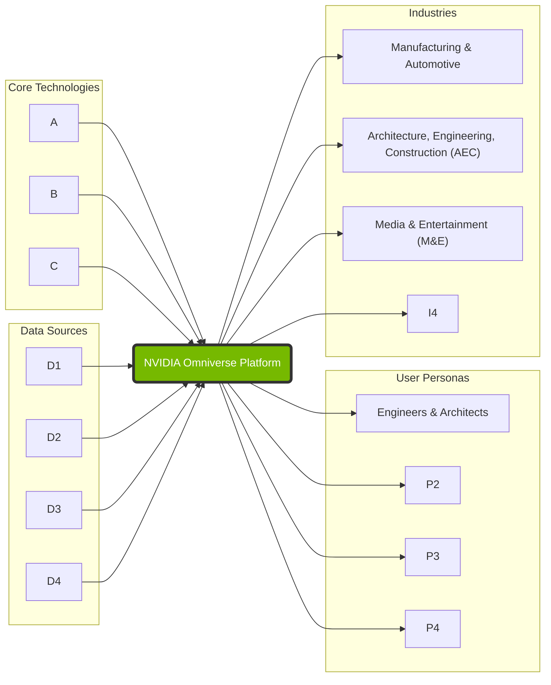
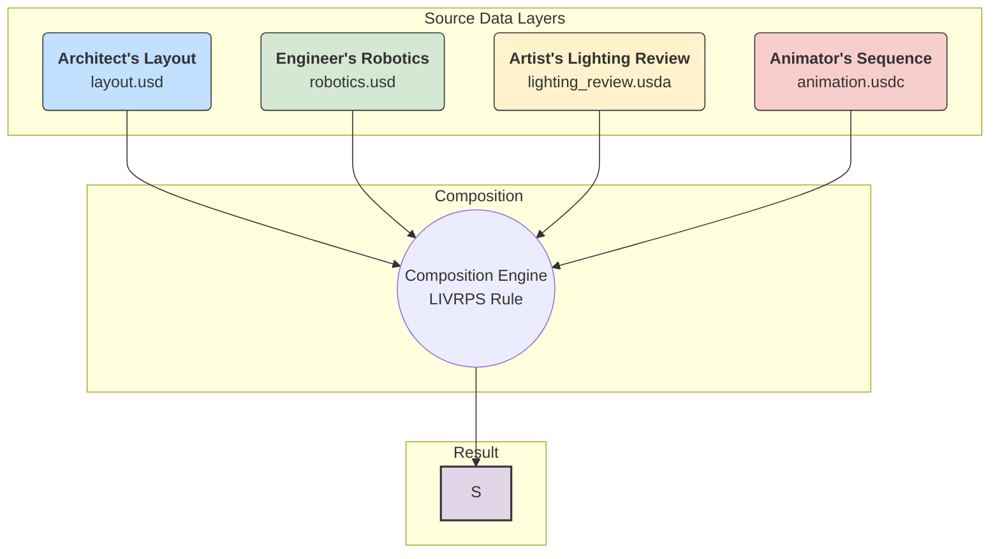
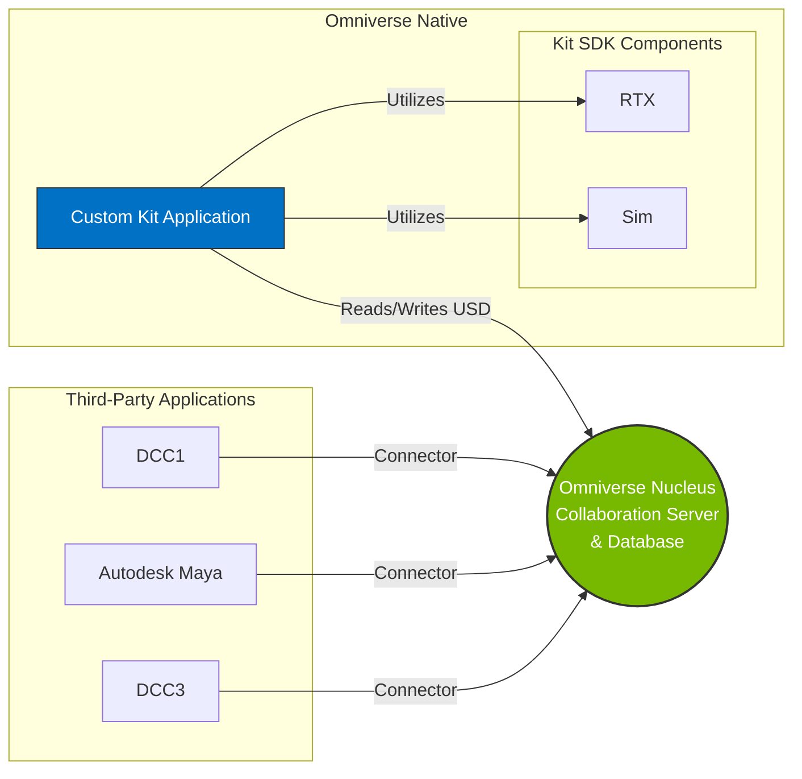
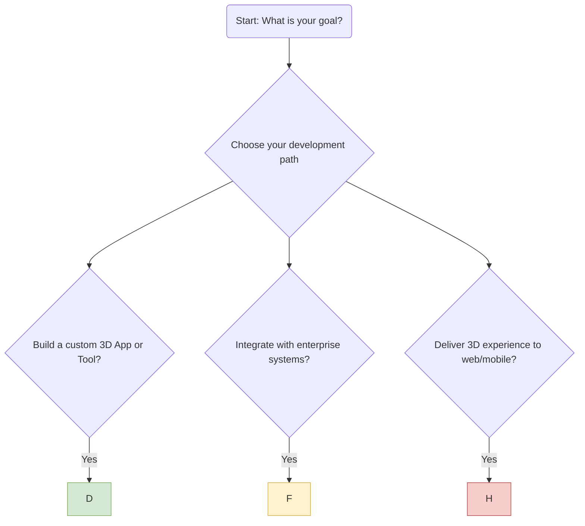
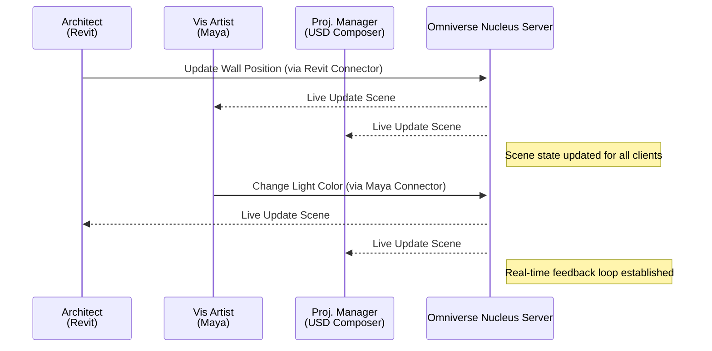
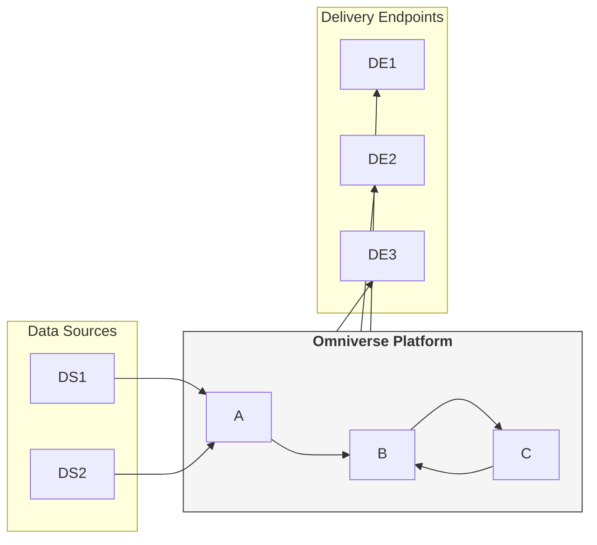
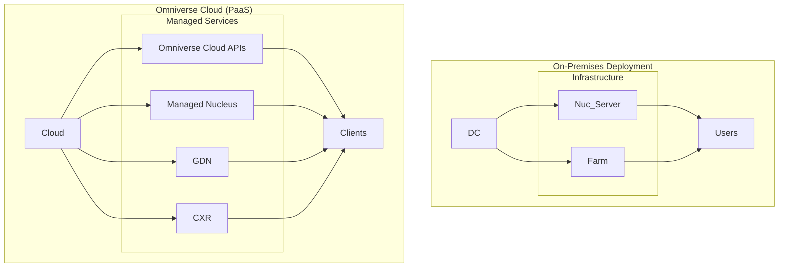

# NVIDIA Omniverse 플랫폼

NVIDIA Omniverse는 단일 애플리케이션이 아닌, Universal Scene Description (OpenUSD) 및 NVIDIA RTX™ 기술을 기반으로 3D 애플리케이션과 서비스를 구축하기 위한 SDK, API, 마이크로서비스로 구성된 모듈식 개발 플랫폼으로 정의됩니다.1 이 플랫폼의 핵심 목표는 산업 디지털화를 가속화하고, 데이터 사일로를 허물며, 팀 간의 실시간 협업을 가능하게 하고, 물리적으로 정확한 세계 규모의 시뮬레이션을 생성하는 것입니다.1

플랫폼의 역량은 세 가지 기본 기둥 위에 구축됩니다.

1. **Universal Scene Description (OpenUSD):** 3D 상호운용성 및 협업을 위한 공통 데이터 프레임워크 역할을 합니다.1
2. **NVIDIA RTX™:** 실시간, 물리 기반 렌더링 및 시뮬레이션을 위한 엔진을 제공합니다.1
3. **인공지능 (AI):** 콘텐츠 생성을 위한 생성형 AI부터 AI 기반 시뮬레이션 및 분석에 이르기까지 플랫폼 전반에 통합되어 워크플로우를 향상시킵니다.1

이러한 기술적 기반 위에서 Omniverse는 물리적 세계와 디지털 세계를 연결하는 근본적인 "운영 체제"를 만들려는 NVIDIA의 전략적 이니셔티브로 자리매김합니다. 이는 AI와 가속 컴퓨팅을 모든 산업에 제공하려는 NVIDIA의 더 넓은 사명과 일치합니다.7 본질적으로 Omniverse는 산업용 메타버스를 위한 인프라를 구축하는 것입니다.

이러한 개념적 구조는 다음 다이어그램으로 시각화할 수 있습니다.

Omniverse는 단순한 소프트웨어 제품군을 넘어 NVIDIA의 핵심 비즈니스를 위한 전략적 "플라이휠(flywheel)" 역할을 합니다. 복잡한 3D 워크플로우, 실시간 레이 트레이싱, 대규모 물리 시뮬레이션은 가장 계산 집약적인 작업 중 하나입니다.4 Omniverse는 바로 이러한 워크로드에 대한 수요를 창출하는 매력적인 플랫폼을 제공합니다. 더 나은 시뮬레이션은 더 강력한 RTX GPU를 필요로 하고, 이는 다시 Omniverse 플랫폼에서 훨씬 더 복잡한 시뮬레이션을 가능하게 하는 선순환 구조를 만듭니다. OpenUSD라는 개방형 기반을 통해 광범위한 생태계 채택을 장려하는 동시에, RTX 렌더러 및 AI 서비스와 같은 고성능 구성 요소는 NVIDIA 하드웨어 및 클라우드 생태계에 긴밀하게 연결되어 있습니다. 이 플랫폼 전략은 방어 가능한 해자를 구축하여 Omniverse의 성공이 NVIDIA의 데이터 센터 및 전문 시각화 비즈니스 부문의 성장과 직접적으로 연결되도록 합니다.

OpenUSD를 단순한 3D 파일 형식으로 이해하는 것은 그 잠재력을 과소평가하는 것입니다. OpenUSD는 본질적으로 강력한 **컴포지션 엔진**입니다.10 그 핵심 기능은 여러 소스(레이어)의 데이터를 비파괴적으로 결합하여 단일의 일관된 장면(스테이지)을 만드는 것입니다. 이 아키텍처는 복잡한 3D 파이프라인에서 발생하는 고질적인 문제인 "기술 부채"를 해결하기 위해 설계되었습니다.

전통적인 3D 파이프라인은 부서별로 CAD, 시뮬레이션, 시각화 등 독점적인 형식을 사용하는 전문 소프트웨어에 의존하여 데이터 사일로를 만듭니다.4 이러한 사일로 간의 데이터 이동은 느리고 손실이 많으며 수동적인 가져오기/내보내기 프로세스를 필요로 합니다. 초기 설계 단계의 변경 사항이 후속 작업에 연쇄적인 업데이트를 유발하여 막대한 시간과 비용을 초래합니다.

OpenUSD의 레이어링 시스템은 이 문제를 정면으로 해결합니다. 원본 CAD 데이터는 기본 레이어에 그대로 유지되고, 시뮬레이션 설정, 재질 적용, 애니메이션과 같은 후속 작업은 별도의 레이어에 희소 오버라이드(sparse override)로 추가됩니다.10 원본 CAD 데이터가 업데이트되면 해당 단일 레이어만 교체하면 됩니다. 컴포지션 엔진은 다른 레이어의 모든 후속 작업을 자동으로 다시 적용하여 설계 반복과 오류 전파에 드는 비용을 극적으로 줄입니다. BMW가 계획 시간 및 오류를 30% 감소시킨 사례는 이러한 효율성을 입증합니다.13

OpenUSD의 핵심 개념은 다음과 같습니다.

- **프림 (Primitives, Prims):** USD 씬의 기본 구성 요소로, 계층 구조로 구성됩니다. 프림은 속성과 데이터를 담는 컨테이너입니다(예: 메시, 조명, 카메라).10
- **레이어 (Layers):** 프림 정의 및 속성 오버라이드를 포함하는 개별 파일 또는 데이터 스트림(`.usd`, `.usda`, `.usdc`)입니다. 이는 병렬적이고 충돌 없는 워크플로우를 가능하게 하는 메커니즘입니다.10
- **스테이지 (Stage):** 모든 레이어의 집계 결과로 생성되는 메모리 내 장면 표현입니다. 사용자가 궁극적으로 보고 상호 작용하는 것이 바로 스테이지입니다.10
- **컴포지션 아크 (Composition Arcs):** 레이어가 결합되는 방식을 제어하는 규칙으로, `subLayers`(레이어 쌓기), `references`(에셋 포함), `variants`(에셋의 사전 정의된 변형) 등이 포함됩니다.11

Omniverse 생태계는 Nucleus 서버에 의해 관리되는 `.live` 레이어를 도입하여 실시간, 다중 사용자 저작을 가능하게 합니다.15 한 사용자가 변경한 사항은 다른 모든 연결된 사용자의 스테이지에 실시간으로 브로드캐스트되고 합성됩니다.

이러한 비파괴적 워크플로우는 다음 다이어그램으로 설명할 수 있습니다.

Omniverse 플랫폼은 5개의 주요 기능 구성 요소로 분해될 수 있으며, 이들은 상호 작용하여 완전한 생태계를 형성합니다.13 이 아키텍처는 의도적으로 최신 클라우드 네이티브 설계 패턴을 반영하여 모듈식이고 확장 가능하도록 설계되었습니다. 이는 단일 워크스테이션에서 모든 구성 요소를 실행하는 소규모 팀부터 전용 서버와 클라우드 GPU 클러스터를 사용하는 대기업에 이르기까지 다양한 규모의 배포를 지원하는 핵심적인 설계 선택입니다.3

- **Omniverse Nucleus:** 플랫폼의 상태 저장 코어입니다. OpenUSD 데이터를 관리하고 동기화하는 데이터베이스 및 협업 서버 역할을 합니다. 모든 연결된 애플리케이션과 사용자를 위한 "단일 진실 공급원(single source of truth)"으로서 "라이브 싱크" 워크플로우를 가능하게 합니다.3 이는 클라우드 네이티브 아키텍처의 영구적이고 상태 저장적인 백엔드 데이터베이스와 유사합니다.
- **Omniverse Connect:** 상호운용성 계층입니다. **커넥터(Connectors)**라고 불리는 플러그인 라이브러리로 구성되어 있으며, Autodesk Maya, Revit, Trimble SketchUp과 같은 타사 DCC(Digital Content Creation) 애플리케이션을 Omniverse 생태계에 통합합니다.4 커넥터는 이러한 애플리케이션이 Nucleus와 실시간으로 데이터를 읽고 쓸 수 있도록 하는 API 통합 또는 데이터 어댑터 역할을 합니다.
- **Omniverse Kit:** 네이티브 Omniverse 애플리케이션 및 확장 프로그램을 구축하기 위한 모듈식 SDK입니다. UI, 데이터 관리, 렌더링 등을 위한 Python 및 C++ API가 포함된 프레임워크를 제공하여 개발자가 특정 목적에 맞는 도구를 만들 수 있도록 합니다.1 이는 React와 같은 웹 프론트엔드 프레임워크나 모바일 SDK에 비유할 수 있습니다.
- **Omniverse Simulation:** 물리적으로 정확한 시뮬레이션을 실행하기 위한 기술 모음입니다. 여기에는 강체 및 연체, 유체에 대한 물리 시뮬레이션과 로봇 공학(Isaac Sim) 및 자율 주행 차량을 위한 특수 솔버와의 통합이 포함됩니다.1
- **Omniverse RTX Renderer:** 멀티 GPU, 실시간 렌더링 엔진입니다. NVIDIA RTX 기술을 활용하여 대화형 세션을 위한 실시간 레이 트레이싱과 최종 프레임 품질의 비주얼을 위한 고품질 패스 트레이싱을 모두 제공합니다.4 렌더러와 시뮬레이션은 전용 하드웨어("Farm" 또는 클라우드 GPU)에서 독립적으로 확장할 수 있는 전문화된 계산 집약적 마이크로서비스로 기능합니다.3

이 구성 요소들 간의 데이터 및 제어 흐름은 다음 다이어그램에 요약되어 있습니다.

NVIDIA는 성공적인 플랫폼이 뛰어난 핵심 기술뿐만 아니라 번성하는 개발자 생태계를 필요로 한다는 것을 이해하고 있습니다. 따라서 Omniverse는 전통적인 3D 그래픽 프로그래머뿐만 아니라 광범위한 개발자를 대상으로 설계되었습니다. 공식 문서는 3D 애플리케이션 개발자, 서비스 개발자, 웹 개발자, IT/DevOps/MLOps를 명시적으로 타겟팅합니다.2

NVIDIA는 다양한 유형의 개발자(애플리케이션, 백엔드, 웹)를 위한 명확하고 잘 문서화된 경로를 제공함으로써 기업 IT 부서의 진입 장벽을 낮추고 있습니다. `블루프린트`(참조 프로젝트), `워크플로우`(모범 사례 가이드), GitHub의 샘플 코드는 채택을 가속화하고 초기 학습 곡선을 줄이기 위한 의도적인 전략입니다.1 이는 Omniverse를 기업의 IT 및 DevOps 팀이 관리하는 소프트웨어 인프라의 핵심적인 통합 부분으로 만들려는 직접적인 전략입니다.

개발자는 목표에 따라 다음 세 가지 주요 경로 중 하나를 선택할 수 있습니다.

1. **네이티브 애플리케이션/확장 프로그램 개발:** 깊이 통합되고 기능이 풍부한 3D 도구를 만드는 경로입니다. 이는 **Omniverse Kit SDK**에 의존하며, Python 및/또는 C++를 사용하여 확장 프로그램이나 독립 실행형 애플리케이션을 구축합니다. 공장 레이아웃을 위한 맞춤형 도구나 독점적인 시뮬레이션 뷰어가 그 예입니다.1
2. **백엔드 서비스 통합:** Omniverse를 기존 엔터프라이즈 시스템과 연결하는 경로입니다. **Omniverse Cloud API**(예: USD Search API, USD Code API)를 사용하여 Nucleus의 데이터와 프로그래밍 방식으로 상호 작용합니다. 이를 통해 에셋 수집을 자동화하거나 디지털 트윈을 ERP 시스템에 연결하는 등의 워크플로우를 구현할 수 있습니다.1
3. **웹 기반 경험 제공:** 로컬 GPU 성능 없이도 광범위한 사용자에게 대화형 3D 콘텐츠를 제공하는 경로입니다. **스트리밍 API**(Kit App Streaming 및 CloudXR 등)를 사용하여 렌더링된 Omniverse 애플리케이션을 표준 웹 브라우저나 경량 클라이언트로 스트리밍합니다.2

개발자는 다음 의사 결정 흐름도를 사용하여 자신의 목표에 가장 적합한 도구와 경로를 식별할 수 있습니다.

제작자(아티스트, 디자이너, 엔지니어)를 위한 최종 사용자 경험은 순차적인 가져오기/내보내기 기반 워크플로우에서 병렬적인 "라이브 싱크" 워크플로우로의 패러다임 전환을 핵심으로 합니다.4 이 혁신은 모든 참여자가 각자의 전문 도구를 사용하여 Nucleus 서버의 동일한 USD 스테이지에 연결함으로써 가능해집니다.

예를 들어, 건축, 엔지니어링 및 건설(AEC) 프로젝트에서는 다음과 같은 시나리오가 펼쳐질 수 있습니다 16:

- 건축가는 Autodesk Revit에서 건물 구조를 수정합니다.
- 동시에 기계 엔지니어는 선호하는 도구를 사용하여 HVAC 시스템을 배치합니다.
- 시각화 아티스트는 Autodesk 3ds Max 또는 Maya에서 조명과 재질을 조정합니다.
- 프로젝트 관리자는 Omniverse USD Composer(구 Create)를 사용하여 완전히 합성되고 사실적인 장면을 실시간으로 보면서 모든 변경 사항을 즉시 확인합니다.

이러한 실시간 협업은 솔루션 아키텍트가 조직의 기존 소프트웨어 생태계에 Omniverse가 어떻게 부합할지 평가하는 데 중요한 정보를 제공합니다. 다음 표는 주요 Omniverse 커넥터와 대상 애플리케이션을 요약하여 "우리 팀이 전문가인 도구를 계속 사용할 수 있는가?"라는 중요한 질문에 답합니다.

**표 1: 주요 NVIDIA Omniverse 커넥터 및 대상 애플리케이션**

| DCC 애플리케이션  | 산업                | 개발자            | 주요 기능                                                   |
| ----------------- | ------------------- | ----------------- | ----------------------------------------------------------- |
| Autodesk 3ds Max  | M&E, AEC            | NVIDIA            | 라이브 싱크, USD 가져오기/내보내기, 재질 변환 18            |
| Autodesk Maya     | M&E, Automotive     | NVIDIA            | 라이브 싱크, USD 가져오기/내보내기, 애니메이션, MDL 지원 18 |
| Autodesk Revit    | AEC                 | NVIDIA            | USD 내보내기, 재질 지원, 프로젝트 게시 27                   |
| Trimble SketchUp  | AEC, Design         | NVIDIA            | 라이브 싱크, USD 가져오기/내보내기, 재질 18                 |
| Unreal Engine     | M&E, Gaming         | NVIDIA            | 라이브 싱크, USD 가져오기/내보내기, 오디오, 재질 매핑 18    |
| Unity             | M&E, Gaming         | NVIDIA            | 라이브 싱크, USD 가져오기/내보내기, 물리, 프리팹 28         |
| Siemens NX        | Manufacturing       | Siemens           | (3rd Party) CAD 데이터 통합 29                              |
| PTC Creo          | Manufacturing       | PTC               | (3rd Party) CAD 데이터 통합                                 |
| Blender           | M&E, General        | NVIDIA            | 라이브 싱크, USD 가져오기/내보내기, 재질 18                 |
| Character Creator | M&E                 | Reallusion        | (3rd Party) 디지털 휴먼, 액세서리, 모션 전송 30             |
| CityEngine        | AEC, Urban Planning | ESRI              | (3rd Party) 3D 도시 모델 전송 및 시각화 30                  |
| Visual Components | Manufacturing       | Visual Components | (3rd Party) 양방향 제조 시뮬레이션 통신 30                  |

이러한 상호 작용은 다음 시퀀스 다이어그램으로 시각화할 수 있습니다.

공장 디지털 트윈은 Omniverse의 모든 역량이 융합된 전형적인 엔터프라이즈 애플리케이션입니다.1 이는 단순한 시각화를 넘어, 물리적 공장을 위한 "AI 공장"으로서 기능합니다. "AI 공장"은 AI 모델을 생산, 개선, 배포하는 파이프라인입니다. Omniverse 디지털 트윈 워크플로우는 바로 이 역할을 수행합니다. 실제 세계에서 수집하기 어렵거나 위험한 시나리오에서 AI 인식 모델을 훈련시키기 위해 방대한 양의 완벽하게 레이블링된 합성 데이터를 생성(SDG)하는 능력은 산업 AI의 가장 큰 병목 현상 중 하나인 데이터 부족 문제를 해결합니다. BMW와 같은 기업에게 디지털 트윈의 주요 경제적 가치는 물리적 시설을 더 효율적으로 운영할 AI를 가상 환경에서 구축하고 검증하는 데 있습니다.32

이 워크플로우는 다음과 같은 엔드투엔드 데이터 흐름을 따릅니다.

1. **데이터 수집 및 집계:** 여러 도메인의 데이터를 소싱합니다. 여기에는 Revit, NX와 같은 도구의 건물 및 기계 CAD 모델과 같은 `기하학적 데이터`와 IoT 장치의 실시간 센서 스트림, ERP 시스템의 생산 일정과 같은 `운영 데이터`가 포함됩니다. 이 데이터는 통합된 USD 스테이지로 집계됩니다.29
2. **시뮬레이션 및 증강:** 디지털 트윈이 "살아 움직이게" 됩니다. 물리 시뮬레이션을 실행하여 자재 흐름과 로봇 운동학을 모델링합니다. 결정적으로, 트윈은 Omniverse Replicator를 사용하여 **합성 데이터 생성(Synthetic Data Generation, SDG)**의 소스로 사용되어 AI 인식 모델을 훈련시킵니다.1
3. **AI 피드백 루프:** 합성 데이터와 실제 데이터로 훈련된 AI 모델은 물리적 로봇을 제어하거나 품질 검사를 수행하기 위해 배포됩니다. 이러한 실제 시스템의 성능은 새로운 데이터를 생성하고, 이는 다시 디지털 트윈에 피드백되어 시뮬레이션을 더욱 정교하게 만들고 AI를 재훈련시키는 지속적인 최적화 루프를 만듭니다.31
4. **제공 및 상호 작용:** 최종적인 대화형 디지털 트윈은 고성능 `로컬 워크스테이션`, `가상 워크스테이션`, `웹 브라우저`로의 스트리밍, 또는 CloudXR을 사용한 `VR/AR 헤드셋`을 통한 몰입형 경험 등 다양한 엔드포인트를 통해 다양한 이해관계자에게 제공됩니다.17

이 완전한 데이터 라이프사이클은 다음 참조 아키텍처 다이어그램에 요약되어 있습니다.

기업은 보안, 성능, 재무 요구 사항이 각기 다르다는 점을 인식하여 Omniverse는 두 가지 주요 배포 모델을 제공합니다. 이 이중 배포 모델은 시장 침투를 위한 전략적 도구입니다. IP 보안 문제로 인해 클라우드 채택에 보수적인 자동차, 항공 우주, 정부와 같은 산업을 공략하기 위해서는 온프레미스 옵션이 필수적입니다.12 동시에, PaaS(Platform-as-a-Service) 오퍼링은 온프레미스 배포에 필요한 IT 오버헤드를 감당할 수 없는 클라우드 네이티브 기업, 스타트업, 소규모 팀을 확보하는 데 중요합니다. 이 전략은 Omniverse의 총 유효 시장을 극대화하고 플랫폼의 전반적인 네트워크 효과를 가속화합니다.

- **온프레미스(On-Premises) 배포:**

  - **구성 요소:** 고객이 자체 인프라를 관리해야 합니다. 여기에는 **Nucleus**용 서버, 렌더링/시뮬레이션을 위한 **Farm** 클러스터, 사용자를 위한 강력한 **NVIDIA RTX 워크스테이션**이 포함됩니다.16
  - **사용 사례:** 엄격한 데이터 주권/보안 정책이 있거나 대규모 데이터셋으로 최대의 예측 가능한 성능이 필요한 조직(예: 자동차 디자인 스튜디오)에 이상적입니다.

- **Omniverse Cloud (PaaS):**

  - **구성 요소:** 인프라 관리를 추상화하는 완전 관리형 서비스형 플랫폼입니다. AWS, Azure와 같은 주요 클라우드 제공업체에서 실행됩니다.3 최적화된 글로벌 스트리밍을 위한 

    **NVIDIA Graphics Delivery Network (GDN)** 및 몰입형 경험을 위한 **CloudXR**과 같은 통합 서비스를 포함합니다.17

  - **사용 사례:** 초기 자본 투자를 줄이고 배포를 가속화하며 복잡한 네트워크 관리 없이 글로벌 협업을 활성화하고 비용을 운영 비용(OpEx) 모델로 전환하려는 조직에 이상적입니다.

두 배포 모델은 다음 다이어그램에서 나란히 비교할 수 있습니다.

Code snippet

본 보고서의 분석을 종합하면, NVIDIA Omniverse는 개방형 표준(OpenUSD)을 활용하여 독점적인 고성능 컴퓨팅 강점(RTX 및 AI)을 중심으로 포괄적인 생태계를 구축하는 정교하게 설계된 플랫폼입니다. 그 진정한 가치는 단일 기능에 있는 것이 아니라, 실시간 협업, 물리적으로 정확한 시뮬레이션, AI 기반 워크플로우의 융합에 있습니다. 이러한 융합은 현대 3D 제작 및 산업 디지털화의 가장 심오한 과제를 해결합니다.

Omniverse의 핵심 가치 제안은 파이프라인의 "기술 부채"를 제거하고, 분산된 팀이 마치 같은 공간에 있는 것처럼 작업할 수 있도록 하며, 물리적 세계에 배포하기 전에 AI 시스템을 안전하고 비용 효율적으로 개발하고 검증할 수 있는 가상 환경을 제공하는 능력에 있습니다. 이는 단순한 효율성 향상을 넘어, 기업이 제품을 설계, 시뮬레이션, 운영하는 방식을 근본적으로 재구성할 수 있는 잠재력을 가지고 있습니다.

플랫폼의 장기적인 성공은 세 가지 핵심 요소에 달려 있을 것입니다.

1. **OpenUSD 표준의 지속적인 성장과 산업 전반의 채택:** OpenUSD가 3D 데이터 교환의 진정한 공용어가 될수록 Omniverse의 가치는 더욱 커질 것입니다.
2. **Omniverse 커넥터 생태계의 폭과 품질:** 더 많은 타사 애플리케이션이 원활하게 통합될수록 플랫폼의 유용성과 채택률이 높아질 것입니다.
3. **클라우드 배포 오퍼링의 원활함과 접근성:** 클라우드 기반 솔루션으로의 전환이 가속화됨에 따라, 강력하고 사용하기 쉬운 PaaS 모델은 신규 고객을 유치하는 데 결정적인 역할을 할 것입니다.

결론적으로, Omniverse는 차세대 3D 인터넷과 AI 기반 산업을 위한 기본 인프라를 제공하려는 NVIDIA의 대담하고 신뢰할 수 있는 시도를 대표합니다. 이는 단순한 제품이 아니라, NVIDIA의 하드웨어, 소프트웨어, AI 연구의 모든 측면을 통합하여 미래의 디지털 세계를 위한 운영 체제를 구축하려는 장기적인 비전의 구체화입니다.

1. Develop on NVIDIA Omniverse Platform | NVIDIA Developer, accessed July 18, 2025, https://developer.nvidia.com/omniverse
2. Introduction - Omniverse Developer Overview, accessed July 18, 2025, https://docs.omniverse.nvidia.com/dev-overview/latest
3. NVIDIA Omniverse - NVIDIA Docs, accessed July 18, 2025, https://docs.nvidia.com/omniverse/index.html
4. NVIDIA Omniverse - The Future of Collaboration - A23D, accessed July 18, 2025, https://www.a23d.co/blog/nvidia-omniverse-the-future-of-collaboration
5. NVIDIA Omniverse Enterprise, accessed July 18, 2025, https://www.nvidia.com/en-us/omniverse/enterprise/
6. Omniverse Platform for OpenUSD - NVIDIA, accessed July 18, 2025, https://www.nvidia.com/en-us/omniverse/
7. Nvidia Mission and Vision Statement - Business Model Analyst, accessed July 18, 2025, https://businessmodelanalyst.com/nvidia-mission-and-vision-statement/
8. About Us: Company Leadership, History, Jobs, News | NVIDIA, accessed July 18, 2025, https://www.nvidia.com/en-us/about-nvidia/
9. NVIDIA Omniverse - Kinetic Vision, accessed July 18, 2025, https://kinetic-vision.com/omniverse/
10. USD Fundamentals - Data Aggregation and Navigation Guide - NVIDIA Omniverse, accessed July 18, 2025, https://docs.omniverse.nvidia.com/dang/latest/guide/usd/usd-fundamentals.html
11. Nvidia Omniverse - Isaac Sim - Introduction to Universal Scene Description - Blog, accessed July 18, 2025, https://blog.marvik.ai/2024/12/10/nvidia-omniverse-isaac-sim-introduction-to-universal-scene-description/
12. NVIDIA Omniverse™ for Automotive Design and Engineering - Dell, accessed July 18, 2025, https://www.delltechnologies.com/asset/en-ca/products/workstations/industry-market/nvidia-omniverse-for-automotive-design-and-engineering.pdf
13. Exploring the Intersection of NVIDIA Omniverse, Digital Twins ... - Dell, accessed July 18, 2025, https://www.delltechnologies.com/asset/en-us/products/workstations/industry-market/exploring-the-intersection-of-nvidia-omniverse-digital-twins-and-3d-modeling.pdf
14. 【Omniverse】Development 102: Learning OpenUSD | by 帽捲 | Maochinn - Medium, accessed July 18, 2025, https://medium.com/maochinn/omniverse-development-102-openusd-59dee6c16bd5
15. Overview - Omniverse Kit, accessed July 18, 2025, https://docs.omniverse.nvidia.com/kit/docs/omni.kit.usd.layers
16. HP ZCENTRAL AND NVIDIA OMNIVERSE™, accessed July 18, 2025, [https://h20195.www2.hp.com/v2/GetDocument.aspx?docname=4AA7-9426ENW&utm_uptracs=null%3Futm_uptracs%3Dnull](https://h20195.www2.hp.com/v2/GetDocument.aspx?docname=4AA7-9426ENW&utm_uptracs=null?utm_uptracs%3Dnull)
17. Delivery - Reference architecture diagrams for Omniverse, accessed July 18, 2025, https://docs.omniverse.nvidia.com/arch-diagrams/latest/ref-arch-diagrams/factory-dt-diagrams/delivery.html
18. Installing Connectors - Omniverse Connect, accessed July 18, 2025, https://docs.omniverse.nvidia.com/connect/latest/installing-connectors.html
19. Omniverse USD Connectors - NVIDIA NGC, accessed July 18, 2025, https://catalog.ngc.nvidia.com/orgs/nvidia/teams/omniverse/collections/omni_connectors
20. Getting Started with Extensions - Omniverse Kit, accessed July 18, 2025, https://docs.omniverse.nvidia.com/kit/docs/kit-manual/latest/guide/extensions_basic.html
21. NVIDIA Omniverse | Collaboration for an Architectural Scene - YouTube, accessed July 18, 2025, https://www.youtube.com/watch?v=XxVMEWm7IG8
22. NVIDIA Omniverse - GitHub, accessed July 18, 2025, https://github.com/NVIDIA-Omniverse
23. Getting Started with Omniverse: Making an extension in a day - YouTube, accessed July 18, 2025, https://www.youtube.com/watch?v=fU08ALE0PXg
24. B.1 Build your first extension in Omnverse - VRKitchen 2.0's Tutorial!, accessed July 18, 2025, https://vrkitchen20-tutorial.readthedocs.io/en/latest/tutorial/build_extension.html
25. Collaborating and Sharing - Omniverse Digital Twins, accessed July 18, 2025, https://docs.omniverse.nvidia.com/digital-twins/latest/building-full-fidelity-viz/collaborating-sharing.html
26. How to Collaborate on Architectural Design and Simulation with NVIDIA Omniverse, accessed July 18, 2025, https://www.youtube.com/watch?v=9y3GgDdKV3I
27. Omniverse Revit Connector - NVIDIA NGC, accessed July 18, 2025, https://catalog.ngc.nvidia.com/orgs/nvidia/teams/omniverse/resources/omni_revit_connector
28. Omniverse Unity Connector - NVIDIA NGC, accessed July 18, 2025, https://catalog.ngc.nvidia.com/orgs/nvidia/teams/omniverse/resources/omni_unity_connector
29. Factory Digital Twin Reference Architecture - NVIDIA Omniverse, accessed July 18, 2025, https://docs.omniverse.nvidia.com/arch-diagrams/latest/ref-arch-diagrams/factory-dt-diagram.html
30. Third Party Connectors - Omniverse Connect, accessed July 18, 2025, https://docs.omniverse.nvidia.com/connect/latest/3rd-party-connectors.html
31. Omniverse Platform - Reference architecture diagrams for Omniverse - NVIDIA Omniverse, accessed July 18, 2025, https://docs.omniverse.nvidia.com/arch-diagrams/latest/ref-arch-diagrams/factory-dt-diagrams/ov-platform.html
32. NVIDIA Omniverse - Designing, Optimizing and Operating the Factory of the Future, accessed July 18, 2025, https://www.youtube.com/watch?v=6-DaWgg4zF8&pp=0gcJCf0Ao7VqN5tD