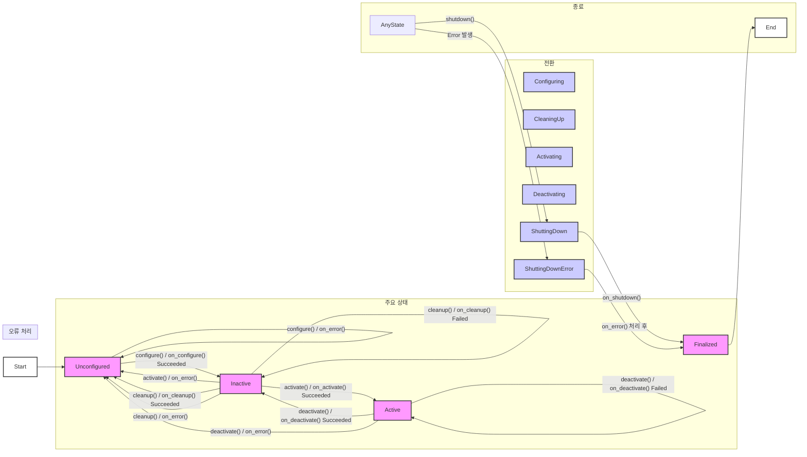

표준 ROS2 노드(`rclcpp::Node` 또는 `rclpy.node.Node`)는 인스턴스화되는 즉시 실행 상태로 전환된다. 즉, 생성자 실행이 완료되면 노드의 모든 기능(퍼블리셔, 서브스크라이버, 서비스 등)이 즉시 활성화된다.1 이러한 '전부 아니면 전무(all-or-nothing)' 방식의 시작 모델은 여러 노드가 상호작용하는 복잡한 로봇 시스템에서 심각한 문제를 야기한다.

표준 노드 모델에는 노드가 자신의 작업을 시작하기 전에 의존하는 다른 노드나 하드웨어 드라이버가 준비되었는지 확인할 수 있는 내장 메커니즘이 없다. 이로 인해 시스템 시작 시 경쟁 조건(race condition)이 발생하거나, 노드 실행 순서가 보장되지 않아 예측 불가능한 동작으로 이어질 수 있다. 예를 들어, 카메라 드라이버 노드가 완전히 초기화되어 이미지를 발행하기 전에, 이를 사용하는 인식(perception) 노드가 먼저 실행되어 데이터를 처리하려고 시도하면 시스템 충돌이나 잘못된 결과를 초래할 수 있다.3 초기화 실패 시 시스템 전체가 불안정한 상태에 빠지거나, 실패한 노드를 복구하는 과정이 복잡해지는 문제도 있다.


ROS2의 노드 생명주기, 즉 '관리형 노드(Managed Nodes)'는 이러한 표준 노드 모델의 근본적인 한계를 해결하기 위해 도입되었다. 관리형 노드의 핵심 목표는 ROS 시스템의 상태에 대한 더 정밀한 제어권을 개발자에게 제공하는 것이다.4 이를 통해 `roslaunch`와 같은 시스템 오케스트레이션 도구는 모든 구성 요소가 올바르게 인스턴스화되고 준비되었음을 보장한 후에야 실제 동작을 시작하도록 할 수 있다.4

이러한 제어권은 세 가지 핵심적인 아키텍처적 이점을 제공한다:

1. **결정성 (Determinism)**: 시스템을 예측 가능하고 정해진 순서에 따라 시작하고 종료할 수 있다. 자율 주행이나 로봇 팔 제어와 같은 안전이 중요한(safety-critical) 시스템에서 이는 선택이 아닌 필수 사항이다.
2. **제어 (Control)**: 개발자는 노드의 상태를 런타임에 세밀하게 제어할 수 있다. 노드를 파괴하고 재생성할 필요 없이, 명령에 따라 초기화, 설정, 활성화, 비활성화, 정리 작업을 수행할 수 있다. 이는 런타임 중 파라미터 변경이나 리소스 집약적인 프로세스의 일시 중지와 같은 작업을 수행하는 데 필수적이다.2
3. **견고성 (Robustness)**: 상태 머신(State Machine)은 실패를 처리하기 위한 공식적인 구조를 제공한다. 특정 노드가 설정 또는 활성화 단계에서 실패하더라도, 시스템은 예측 불가능하게 충돌하는 대신 제어된 방식으로 대응할 수 있다.1

이러한 원칙들을 통해, 관리형 노드는 단순한 노드 실행을 넘어, 전체 로봇 시스템의 동작을 체계적으로 관리하고 조율하는 강력한 패러다임을 제시한다.


관리형 노드는 시스템 아키텍처 관점에서 세 가지 중요한 목표를 달성하도록 설계되었다.

1. **예측 가능한 시작 (Predictable Startup)**: 노드는 온라인 상태에서 재시작되거나 교체될 수 있으며, 의존성을 가진 노드들이 먼저 활성화된 후에 해당 노드가 활성화되는 '연쇄적 시작(cascading bringup)'을 가능하게 한다.4 ROS2의 Navigation2 스택은 이를 가장 잘 보여주는 사례다. 제어, 경로 계획, 행동 서버 등 핵심 구성 요소들이 정해진 순서에 따라 설정되고 활성화됨으로써, 시스템이 불완전하거나 위험한 상태로 동작하는 것을 원천적으로 방지한다.1
2. **런타임 재설정 (Runtime Reconfiguration)**: `Inactive` 상태는 이 목표의 핵심이다. 이 상태는 노드가 모든 리소스를 할당받았지만 아직 활발히 동작하지 않는 '대기' 모드를 제공한다. 이 상태에서 개발자는 활성화된 다른 시스템에 영향을 주지 않고 안전하게 노드의 파라미터를 변경하거나 통신 설정을 수정할 수 있다.1
3. **정상 종료 (Graceful Shutdown)**: `deactivate`, `cleanup`, `shutdown` 상태 전환은 하드웨어 연결이나 파일 핸들과 같은 시스템 리소스가 제어된 순서에 따라 깨끗하게 해제되도록 보장한다. 이는 리소스 누수나 하드웨어 손상을 방지하는 데 매우 중요하다.

이러한 아키텍처 목표는 관리형 노드가 단순한 기능 추가가 아니라, 로봇 소프트웨어의 안정성과 신뢰성을 한 단계 끌어올리는 핵심적인 설계 패턴임을 보여준다. 표준 노드는 리소스 할당(생성자)과 리소스 활성화(실행)가 강하게 결합되어 있다. 반면, 생명주기 노드는 리소스 할당(`on_configure`)과 리소스 활성화(`on_activate`)를 명확하게 분리한다.

이러한 분리(decoupling)는 견고한 소프트웨어 아키텍처의 기본 원칙인 '관심사의 분리(Separation of Concerns)'를 구현한다. 즉, 노드의 상태를 언제 변경할지에 대한 *정책(policy)*은 외부 오케스트레이터가 담당하고, 상태 전환을 어떻게 수행할지에 대한 *메커니즘(mechanism)*은 노드 자체가 책임진다. 이 덕분에 센서 드라이버의 핵심 로직은 전체 로봇 시스템의 시작 순서를 알 필요 없이, 자신의 상태 전환만 올바르게 구현하면 된다. 시스템 수준의 동작은 이처럼 잘 정의되고 분리된 구성 요소들의 조율을 통해 나타나며, 이는 복잡한 로봇 소프트웨어의 모듈성과 재사용성을 극대화한다.8


모든 관리형 노드의 핵심에는 동작을 제어하는 유한 상태 머신(Finite State Machine, FSM)이 있다. 이 FSM은 관리형 노드의 '계약'과 같으며, 이 인터페이스를 올바르게 구현한 노드는 어떤 관리 도구와도 호환됨을 보장한다. 관리형 노드는 이 FSM에 따라 실행되며, 그 외의 내부 구현은 외부에서 알 필요 없는 '블랙박스'로 간주될 수 있다.4


ROS2의 생명주기 구현은 두 가지 종류의 상태를 구분한다: `Primary States`(주요 상태)와 `Transition States`(전환 상태).10

- **주요 상태 (Primary States)**: 노드가 안정적으로 머무를 수 있는 상태다. 이 상태에서 노드는 특정 작업을 수행하거나 대기한다.
- **전환 상태 (Transition States)**: 두 주요 상태 사이를 이동하는 동안 일시적으로 존재하는 중간 상태다. 이 상태는 특정 전환 콜백 함수가 실행되는 동안에만 유지된다.

이 FSM 구조는 노드의 동작을 예측 가능하게 만들고, 외부에서 노드의 상태를 명확하게 파악하고 제어할 수 있는 기반을 제공한다.


생명주기 FSM은 4개의 주요 상태, 6개의 전환 상태, 그리고 1개의 오류 처리 상태로 구성된다. 각 상태의 목적, 허용된 작업, 그리고 유효한 전환 경로는 ROS2 설계 문서에 명확히 정의되어 있다.4




- **`Unconfigured`**: 노드가 인스턴스화된 직후의 초기 상태다. 오류 발생 후 복구를 위해 돌아오는 상태이기도 하다. 이 상태에서는 어떠한 리소스도 할당되거나 설정되지 않은 상태여야 한다.
  - **유효 전환**: `configure`를 통해 `Inactive` 상태로, `shutdown`을 통해 `Finalized` 상태로 전환될 수 있다.
- **`Inactive`**: 노드가 모든 설정을 마쳤지만, 아직 어떠한 처리도 수행하지 않는 상태다. 이 상태의 주된 목적은 실행 중인 동작에 영향을 주지 않고 노드를 재설정(파라미터 변경, 토픽 추가/제거 등)하는 것이다. 이 상태에서는 토픽 데이터 수신, 서비스 요청 처리 등의 작업이 수행되지 않는다.
  - **유효 전환**: `activate`를 통해 `Active` 상태로, `cleanup`을 통해 `Unconfigured` 상태로, `shutdown`을 통해 `Finalized` 상태로 전환될 수 있다.
- **`Active`**: 노드의 주된 작동 상태다. 이 상태에서 노드는 데이터를 처리하고, 서비스 요청에 응답하며, 출력을 생성하는 등 모든 핵심 기능을 수행한다. 처리 불가능한 오류가 발생하면 `ErrorProcessing` 상태로 전환된다.
  - **유효 전환**: `deactivate`를 통해 `Inactive` 상태로, `shutdown`을 통해 `Finalized` 상태로 전환될 수 있다.
- **`Finalized`**: 노드가 소멸되기 직전의 최종 상태다. 이 상태에서 유일하게 가능한 전환은 노드의 메모리 해제(소멸)뿐이다. 이 상태는 실패한 노드가 즉시 사라지지 않고 시스템 분석 및 디버깅 도구에 의해 관찰될 수 있도록 하는 데 목적이 있다.1


전환 상태는 해당 이름의 콜백 함수가 실행되는 동안 노드가 머무는 일시적인 상태다.4

- **`Configuring`**: `onConfigure()` 콜백이 실행되는 동안의 상태다. 영구적인 메모리 버퍼 할당, 변경되지 않는 토픽 발행/구독 설정 등 노드의 생애 동안 한 번만 수행되는 작업을 처리한다.
- **`CleaningUp`**: `onCleanup()` 콜백이 실행되는 동안의 상태다. `onConfigure()`에서 할당된 모든 리소스를 해제하고 노드를 `Unconfigured` 상태로 되돌린다.
- **`Activating`**: `onActivate()` 콜백이 실행되는 동안의 상태다. 하드웨어 접근 권한 획득과 같이 노드가 활성 상태일 때만 유지해야 하는 리소스를 확보하는 등 실행을 위한 최종 준비를 한다.
- **`Deactivating`**: `onDeactivate()` 콜백이 실행되는 동안의 상태다. `onActivate()`에서 수행된 변경 사항을 되돌리고 노드의 활성 동작을 중지시킨다.
- **`ShuttingDown`**: `onShutdown()` 콜백이 실행되는 동안의 상태다. 노드 소멸 전에 필요한 모든 정리 작업을 수행한다.


- **`ErrorProcessing`**: 전환 콜백이 `FAILURE`나 `ERROR`를 반환하거나, 처리되지 않은 예외를 던질 때 진입하는 중요한 상태다.4 이 상태에서는 `onError()` 콜백이 호출된다.

  - **복구**: `onError()` 콜백이 `SUCCESS`를 반환하면, 노드는 모든 상태를 정리하고 `Unconfigured` 상태로 전환되어 복구를 시도할 수 있다.
- **실패**: `onError()` 콜백이 `FAILURE`를 반환하거나(기본 동작), 또 다른 오류가 발생하면 노드는 복구 불가능으로 판단되어 `Finalized` 상태로 전환된다.

이러한 FSM의 구조는 로봇 시스템이 예기치 않은 오류에 직면했을 때 무질서하게 붕괴하는 대신, 예측 가능하고 제어된 방식으로 대응할 수 있는 견고한 기반을 제공한다.


아래 표는 생명주기 상태 머신의 전체 로직을 요약한 것으로, 개발자가 상태, 전환, 콜백 간의 관계를 빠르게 파악하는 데 유용한 참조 자료다.

| 상태 유형 | 상태 이름         | 목적 및 설명                                 | 유효 나가는 전환                  | 개발자 콜백       | 성공 시 다음 상태 | 실패 시 다음 상태                     |
| --------- | ----------------- | -------------------------------------------- | --------------------------------- | ----------------- | ----------------- | ------------------------------------- |
| **주요**  | `Unconfigured`    | 인스턴스화 직후 초기 상태. 리소스 할당 없음. | `configure`, `shutdown`           | -                 | -                 | -                                     |
| 전환      | `Configuring`     | 리소스 할당 및 설정 수행.                    | -                                 | `on_configure()`  | `Inactive`        | `Unconfigured` 또는 `ErrorProcessing` |
| **주요**  | `Inactive`        | 설정 완료, 동작 대기 상태. 재설정 가능.      | `activate`, `cleanup`, `shutdown` | -                 | -                 | -                                     |
| 전환      | `Activating`      | 활성화를 위한 최종 준비.                     | -                                 | `on_activate()`   | `Active`          | `ErrorProcessing`                     |
| **주요**  | `Active`          | 모든 기능이 동작하는 주 실행 상태.           | `deactivate`, `shutdown`          | -                 | -                 | -                                     |
| 전환      | `Deactivating`    | 활성 상태의 동작을 중지.                     | -                                 | `on_deactivate()` | `Inactive`        | `ErrorProcessing`                     |
| 전환      | `CleaningUp`      | 할당된 모든 리소스를 해제.                   | -                                 | `on_cleanup()`    | `Unconfigured`    | `ErrorProcessing`                     |
| 전환      | `ShuttingDown`    | 소멸 전 최종 정리 작업 수행.                 | -                                 | `on_shutdown()`   | `Finalized`       | `ErrorProcessing`                     |
| 오류 처리 | `ErrorProcessing` | 전환 실패 또는 예외 발생 시 진입.            | -                                 | `on_error()`      | `Unconfigured`    | `Finalized`                           |
| **주요**  | `Finalized`       | 소멸 직전의 최종 상태. 디버깅 및 분석용.     | `destroy`                         | -                 | -                 | -                                     |

이 상태 머신은 규범적이면서 동시에 확장 가능하다. 주요 상태와 전환 경로는 ROS2 프레임워크에 의해 엄격하게 규정되어 있어 모든 생명주기 노드가 동일한 인터페이스를 갖도록 보장한다. 이는 생태계의 상호 운용성을 위한 핵심적인 특징이다. 그러나 각 상태 *내에서* 수행되는 구체적인 동작은 전적으로 개발자가 구현하는 콜백 함수에 의해 결정된다. 심지어 `Active` 상태 내에서 애플리케이션 고유의 복잡한 상태 머신을 실행하는 것도 가능하다.12

따라서 ROS2 생명주기 FSM은 애플리케이션 수준의 상태 관리를 대체하는 것이 아니라, 이를 위한 견고한 컨테이너를 제공하는 기본 계층으로 이해해야 한다. 생명주기 FSM은 노드가 더 넓은 ROS 시스템과 상호작용하는 '거시적(macro)' 상태를 관리하고, 개발자는 `Active` 상태 내에서 애플리케이션의 '미시적(micro)' 상태를 자유롭게 구현할 수 있다.


이 섹션에서는 공식 `lifecycle_talker` 데모를 참조 모델로 사용하여 C++로 생명주기 노드를 생성하는 실용적이고 코드 중심적인 가이드를 제공한다.


생명주기 노드를 작성하기 위한 첫 단계는 상속받는 기본 클래스를 변경하는 것이다. 표준 `rclcpp::Node` 대신 `rclcpp_lifecycle::LifecycleNode`를 상속받아야 한다.10

```C++
#include "rclcpp_lifecycle/lifecycle_node.hpp"

class MyLifecycleNode : public rclcpp_lifecycle::LifecycleNode
{
public:
  explicit MyLifecycleNode(const std::string & node_name, const rclcpp::NodeOptions & options = rclcpp::NodeOptions())
  : rclcpp_lifecycle::LifecycleNode(node_name, options)
  {}
  
  // Transition callbacks will be defined here
};
```

이 클래스 변경은 `<rclcpp_lifecycle/lifecycle_node.hpp>` 헤더를 통해 새로운 인터페이스를 제공한다. 가장 중요한 것은 상태 전환 시 호출되는 가상 콜백 함수들이다. 이 함수들을 재정의(override)하여 각 전환 단계에 맞는 사용자 정의 로직을 구현하게 된다.13


각 전환 콜백은 `rclcpp_lifecycle::node_interfaces::LifecycleNodeInterface::CallbackReturn` 열거형 값을 반환해야 한다. 이 값은 `SUCCESS`, `FAILURE`, `ERROR` 중 하나이며, 상태 머신의 다음 상태를 결정한다.13

- **`on_configure()`**: 이 콜백은 `configure` 전환이 트리거될 때 호출된다. 퍼블리셔, 서브스크라이버, 타이머, 파라미터 등 노드가 비활성 상태에서도 유지해야 할 리소스를 할당하고 설정하는 곳이다. 여기서의 실패는 시스템의 다른 부분에 영향을 주기 전에 초기 단계에서 문제를 발견할 수 있게 해준다.

  ```C++
  CallbackReturn on_configure(const rclcpp_lifecycle::State &)
  {
    RCLCPP_INFO(get_logger(), "on_configure() is called.");
    // Publisher, timer, etc. are created here.
    // Parameters are read and configured.
    return CallbackReturn::SUCCESS;
  }
  ```

- **`on_activate()`**: `activate` 전환 시 호출된다. `on_configure`에서 생성된 리소스들의 실제 동작을 시작하는 역할을 한다. 예를 들어, 타이머를 시작하거나, `LifecyclePublisher`를 활성화하여 메시지 발행을 허용한다. 이 작업은 신속하게 완료되어야 한다.

  ```C++
  CallbackReturn on_activate(const rclcpp_lifecycle::State &)
  {
    RCLCPP_INFO(get_logger(), "on_activate() is called.");
    // Activate publishers and timers.
    // For LifecyclePublisher: pub_->on_activate();
    return CallbackReturn::SUCCESS;
  }
  ```

- **`on_deactivate()`**: `deactivate` 전환 시 호출되며, `on_activate`의 반대 역할을 한다. 리소스를 해제하지 않고 노드의 기능만 일시 중지시킨다.

  ```C++
  CallbackReturn on_deactivate(const rclcpp_lifecycle::State &)
  {
    RCLCPP_INFO(get_logger(), "on_deactivate() is called.");
    // Deactivate publishers and timers.
    // For LifecyclePublisher: pub_->on_deactivate();
    return CallbackReturn::SUCCESS;
  }
  ```

- **`on_cleanup()`**: `cleanup` 전환 시 호출되며, `on_configure`의 반대 역할을 한다. `on_configure`에서 할당된 모든 리소스를 해제하고, 노드를 생성자 호출 직후와 동일한 상태로 되돌려야 한다.

  ```C++
  CallbackReturn on_cleanup(const rclcpp_lifecycle::State &)
  {
    RCLCPP_INFO(get_logger(), "on_cleanup() is called.");
    // Release all resources created in on_configure.
    // pub_.reset(); timer_.reset();
    return CallbackReturn::SUCCESS;
  }
  ```

- **`on_shutdown()`**: `shutdown` 전환 시 호출된다. `Finalized` 상태로 가기 전, 노드가 어떤 주요 상태에 있든 호출될 수 있는 마지막 정리 기회다.

  ```C++
  CallbackReturn on_shutdown(const rclcpp_lifecycle::State &)
  {
    RCLCPP_INFO(get_logger(), "on_shutdown() is called.");
    // Perform final cleanup.
    return CallbackReturn::SUCCESS;
  }
  ```

- **`on_error()`**: 다른 콜백에서 `FAILURE`나 `ERROR`를 반환하거나 예외가 발생했을 때 호출되는 핵심적인 복구 함수다. 이 함수의 `previous_state` 인자는 오류가 발생하기 *전*의 주요 상태를 알려주지만, 어떤 전환 상태(`Configuring`, `Activating` 등)에서 오류가 발생했는지 또는 어떤 예외가 발생했는지에 대한 직접적인 정보는 제공하지 않는다는 한계가 있다.16

  - 기본적으로 `on_error`는 `FAILURE`를 반환하여 노드를 `Finalized` 상태로 보낸다.17
  - 개발자가 의도적으로 복구를 시도하려면, 모든 리소스를 완벽하게 정리한 후 `SUCCESS`를 반환해야 한다. 그러면 노드는 `Unconfigured` 상태로 전환되어 재설정을 시도할 수 있다.

  ```C++
  CallbackReturn on_error(const rclcpp_lifecycle::State & previous_state)
  {
    RCLCPP_ERROR(get_logger(), "on_error() is called from state %s.", previous_state.label().c_str());
    // Perform cleanup and recovery actions.
    // Returning SUCCESS transitions to Unconfigured.
    // Returning FAILURE or ERROR transitions to Finalized.
    return CallbackReturn::SUCCESS;
  }
  ```


아래는 `ros2/demos` 저장소에 있는 `lifecycle_talker.cpp`의 전체 소스 코드에 상세한 주석을 추가한 것이다. 이 코드는 생명주기 노드의 개념을 실제로 어떻게 구현하는지 명확하게 보여준다.14

```C++
// Copyright 2016 Open Source Robotics Foundation, Inc.
//
// Licensed under the Apache License, Version 2.0 (the "License");
// you may not use this file except in compliance with the License.
// You may obtain a copy of the License at
//
//     http://www.apache.org/licenses/LICENSE-2.0
//
// Unless required by applicable law or agreed to in writing, software
// distributed under the License is distributed on an "AS IS" BASIS,
// WITHOUT WARRANTIES OR CONDITIONS OF ANY KIND, either express or implied.
// See the License for the specific language governing permissions and
// limitations under the License.

#include <chrono>
#include <memory>
#include <string>
#include <utility>

#include "lifecycle_msgs/msg/transition.hpp"
#include "rclcpp/rclcpp.hpp"
#include "rclcpp/publisher.hpp"
#include "rclcpp_lifecycle/lifecycle_node.hpp"
#include "rclcpp_lifecycle/lifecycle_publisher.hpp"
#include "std_msgs/msg/string.hpp"

using namespace std::chrono_literals;

// LifecycleTalker 클래스는 rclcpp_lifecycle::LifecycleNode를 상속받는다.
class LifecycleTalker : public rclcpp_lifecycle::LifecycleNode
{
public:
  explicit LifecycleTalker(const std::string & node_name, bool intra_process_comms = false)
  : rclcpp_lifecycle::LifecycleNode(node_name,
      rclcpp::NodeOptions().use_intra_process_comms(intra_process_comms))
  {}

  // on_configure 콜백: 'configuring' 상태에서 호출된다.
  // 리소스 할당(퍼블리셔, 타이머 등)을 수행한다.
  rclcpp_lifecycle::node_interfaces::LifecycleNodeInterface::CallbackReturn
  on_configure(const rclcpp_lifecycle::State &)
  {
    RCLCPP_INFO(get_logger(), "on_configure() is called.");

    pub_ = this->create_publisher<std_msgs::msg::String>("lifecycle_chatter", 10);
    timer_ = this->create_wall_timer(
      1s, std::bind(&LifecycleTalker::publish, this));

    return rclcpp_lifecycle::node_interfaces::LifecycleNodeInterface::CallbackReturn::SUCCESS;
  }

  // on_activate 콜백: 'activating' 상태에서 호출된다.
  // 할당된 리소스의 동작을 시작한다.
  rclcpp_lifecycle::node_interfaces::LifecycleNodeInterface::CallbackReturn
  on_activate(const rclcpp_lifecycle::State &)
  {
    RCLCPP_INFO(get_logger(), "on_activate() is called.");

    // LifecyclePublisher를 활성화하여 메시지 발행을 시작한다.
    pub_->on_activate();

    return rclcpp_lifecycle::node_interfaces::LifecycleNodeInterface::CallbackReturn::SUCCESS;
  }

  // on_deactivate 콜백: 'deactivating' 상태에서 호출된다.
  // 리소스의 동작을 중지시킨다.
  rclcpp_lifecycle::node_interfaces::LifecycleNodeInterface::CallbackReturn
  on_deactivate(const rclcpp_lifecycle::State &)
  {
    RCLCPP_INFO(get_logger(), "on_deactivate() is called.");

    // LifecyclePublisher를 비활성화하여 메시지 발행을 중단한다.
    pub_->on_deactivate();

    return rclcpp_lifecycle::node_interfaces::LifecycleNodeInterface::CallbackReturn::SUCCESS;
  }

  // on_cleanup 콜백: 'cleaningup' 상태에서 호출된다.
  // on_configure에서 할당한 모든 리소스를 해제한다.
  rclcpp_lifecycle::node_interfaces::LifecycleNodeInterface::CallbackReturn
  on_cleanup(const rclcpp_lifecycle::State &)
  {
    RCLCPP_INFO(get_logger(), "on_cleanup() is called.");

    timer_.reset();
    pub_.reset();

    return rclcpp_lifecycle::node_interfaces::LifecycleNodeInterface::CallbackReturn::SUCCESS;
  }

  // on_shutdown 콜백: 'shuttingdown' 상태에서 호출된다.
  // 노드가 소멸되기 전 최종 정리 작업을 수행한다.
  rclcpp_lifecycle::node_interfaces::LifecycleNodeInterface::CallbackReturn
  on_shutdown(const rclcpp_lifecycle::State & state)
  {
    RCLCPP_INFO(get_logger(), "on_shutdown() is called from state %s.", state.label().c_str());

    timer_.reset();
    pub_.reset();

    return rclcpp_lifecycle::node_interfaces::LifecycleNodeInterface::CallbackReturn::SUCCESS;
  }

private:
  // 타이머 콜백 함수: 주기적으로 메시지를 발행한다.
  void publish()
  {
    static size_t count = 0;
    auto msg = std::make_unique<std_msgs::msg::String>();
    msg->data = "Lifecycle HelloWorld #" + std::to_string(++count);

    // 퍼블리셔가 활성화 상태가 아니면, publish()를 호출해도 실제 메시지는 전송되지 않는다.
    if (!pub_->is_activated()) {
      RCLCPP_INFO(
        get_logger(), "Lifecycle publisher is currently inactive. Messages are not published.");
    } else {
      RCLCPP_INFO(
        get_logger(), "Lifecycle publisher is active. Publishing: [%s]", msg->data.c_str());
    }

    pub_->publish(std::move(msg));
  }

  std::shared_ptr<rclcpp_lifecycle::LifecyclePublisher<std_msgs::msg::String>> pub_;
  std::shared_ptr<rclcpp::TimerBase> timer_;
};

int main(int argc, char * argv)
{
  setvbuf(stdout, NULL, _IONBF, BUFSIZ);

  rclcpp::init(argc, argv);

  rclcpp::executors::SingleThreadedExecutor exe;
  std::shared_ptr<LifecycleTalker> lc_node =
    std::make_shared<LifecycleTalker>("lc_talker");
  exe.add_node(lc_node->get_node_base_interface());
  exe.spin();

  rclcpp::shutdown();

  return 0;
}
```


이 섹션은 C++ 가이드와 마찬가지로, Python 개발자를 위한 완전한 생명주기 노드 구현 가이드를 제공하며 `rclpy` 구현의 미묘한 차이점을 강조한다.


ROS2 Humble과 Rolling 배포판부터 생명주기 노드에 대한 Python 지원이 공식적으로 추가되었다.1 이전에는 생명주기 관리가 C++ 전용 기능이었기 때문에, Python 중심의 개발팀에게는 큰 제약이었다.20 이 기능 추가는 C++과 Python 간의 기능적 동등성을 높이고, 두 언어가 혼합된 시스템에서도 모든 노드를 통일된 생명주기 프레임워크 하에서 관리할 수 있게 되었다는 점에서 중요한 의미를 가진다. 관련 데모 코드는 `ros2/demos` 저장소의 `lifecycle_py` 패키지에서 찾을 수 있다.20


Python에서 생명주기 노드를 작성하려면 `rclpy.lifecycle.Node` 클래스를 상속받아야 한다. 각 상태 전환에 해당하는 콜백 메서드를 구현해야 하며, 이 메서드들은 `TransitionCallbackReturn.SUCCESS` 또는 `TransitionCallbackReturn.FAILURE`를 반환해야 한다.

```Python
import rclpy
from rclpy.lifecycle import Node
from rclpy.lifecycle import State
from rclpy.lifecycle import TransitionCallbackReturn

class MyLifecycleNode(Node):
    def __init__(self, node_name, **kwargs):
        super().__init__(node_name, **kwargs)

    def on_configure(self, state: State) -> TransitionCallbackReturn:
        self.get_logger().info('on_configure() is called.')
        # 리소스 할당 로직
        return TransitionCallbackReturn.SUCCESS

    def on_activate(self, state: State) -> TransitionCallbackReturn:
        self.get_logger().info('on_activate() is called.')
        # 리소스 활성화 로직
        return TransitionCallbackReturn.SUCCESS
    
    # on_deactivate, on_cleanup, on_shutdown, on_error 등 다른 콜백 구현
```

C++의 `rclcpp_lifecycle::LifecycleNode` 개념이 Python의 `rclpy.lifecycle.Node`로 직접 매핑됨을 알 수 있다. 콜백 함수의 역할과 반환 값의 의미도 동일하여, 두 언어 간에 일관된 개발 경험을 제공한다.


아래는 C++ `LifecycleTalker`와 동일한 기능을 수행하는 Python 버전의 전체 코드 예제다. `lifecycle_py` 데모 패키지는 talker 노드만 포함하고 있으며, listener나 service client는 C++ 버전을 사용해야 한다.22 이 예제는 Python에서의 생명주기 노드 구현 구조를 명확히 보여준다.

```python
# Copyright 2022 Open Source Robotics Foundation, Inc.
#
# Licensed under the Apache License, Version 2.0 (the "License");
# you may not use this file except in compliance with the License.
# You may obtain a copy of the License at
#
#     http://www.apache.org/licenses/LICENSE-2.0
#
# Unless required by applicable law or agreed to in writing, software
# distributed under the License is distributed on an "AS IS" BASIS,
# WITHOUT WARRANTIES OR CONDITIONS OF ANY KIND, either express or implied.
# See the License for the specific language governing permissions and
# limitations under the License.

import rclpy
from rclpy.lifecycle import Node
from rclpy.lifecycle import State
from rclpy.lifecycle import TransitionCallbackReturn
from std_msgs.msg import String

class LifecycleTalker(Node):
    """LifecycleTalker는 rclpy.lifecycle.Node를 상속받는 생명주기 노드다."""

    def __init__(self, node_name, **kwargs):
        super().__init__(node_name, **kwargs)
        self._publisher = None
        self._timer = None
        self._count = 0

    def publish(self):
        """타이머에 의해 주기적으로 호출되어 메시지를 발행한다."""
        msg = String()
        msg.data = f'Lifecycle HelloWorld #{self._count}'
        self._count += 1

        if self._publisher is not None and self._publisher.is_activated:
            self.get_logger().info(f'Lifecycle publisher is active. Publishing: [{msg.data}]')
            self._publisher.publish(msg)
        else:
            self.get_logger().info('Lifecycle publisher is inactive. Messages are not published.')

    def on_configure(self, state: State) -> TransitionCallbackReturn:
        """'configuring' 상태에서 호출. 퍼블리셔와 타이머를 생성한다."""
        self.get_logger().info('on_configure() is called.')
        self._publisher = self.create_lifecycle_publisher(String, 'lifecycle_chatter', 10)
        self._timer = self.create_timer(1.0, self.publish)
        return TransitionCallbackReturn.SUCCESS

    def on_activate(self, state: State) -> TransitionCallbackReturn:
        """'activating' 상태에서 호출. 퍼블리셔를 활성화한다."""
        self.get_logger().info('on_activate() is called.')
        # create_lifecycle_publisher는 on_activate를 자동으로 처리하므로,
        # 명시적으로 super()를 호출하여 상위 클래스의 동작을 활성화한다.
        return super().on_activate(state)

    def on_deactivate(self, state: State) -> TransitionCallbackReturn:
        """'deactivating' 상태에서 호출. 퍼블리셔를 비활성화한다."""
        self.get_logger().info('on_deactivate() is called.')
        return super().on_deactivate(state)

    def on_cleanup(self, state: State) -> TransitionCallbackReturn:
        """'cleaningup' 상태에서 호출. 모든 리소스를 해제한다."""
        self.get_logger().info('on_cleanup() is called.')
        self.destroy_timer(self._timer)
        self.destroy_publisher(self._publisher)
        self._publisher = None
        self._timer = None
        return TransitionCallbackReturn.SUCCESS

    def on_shutdown(self, state: State) -> TransitionCallbackReturn:
        """'shuttingdown' 상태에서 호출. 최종 정리 작업을 수행한다."""
        self.get_logger().info('on_shutdown() is called.')
        self.destroy_timer(self._timer)
        self.destroy_publisher(self._publisher)
        return TransitionCallbackReturn.SUCCESS

def main(args=None):
    rclpy.init(args=args)
    executor = rclpy.executors.SingleThreadedExecutor()
    lc_node = LifecycleTalker('lc_talker')
    executor.add_node(lc_node)
    try:
        executor.spin()
    except (KeyboardInterrupt, rclpy.executors.ExternalShutdownException):
        pass
    finally:
        lc_node.destroy_node()
        rclpy.shutdown()

if __name__ == '__main__':
    main()
```


개별 생명주기 노드를 구현하는 것을 넘어, 여러 노드로 구성된 시스템 전체를 관리하고 조율하는 방법을 다룬다. 이 섹션에서는 수동적인 명령줄 제어부터 완전 자동화된 이벤트 기반 시스템 실행까지의 모든 제어 스펙트럼을 설명한다.


`ros2 lifecycle` 명령줄 도구는 생명주기 노드와 상호작용하는 가장 기본적인 수단이며, 디버깅 및 수동 개입에 필수적이다. 이 도구는 노드가 노출하는 내부 서비스를 호출하여 동작한다.10

- **현재 상태 확인 (`get`)**: 노드의 현재 주요 상태를 조회한다.

  ```Bash
  $ ros2 lifecycle get /lc_talker
  unconfigured
  ```

  이 명령은 `/lc_talker` 노드가 현재 `unconfigured` 상태임을 보여준다.10

- **사용 가능한 전환 목록 (`list`)**: 현재 상태에서 가능한 모든 전환 목록을 보여준다.

  ```Bash
  $ ros2 lifecycle list /lc_talker
  - configure 
    Start: unconfigured
    Goal: configuring
  - shutdown 
    Start: unconfigured
    Goal: shuttingdown
  ```

  `unconfigured` 상태에서는 `configure`와 `shutdown` 전환만 가능하다는 것을 알 수 있다.10

- **상태 전환 트리거 (`set`)**: 특정 전환을 실행하여 노드의 상태를 변경한다.

  ```Bash
  # Unconfigured -> Inactive 로 전환
  $ ros2 lifecycle set /lc_talker configure
  Transitioning successful
  
  # Inactive -> Active 로 전환
  $ ros2 lifecycle set /lc_talker activate
  Transitioning successful
  ```

  `set` 명령은 노드의 `change_state` 서비스를 호출하여 상태 전환을 요청한다.10


실제 로봇 시스템에서는 수동 제어 대신 런치 파일을 통해 노드들을 자동으로, 그리고 질서 있게 실행해야 한다. `launch_ros` 패키지는 이를 위한 강력한 메커니즘을 제공한다.

- autostart 파라미터를 이용한 자동 활성화:

  LifecycleNode 런치 액션에 autostart=True 파라미터를 설정하면, 노드가 실행되자마자 자동으로 configure와 activate 전환이 순차적으로 트리거된다.24 이는 생명주기 노드를 일반 노드처럼 간단하게 사용하면서도 내부적으로는 상태 관리의 이점을 유지하고 싶을 때 유용하다.

  ```Python
  # launch file snippet
  from launch_ros.actions import LifecycleNode
  
  ld.add_action(LifecycleNode(
      package='lifecycle',
      executable='lifecycle_talker',
      name='lc_talker',
      namespace='',
      output='screen',
      parameters=
  ))
  ```

- 이벤트 핸들러를 이용한 정교한 오케스트레이션:

  더 복잡한 순차적 시작을 위해서는 런치 시스템의 이벤트 핸들러를 사용해야 한다. RegisterEventHandler와 OnStateTransition을 조합하면 특정 노드가 특정 상태에 도달했을 때 다른 액션을 트리거하도록 선언적으로 시스템 동작을 정의할 수 있다.26

  예를 들어, "talker 노드가 `inactive` 상태에 도달하면, listener 노드를 실행하라"와 같은 로직을 구현할 수 있다.

  ```Python
  # launch_ros/examples/lifecycle_pub_sub_launch.py 예제
  import launch
  from launch_ros.actions import LifecycleNode
  from launch_ros.event_handlers import OnStateTransition
  from launch.actions import RegisterEventHandler, LogInfo
  
  #... talker_node 정의...
  
  # talker_node가 'inactive' 상태에 도달하면 로그를 남기고 'activate' 전환을 요청하는 이벤트 핸들러
  register_event_handler_for_inactive_state = RegisterEventHandler(
      OnStateTransition(
          target_lifecycle_node=talker_node,
          goal_state='inactive',
          entities=,
      )
  )
  ```

  이 방식은 노드 간의 의존성을 명시적으로 관리하여 견고하고 예측 가능한 시스템 시작을 보장하는 핵심 기술이다.


Navigation2와 같이 매우 복잡한 시스템에서는 런치 파일의 선언적 로직만으로는 부족할 수 있다. 이런 경우, 시스템의 모든 노드들의 상태 전환을 전담하는 별도의 '생명주기 관리자' 노드를 두는 것이 효과적인 설계 패턴이다.1

이 관리자 노드는 다른 생명주기 노드들의 `change_state` 서비스에 대한 클라이언트 역할을 한다. 시스템 전체에 대한 고수준의 명령(예: "startup", "shutdown", "reset")을 서비스 형태로 제공받아, 내부 로직에 따라 관리 대상 노드들에게 순차적으로 저수준의 상태 전환 명령을 내린다.

`nav2_lifecycle_manager`는 이 패턴의 대표적인 예시다. 이 노드는 `node_names`라는 파라미터를 통해 관리할 노드들의 목록을 순서대로 받는다. "startup" 요청을 받으면, `node_names` 목록의 노드들을 순서대로 `configure`하고, 모든 노드의 설정이 성공적으로 끝나면 한 번에 모든 노드를 `activate`한다.5

이러한 오케스트레이션 방법들은 단순함과 기능성에 따라 계층을 이룬다.

1. **레벨 1 (명령줄 도구)**: 직접적인 상호작용, 디버깅, 간단한 스크립팅에 사용된다. 선언적이기보다는 명령적이다.
2. **레벨 2 (런치 파일과 이벤트 핸들러)**: 정적인 시스템 구성을 선언적으로 정의하는 데 이상적이다. 고정된 시작 순서를 정의하는 데 탁월하지만, 동적인 런타임 복구나 복잡한 조건부 로직을 표현하기에는 한계가 있다.
3. **레벨 3 (관리자 노드)**: 동적이고 견고한 시스템 관리를 위한 최상위 방법이다. 관리자 노드는 복잡한 상태 로직, 재시도와 같은 복구 전략, 그리고 시스템의 나머지 부분에 "startup"과 같은 고수준 API를 제공할 수 있다.

개발자는 시스템의 요구사항에 맞는 가장 간단한 방법을 선택해야 한다. 결정론적 시작이 필요하면 런치 파일로 시작하고, 복잡한 런타임 조율 및 오류 복구가 필요하면 관리자 노드로 확장하는 것이 합리적인 접근 방식이다.


이 마지막 섹션에서는 생명주기 관리가 핵심적인 ROS2 패키지에서 어떻게 적용되는지 실제 사례를 통해 살펴보고, 기본적인 FSM을 기반으로 구축된 더 높은 수준의 설계 패턴을 소개한다.


`ros2_control` 프레임워크는 로봇의 하드웨어 추상화와 제어를 위한 핵심 패키지로, 안전과 리소스 관리를 위해 생명주기 모델을 깊숙이 채택하고 있다. 이 프레임워크는 하드웨어 컴포넌트와 컨트롤러 모두에 대해 생명주기 기반 모델을 사용한다.30

- **하드웨어 인터페이스 생명주기**: `ResourceManager`는 하드웨어 컴포넌트의 생명주기를 관리한다. 여기서 상태는 물리적 하드웨어의 상태와 직접 연결된다.30

  - `INACTIVE` 상태: 하드웨어와의 통신(예: 시리얼 포트 열기)은 설정되었지만, 모터 전원은 인가되지 않은 안전한 대기 상태를 의미한다.

  - ACTIVE 상태: 모터 전원이 인가되고, 브레이크가 해제되는 등 하드웨어가 실제로 움직일 준비가 완료된 상태를 의미한다.

    이처럼 물리적 동작과 논리적 설정을 분리하는 것은 로봇의 안전을 위해 매우 중요하다.15

- **컨트롤러 생명주기**: `ControllerManager`는 컨트롤러의 로딩, 설정, 활성화, 비활성화를 관리한다.31 이를 통해 런타임 중에 제어 전략을 동적으로 변경할 수 있다. 예를 들어, 로봇 팔을 정밀하게 제어하기 위해 

  `joint_trajectory_controller`에서 `admittance_controller`로 전체 시스템을 재시작하지 않고 전환하는 것이 가능하다. `spawner`, `unspawner`와 같은 스크립트는 이러한 컨트롤러 생명주기와 상호작용하여 런치 타임에 특정 컨트롤러를 활성화하거나 비활성화한다.


단순한 관리자 노드만으로는 표현하기 어려운 복잡한 시스템 의존성이나 동작 모드를 관리하기 위한 고급 패턴과 패키지들이 존재한다.

- **`cascade_lifecycle`**: 이 패키지는 노드 간의 의존성을 정의하여 활성화/비활성화 '트리'를 구성하는 메커니즘을 제공한다.33

  `add_activation()` API를 사용하여 노드 A가 노드 B에 대한 의존성을 추가하면, A에 대한 상태 전환 요청이 자동으로 B에게 전파된다. 이는 중앙 오케스트레이터의 로직을 단순화하고, 시스템의 구조적 의존성을 코드에 명확하게 표현할 수 있게 해준다.

- **`system_modes`**: 이는 생명주기 개념을 한 단계 더 추상화한 고급 패턴이다. `Active` 상태 내에서 "대기", "탐색", "작업"과 같은 애플리케이션 수준의 '모드'를 정의할 수 있게 해준다.34 각 모드는 특정 노드 그룹의 생명주기 상태와 파라미터 값들의 조합으로 정의된다. 이를 통해 로봇 전체의 동작 모드를 더 높은 수준에서 관리하고 전환할 수 있는 강력한 아키텍처를 구축할 수 있다.


생명주기 노드를 효과적으로 사용하기 위해서는 몇 가지 중요한 아키텍처적 고려사항을 이해해야 한다.

- **성능 오버헤드**: 생명주기 노드는 기본적으로 1개의 퍼블리셔(`transition_event`)와 5개의 서비스(`get_state`, `change_state` 등)를 생성한다. 이는 DDS 미들웨어 수준에서 각 노드마다 6개의 DataWriter와 5개의 DataReader를 추가하는 것과 같다.25 수십, 수백 개의 노드로 구성된 대규모 시스템, 특히 Wi-Fi와 같은 불안정한 네트워크 환경에서는 이러한 오버헤드가 노드 발견 시간과 전체 시스템의 시작 성능에 심각한 병목 현상을 일으킬 수 있다.25 따라서 제어의 유연성과 성능 사이의 트레이드오프를 신중하게 고려해야 한다. 

  `LifecycleNode`를 `Node`에 통합하고 `lifecycle="none"`과 같은 옵션을 통해 오버헤드를 줄이려는 논의는 바로 이 문제를 해결하기 위한 것이다.25

- **생명주기 서비스의 QoS 설정**: 상태 전환을 요청하는 `change_state`와 같은 서비스의 신뢰성은 시스템의 안정성에 직결된다. 만약 상태 전환 명령이 `Best Effort` QoS 정책으로 인해 유실된다면, 시스템은 일부 노드만 전환되고 나머지는 그대로인 불일치 상태에 빠져 예측 불가능한 동작을 할 수 있다. 따라서 생명주기 관리와 관련된 모든 서비스 통신에는 반드시 `Reliable` QoS 프로파일을 사용해야 한다. ROS2에서 서비스의 기본 QoS 프로파일은 `Reliable`이므로 대부분의 경우 문제가 없지만, 이를 임의로 변경하지 않도록 주의해야 한다.39

- **생명주기 노드를 사용하지 말아야 할 때**: 모든 노드를 생명주기 노드로 만드는 것이 항상 최선은 아니다. 커뮤니티에서는 의존성이 없고 단순한 기능만 수행하는 노드(예: 간단한 라이다 드라이버)에 생명주기를 적용하는 것이 불필요한 복잡성과 오버헤드를 추가한다는 지적이 있다.25 생명주기 노드는 다음과 같은 경우에 가장 큰 가치를 발휘한다:

  1. 하드웨어 드라이버와 같이 중요하고 공유된 리소스를 관리하는 노드.
  2. 내비게이션이나 매니퓰레이션 스택처럼 복잡하고 정해진 순서에 따라 시작/종료되어야 하는 시스템의 일부인 노드.
  3. 런타임 중에 동작을 제어하거나 재설정해야 할 필요가 있는 노드.

  반면, 중요 의존성이 없는 단순하고 상태 비저장(stateless)적인 처리 노드의 경우, 표준 `rclcpp::Node`를 사용하는 것이 오버헤드를 피하고 코드를 단순하게 유지하는 더 나은 선택일 수 있다. `autostart=True` 옵션은 수동 오케스트레이션 없이 생명주기 구조를 사용하고자 할 때 좋은 절충안을 제공한다.25


1. How to Use ROS 2 Lifecycle Nodes - Foxglove, accessed July 27, 2025, https://foxglove.dev/blog/how-to-use-ros2-lifecycle-nodes
2. ROS 2 - Intro to Managed (Lifecycle) Nodes | by Sharad Maheshwari | Medium, accessed July 27, 2025, https://medium.com/@thehummingbird/ros-2-intro-to-managed-lifecycle-nodes-a63caceb821c
3. ROS2 with C++ - Lifecycle Nodes - 회원님의 블로그를 잘 설명하는 이름, accessed July 27, 2025, https://soohwan-justin.tistory.com/94
4. Managed nodes - ROS2 Design, accessed July 27, 2025, https://design.ros2.org/articles/node_lifecycle.html
5. navigation2/nav2_lifecycle_manager/README.md at main / ros ..., accessed July 27, 2025, https://github.com/ros-planning/navigation2/blob/main/nav2_lifecycle_manager/README.md
6. [Ro] ROS 2 Commands « IanLecture, accessed July 27, 2025, https://goodgodgd.github.io/ian-lecture/archivers/ro-command
7. Impact of ROS 2 Node Composition in Robotic Systems - arXiv, accessed July 27, 2025, https://arxiv.org/pdf/2305.09933
8. Review Article Robotics Middleware: A Comprehensive Literature Survey and Attribute-Based Bibliography - CORE, accessed July 27, 2025, https://core.ac.uk/download/pdf/52956509.pdf
9. Implementation of a Universal Framework Using Design Patterns for Application Development on Microcontrollers - MDPI, accessed July 27, 2025, https://www.mdpi.com/1424-8220/24/10/3116
10. lifecycle: Humble 0.20.5 documentation, accessed July 27, 2025, https://docs.ros.org/en/humble/p/lifecycle/
11. ROS Package: lifecycle, accessed July 27, 2025, https://index.ros.org/p/lifecycle/
12. Lifecycle Node Demo | Introduction to ROS2 and Robotics, accessed July 27, 2025, https://www.learnros2.com/ros/tutorials/lifecycle-node-demo
13. rclcpp_lifecycle::node_interfaces::LifecycleNodeInterface Class Reference - ROS Documentation, accessed July 27, 2025, https://docs.ros2.org/foxy/api/rclcpp_lifecycle/classrclcpp__lifecycle_1_1node__interfaces_1_1LifecycleNodeInterface.html
14. demos/lifecycle/src/lifecycle_talker.cpp at rolling / ros2/demos - GitHub, accessed July 27, 2025, https://github.com/ros2/demos/blob/rolling/lifecycle/src/lifecycle_talker.cpp
15. Hardware Components - ROS2_Control: Rolling Jul 2025 documentation, accessed July 27, 2025, https://control.ros.org/rolling/doc/ros2_control/hardware_interface/doc/hardware_components_userdoc.html
16. Lifecycle node error processing improvements / Issue #1506 / ros2/ros2 - GitHub, accessed July 27, 2025, https://github.com/ros2/ros2/issues/1506
17. lifecycle: Rolling 0.37.1 documentation, accessed July 27, 2025, https://docs.ros.org/en/rolling/p/lifecycle/
18. ROS2 Managed node: on_error - ROS Answers archive, accessed July 27, 2025, https://answers.ros.org/question/302073/
19. accessed January 1, 1970, https://github.com/ros2/demos/blob/humble/lifecycle/src/lifecycle_talker.cpp
20. Lifecycle Nodes in Python - ROS General - Open Robotics Discourse, accessed July 27, 2025, https://discourse.openrobotics.org/t/lifecycle-nodes-in-python/14547
21. Lifecycle Nodes in Python - ROS General - Open Robotics Discourse, accessed July 27, 2025, https://discourse.ros.org/t/lifecycle-nodes-in-python/14547
22. ROS Package: lifecycle_py, accessed July 27, 2025, https://index.ros.org/p/lifecycle_py/
23. The ROS Command Line Interface - Programming Multiple Robots with ROS 2, accessed July 27, 2025, https://osrf.github.io/ros2multirobotbook/ros2_cli.html
24. Lifecycle Manager - Nav2 1.0.0 documentation, accessed July 27, 2025, https://docs.nav2.org/configuration/packages/configuring-lifecycle.html
25. All Nodes as Lifecycle Nodes - ROS General - Open Robotics Discourse, accessed July 27, 2025, https://discourse.ros.org/t/all-nodes-as-lifecycle-nodes/43559
26. Launching/monitoring multiple nodes with Launch - ROS 2 Documentation, accessed July 27, 2025, https://docs.ros.org/en/crystal/Tutorials/Launch-system.html
27. ros2 launch lifecycle callback component - ROS Answers archive, accessed July 27, 2025, https://answers.ros.org/question/378126/
28. ros2_documentation/source/Tutorials/Intermediate/Launch/Using-Event-Handlers.rst at rolling - GitHub, accessed July 27, 2025, https://github.com/ros2/ros2_documentation/blob/rolling/source/Tutorials/Intermediate/Launch/Using-Event-Handlers.rst
29. Event handling on ROS2 Nodes across Launch files - Robotics Stack Exchange, accessed July 27, 2025, https://robotics.stackexchange.com/questions/101064/event-handling-on-ros2-nodes-across-launch-files
30. Getting Started - ROS2_Control: Galactic Jul 2025 documentation, accessed July 27, 2025, https://control.ros.org/galactic/doc/getting_started/getting_started.html
31. Controller Manager - ROS2_Control: Rolling Jul 2025 documentation, accessed July 27, 2025, https://control.ros.org/rolling/doc/ros2_control/controller_manager/doc/userdoc.html
32. Controller Manager - ROS2_Control: Humble Jul 2025 documentation, accessed July 27, 2025, https://control.ros.org/humble/doc/ros2_control/controller_manager/doc/userdoc.html
33. fmrico/cascade_lifecycle: Managed nodes (or lifecycle nodes, LN) package provides a mechanism to create LifecycleNode activation trees - GitHub, accessed July 27, 2025, https://github.com/fmrico/cascade_lifecycle
34. Recommendation to manage multiple lifecycle nodes - Robotics Stack Exchange, accessed July 27, 2025, https://robotics.stackexchange.com/questions/94409/recommendation-to-manage-multiple-lifecycle-nodes
35. Lifecycle and System Modes - micro-ROS, accessed July 27, 2025, https://micro.ros.org/docs/concepts/client_library/lifecycle_and_system_modes/
36. system_modes - ROS Wiki, accessed July 27, 2025, http://wiki.ros.org/system_modes
37. ROS Package: system_modes, accessed July 27, 2025, https://index.ros.org/p/system_modes/
38. Unify LifecycleNode and Node / Issue #2874 / ros2/rclcpp - GitHub, accessed July 27, 2025, https://github.com/ros2/rclcpp/issues/2874
39. Quality of Service settings - ROS 2 Documentation: Rolling documentation, accessed July 27, 2025, https://docs.ros.org/en/rolling/Concepts/Intermediate/About-Quality-of-Service-Settings.html

