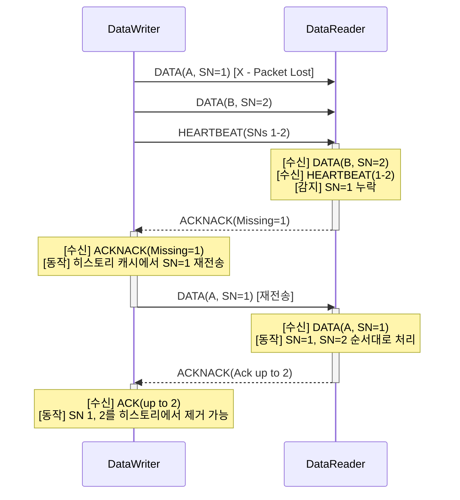
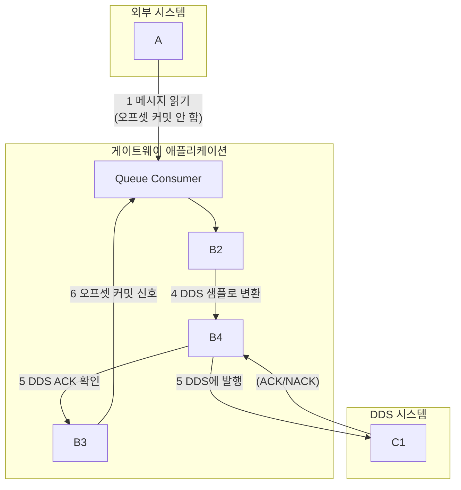
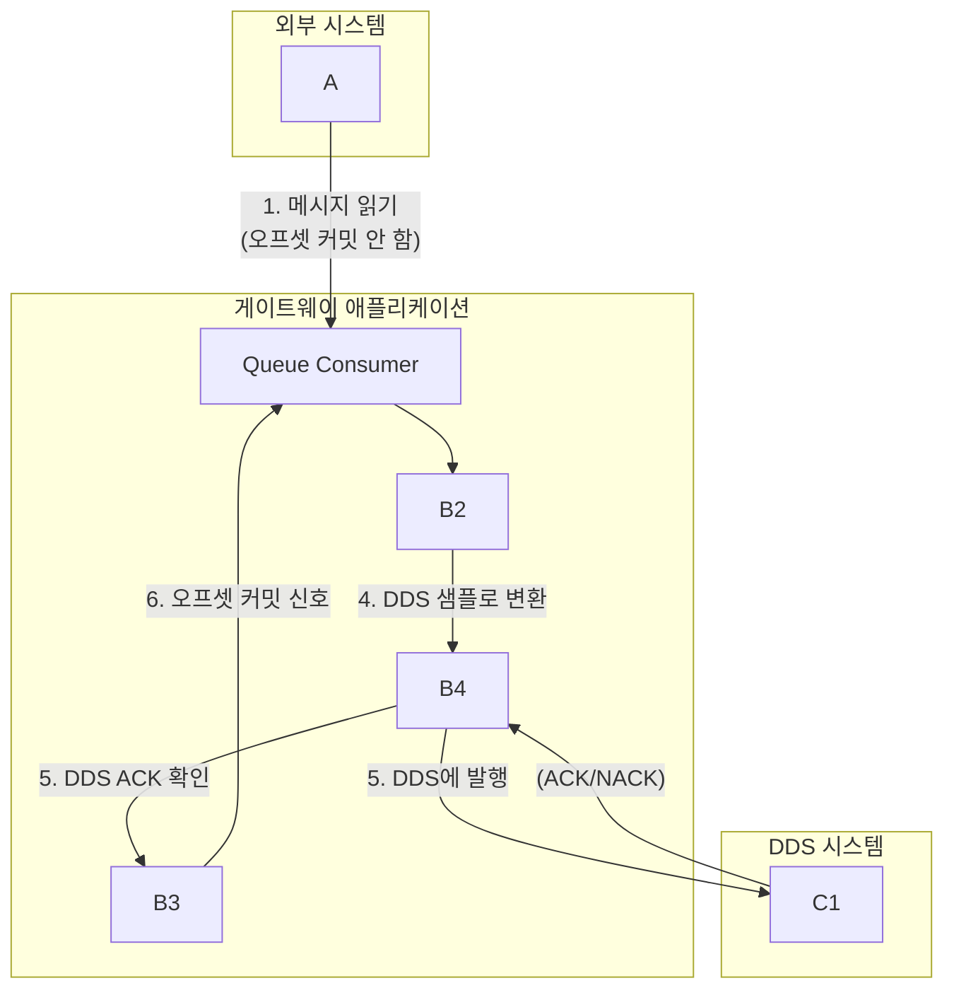

# UDP 기반 DDS와 외부 큐 연동을 위한 최종 가이드

## 1. 분산 시스템에서의 보장된 메시징이라는 과제

분산 시스템을 설계할 때 마주하는 가장 근본적인 과제 중 하나는 보장되고, 순서가 있으며, 정확히 한 번(exactly-once)만 전달되는 메시징을 구현하는 것입니다. 이 문제는 특히 기반 전송 프로토콜이 UDP처럼 본질적으로 비연결성이고 비신뢰적일 때 더욱 복잡해집니다.1 이러한 배경 속에서 정교한 미들웨어 솔루션의 필요성이 대두됩니다.

데이터 분산 서비스(Data Distribution Service, DDS)는 단순한 메시징 라이브러리를 넘어, 실시간 분산 시스템 구축을 위한 표준화된 데이터 중심 패러다임을 제시합니다.1 DDS의 핵심 역량은 두 가지 주요 메커니즘을 통해 복잡한 네트워크 프로그래밍을 추상화하는 데 있습니다. 첫째는 실시간 발행-구독(Real-Time Publish-Subscribe, RTPS) 와이어 프로토콜이며, 둘째는 풍부하고 설정 가능한 서비스 품질(Quality of Service, QoS) 프레임워크입니다.3

본 보고서의 목적은 외부 메시지 큐(예: Kafka, RabbitMQ)에 저장된 데이터를 DDS 도메인으로 안정적으로 전송하는 "게이트웨이" 또는 "브리지" 애플리케이션을 설계하고 구현하기 위한 포괄적인 아키텍처 청사진을 제공하는 것입니다. 이 아키텍처는 UDP 전송 중 데이터 유실이나 중복을 방지하여, 시스템 경계를 넘어선 완벽한 단일 전송(exactly-once semantics)을 달성하는 것을 목표로 합니다.

## 2.  RTPS 프로토콜: 비신뢰적 기반 위에 신뢰성을 구축하다

DDS 신뢰성의 이면에는 잘 정의된 프로토콜 엔지니어링 솔루션이 존재합니다. 이 섹션에서는 그 메커니즘을 심층적으로 분석합니다.

### 2.1  DDS와 RTPS의 관계: DDS가 의도적으로 UDP를 선택한 이유

DDS는 표준 API이자 데이터 중심 모델이며 5, RTPS는 이를 구현하는 표준화된 와이어 프로토콜입니다.4 DDS가 UDP 위에 구축된 이유는 실시간 성능에 필수적인 낮은 지연 시간, 적은 오버헤드, 그리고 멀티캐스트 기능을 활용하기 위함입니다.5 그 후 DDS는 자체 신뢰성 메커니즘을 상위에 계층화하여, 성능과 선택적 신뢰성이라는 두 가지 장점을 모두 제공합니다.2

이러한 설계는 DDS의 신뢰성이 UDP의 기능이 아니라, 전적으로 RTPS 프로토콜 계층 내에서 구현된다는 것을 의미합니다.8 이는 네트워크 엔지니어링에서 고전적인 설계 패턴(예: IP 위의 TCP, UDP 위의 QUIC 10)으로, 관심사의 분리를 통해 각 계층의 장점을 극대화하는 핵심적인 아키텍처 강점입니다.

### 2.2  보장된 전달의 메커니즘: RTPS 상태 머 심층 분석

신뢰성은 RTPS 프로토콜 계층 내에서 상태를 가진 ACK/NACK 기반 프로토콜을 구현함으로써 달성됩니다. 이 메커니즘은 다음과 같은 핵심 요소들로 구성됩니다.

#### 2.2.1 시퀀스 번호(Sequence Numbers, SN): 순서와 유일성의 초석

`DataWriter`가 발행하는 모든 데이터 샘플에는 단조롭게 증가하는 64비트 시퀀스 번호가 할당됩니다.11 이 SN은 `DataReader`가 패킷 손실(SN 시퀀스의 공백)을 감지하고 데이터 중복(이미 처리된 SN 무시)을 방지하는 근본적인 메커니즘입니다. 예를 들어, `DATA(value, sequenceNum)` 형태의 메시지는 특정 값과 고유한 SN을 연관시킵니다.11 이는 실시간 전송 프로토콜(RTP)과 같은 다른 프로토콜에서도 흔히 볼 수 있는 패턴입니다.12

#### 2.2.2 하트비트(Heartbeats, HB): "데이터가 있습니다"라는 방송

`DataWriter`는 주기적으로 매칭된 `DataReader`들에게 `HEARTBEAT` 메시지를 전송합니다.8 이 메시지는 `DataWriter`의 히스토리 캐시에 사용 가능한 시퀀스 번호의 범위를 알립니다(예: `HB(1-3)`는 SN 1, 2, 3이 사용 가능함을 의미).11 이 메커니즘은 수신자가 자신의 상태를 확인하고 데이터가 누락된 경우 반응하도록 유도하는 사전 예방적 조치이며, 동시에 `DataWriter`의 활성 상태를 알리는 역할도 합니다.

#### 2.2.3 확인 응답(ACK/NACK): 수신자의 응답

`HEARTBEAT`를 수신한 `DataReader`는 `DataWriter`가 제공하는 SN 범위와 자신이 수신한 SN을 비교합니다. 모든 데이터가 존재하면 긍정적 확인 응답(`ACK`)을 보낼 수 있습니다. 만약 공백이 있다면, *구체적으로* 누락된 시퀀스 번호의 비트맵을 포함하는 부정적 확인 응답(`NACK`) 메시지를 보냅니다.11 예를 들어, 

`ACKNACK(4)`는 SN 1, 2, 3은 수신되었지만 4가 누락되었음을 의미합니다.11

`NACK`를 수신한 `DataWriter`는 자신의 히스토리 캐시에서 요청된 누락 샘플만 재전송합니다. 이러한 표적화된 재전송은 전체 윈도우를 재전송하는 것보다 훨씬 효율적입니다.

이러한 재전송 메커니즘은 필연적으로 `DataWriter`가 잠재적인 재전송을 위해 샘플을 메모리에 저장해야 함을 시사합니다. 이 메모리가 바로 히스토리 캐시(History Cache)이며, 이는 "신뢰성"이 메모리와 CPU 측면에서 리소스 비용을 수반함을 명확히 보여줍니다. 이 비용을 관리하는 방법은 다음 섹션의 QoS 설정에서 다루어집니다.

------

**다이어그램 1: RTPS 신뢰성 프로토콜 시퀀스 (데이터 손실 시)**

아래 다이어그램은 네트워크에서 데이터 패킷이 손실되었을 때 RTPS 프로토콜이 어떻게 신뢰성을 보장하는지 보여줍니다.



## 3.  QoS 규약: 보장된 전달을 위한 구성

이 섹션에서는 프로토콜 이론을 실제 구성 가능한 정책으로 전환하는 방법을 설명합니다.

### 3.1  DDS 서비스 품질(QoS) 프레임워크 소개

QoS 정책은 개발자가 DDS 미들웨어의 동작을 제어하여 특정 사용 사례에 맞게 통신을 조정하는 메커니즘입니다.3 DDS는 22개 이상의 표준 QoS 정책을 제공하며 14, 연결이 성립되기 위해서는 `DataReader`가 요청하는 QoS가 `DataWriter`가 제공하는 QoS와 호환되어야 한다는 요청-제공(Request-Offered, RxO) 의미론을 따릅니다.15

### 3.2  보장된 상태 기반 전달의 네 가지 기둥

"완벽한 단일 전송"을 달성하는 것은 단일 설정이 아니라, 네 가지 개별 QoS 정책(`Reliability`, `History`, `Durability`, `ResourceLimits`) 간의 *규약 계약*의 결과물입니다. 이 중 하나라도 잘못 구성하면 보증이 미묘하게 깨질 수 있습니다.

#### 3.2.1 기둥 1: `ReliabilityQosPolicy`

이것은 신뢰성을 위한 마스터 스위치입니다.

- **`BEST_EFFORT`**: "쏘고 잊어버리는(Fire and forget)" 방식으로, 원시 UDP와 유사합니다. 최신 값이 단일 손실 샘플보다 더 중요한 고주파 센서 데이터에 적합합니다.18

- **`RELIABLE`**: 섹션 1에서 설명한 RTPS ACK/NACK 메커니즘을 활성화하여 전달을 보장합니다. 명령, 상태 전환, 금융 거래 등 손실이 허용되지 않는 모든 데이터에 필수적입니다.18 XML 및 API에서는 

  `RELIABLE_RELIABILITY_QOS`로 지정됩니다.21

#### 3.2.2 기둥 2: `HistoryQosPolicy`

이 정책은 `DataWriter`의 히스토리 캐시, 즉 재전송을 위한 메모리를 제어합니다.

- **`KEEP_LAST (depth=N)`**: 캐시는 크기 N의 순환 버퍼처럼 작동합니다. 가득 차면 새 샘플이 가장 오래된 샘플을 덮어씁니다. *가장 오래된 샘플이 아직 확인 응답을 받지 못했더라도 덮어씁니다*. 이는 엄격한 신뢰성을 깨뜨릴 수 있습니다.17
- **`KEEP_ALL`**: 캐시는 모든 샘플을 모든 신뢰성 있는 수신자가 확인 응답하거나 리소스 한계에 도달할 때까지 저장합니다. **이것이 진정한 무손실 통신에 필수적입니다**.15

#### 3.2.3 기둥 3: `DurabilityQosPolicy`

이 정책은 데이터가 작성된 *후에* 참여하거나 재시작하는 `DataReader`(지연 참여자)에게 데이터가 제공되도록 보장합니다.

- **`VOLATILE`**: 지속성이 없습니다. 지연 참여자는 오래된 데이터를 놓칩니다.
- **`TRANSIENT_LOCAL`**: `DataWriter`는 지연 참여자에게 제공하기 위해 데이터를 자신의 메모리(히스토리 캐시)에 보관합니다. 이는 `DataReader`(또는 게이트웨이)가 재시작된 후 상태를 복구하는 데 매우 중요합니다.20
- **중요 사항**: 내구성(Durability)이 작동하려면 신뢰성(`Reliability`)이 반드시 `RELIABLE`로 설정되어야 합니다.26

`Durability.kind = TRANSIENT_LOCAL` 설정은 `DataWriter`의 히스토리 캐시를 직접 재사용합니다. 즉, 캐시의 역할을 비행 중인 미확인 데이터를 위한 임시 버퍼에서 지연 참여자를 위해 확인된 데이터를 장기간 보관하는 캐시로 변경합니다. 이는 `Durability`가 이 모드에서 별도의 메모리 저장소가 아니라 기존 `History` 캐시에 적용되는 규칙임을 명확히 하며, `ResourceLimits` 구성의 중요성을 더욱 강조합니다.

#### 3.2.4 기둥 4: `ResourceLimitsQosPolicy`

이 정책은 히스토리 캐시에 대한 물리적 메모리 경계를 설정합니다.

- **설정**: `max_samples`, `max_instances`, `max_samples_per_instance`와 같은 값들은 `KEEP_ALL` 히스토리의 메모리 사용량을 제한하여 무한한 메모리 증가를 방지합니다.15

  `History.depth`는 `ResourceLimits.max_samples_per_instance`보다 작거나 같아야 하는 등 일관성 규칙이 적용됩니다.24

### 3.3  시너지 효과: "완벽한 단일 전송" 구성 만들기

이 네 가지 기둥을 종합하여 일관된 전략을 수립할 수 있습니다.

- **데이터 손실 방지**: `Reliability.kind = RELIABLE`과 `History.kind = KEEP_ALL`의 조합은 필수적입니다. 이는 `DataWriter`가 모든 것을 전송하려고 시도하고 그렇게 할 메모리를 확보하도록 보장합니다.27
- **재시작 시 데이터 손실 방지**: `Durability.kind = TRANSIENT_LOCAL`을 추가해야 합니다. 이는 `DataWriter`가 잠재적인 지연 참여자를 위해 확인된 데이터를 보관하도록 지시합니다.24
- **시스템 충돌 방지**: `ResourceLimits`는 예상 데이터 볼륨에 충분한 메모리를 제공하되, 무한한 메모리 증가를 막기 위해 상한선을 설정해야 합니다.

이 구성의 중요한 결과는 "블로킹(blocking)" 동작입니다. 만약 `DataReader`가 실패하여 확인 응답을 중단하면, `RELIABLE`/`KEEP_ALL`로 설정된 `DataWriter`는 결국 `ResourceLimits`를 채우게 되고, `write()` 호출은 결코 오지 않을 확인 응답을 기다리며 블로킹됩니다.15 이때 

`Reliability.max_blocking_time` QoS 27는 무기한 블로킹 대신 쓰기 작업이 시간 초과되어 오류를 반환하도록 하는 중요한 안전 밸브 역할을 합니다.

| 표 1: 보장된 전달을 위한 핵심 QoS 정책 |
| -------------------------------------- |
| **정책 이름**                          |
| `ReliabilityQosPolicy`                 |
| `HistoryQosPolicy`                     |
| `DurabilityQosPolicy`                  |
| `ResourceLimitsQosPolicy`              |

## 4.  게이트웨이 패턴: 큐에서 DDS로의 브리지 아키텍처링

이 섹션에서는 DDS 내부에서 시스템 수준 아키텍처로 초점을 이동합니다.

### 4.1  세계를 잇다: 게이트웨이가 필요한 이유

전통적인 메시지 큐(Kafka/RabbitMQ 등)와 DDS의 근본적인 패러다임은 서로 다릅니다.

- **메시지 큐 (예: Kafka, RabbitMQ)**:
  - 브로커 기반(클라이언트-서버) 아키텍처.29
  - 메시지 중심: 브로커는 불투명한 데이터 덩어리를 라우팅.30
  - 소비자 풀(Kafka) 대 브로커 푸시(RabbitMQ) 모델.32
  - 영구 로그(Kafka) 대 임시 큐(일반적인 RabbitMQ).34
- **DDS**:
  - P2P, 브로커 없는 아키텍처(일반적으로).3
  - 데이터 중심: 미들웨어는 IDL 정의 타입을 통해 데이터 구조를 이해.3
  - 엔드포인트의 동적 발견.3

이러한 패러다임은 근본적으로 호환되지 않으므로, 이들 사이를 중재하기 위한 전용 "게이트웨이" 또는 "브리지" 애플리케이션이 필요합니다.29

| 표 2: 아키텍처 비교: DDS 대 전통적 메시지 큐 |
| -------------------------------------------- |
| **기능**                                     |
| 아키텍처                                     |
| 데이터 모델                                  |
| 발견(Discovery)                              |
| 내구성 모델                                  |
| 통신 패턴                                    |

### 4.2  게이트웨이 애플리케이션 설계

게이트웨이의 핵심 책임은 다음과 같습니다.

1. **큐에서 소비**: 소스 큐(예: Kafka 소비자)의 표준 소비자 역할을 합니다.
2. **데이터 변환**: 큐의 원시 바이트/JSON/Avro 형식 메시지를 IDL에 정의된 강력한 타입의 DDS 샘플로 변환합니다.29
3. **상태 관리**: 가장 중요하고 복잡한 부분입니다. 게이트웨이는 중복을 피하기 위해 어떤 메시지가 DDS에 성공적으로 기록되었는지 추적해야 합니다.
4. **DDS에 발행**: 섹션 2의 "완벽한 단일 전송" QoS 프로파일로 구성된 DDS `DataWriter` 역할을 합니다.

이러한 게이트웨이는 단일 장애점이 될 수 있으므로, 다중 인스턴스(액티브-패시브, 파티션 소비를 통한 액티브-액티브) 실행 전략과 그에 따른 상태 관리의 복잡성을 고려해야 합니다.

------

**다이어그램 2: 외부 큐-DDS 게이트웨이 아키텍처**

이 다이어그램은 외부 메시지 큐의 데이터를 DDS 도메인으로 안정적으로 전달하는 게이트웨이 애플리케이션의 내부 구성 요소와 데이터 흐름을 보여줍니다.



### 4.3  시스템 수준에서 완벽한 단일 전송 의미론 달성

문제의 핵심은 종단 간 흐름입니다. 신뢰성의 과제는 네트워크 전송 계층(RTPS로 해결됨)에서 애플리케이션 계층, 특히 게이트웨이의 상태 관리 로직으로 이동합니다. 게이트웨이 자체가 무결성이 가장 중요한 상태 저장 구성 요소가 되는 것입니다.

핵심 로직은 트랜잭션 방식의 읽기-처리-쓰기 루프를 구현하는 것입니다.

1. 소스 큐(예: Kafka)에서 메시지 배치를 읽습니다.
2. 아직 큐에 오프셋을 커밋하지 **않습니다**.
3. 신뢰성 있는 QoS 설정으로 구성된 `DataWriter`를 사용하여 각 메시지를 DDS에 발행합니다.
4. 배치의 모든 메시지가 모든 신뢰성 있는 DDS `DataReader`에 의해 *완전히 확인될 때까지* 기다립니다. `DataWriter`의 `wait_for_acknowledgments()`와 같은 API 호출이 여기서 사용됩니다.
5. 모든 DDS 쓰기가 확인된 후에만 소스 큐(예: Kafka)에 오프셋을 커밋합니다.

------

**다이어그램 3: 종단 간 완벽한 단일 전송(Exactly-Once) 시퀀스**

이 시퀀스 다이어그램은 게이트웨이가 충돌하더라도 데이터 중복이나 유실 없이 메시지를 전달하는 과정을 보여줍니다. 핵심은 DDS 전송이 완전히 확인된 *후에만* 소스 큐의 오프셋을 커밋하는 것입니다.



------

이러한 접근 방식은 간단한 장애 시나리오를 처리합니다. 예를 들어, 게이트웨이가 오프셋을 커밋하기 전에 충돌하면, 재시작 시 동일한 메시지 배치를 다시 읽게 됩니다. DDS `DataReader`는 이미 이 메시지를 수신했으므로(재시작했다면 `TRANSIENT_LOCAL` 내구성 덕분에), 시퀀스 번호를 기반으로 중복을 폐기합니다.

소스 큐의 선택은 게이트웨이 설계와 장애 복구 능력에 지대한 영향을 미칩니다. Kafka의 재생 가능한 영구 로그는 RabbitMQ의 소비 후 삭제되는 큐 모델보다 일반적으로 완벽한 단일 전송 의미론을 달성하는 데 더 우수합니다.32 Kafka를 사용하는 게이트웨이는 중지 후 재시작하여 마지막으로 커밋된 오프셋부터 간단히 읽기를 재개할 수 있습니다.

## 5.  구현 청사진 및 벤더별 구성

이 섹션에서는 코드와 구성을 통해 구체적인 "방법"을 제공합니다.

### 5.1  게이트웨이 로직: 상태 기반 C++ 구현 청사진

다음은 게이트웨이 애플리케이션의 핵심 로직을 보여주는 상세한 C++ 의사 코드입니다.

```C++
// 의사 코드: DDS-Queue Gateway Main Loop

// 1. 초기화
QueueConsumer queue_consumer = initialize_queue_consumer("kafka_broker", "source_topic");
DDS_Publisher dds_publisher = initialize_dds_publisher("DDS_Domain", "target_topic", "ExactlyOnceQoSProfile");

// 2. 메인 루프
while (application_is_running) {
    try {
        // 2.1. 큐에서 메시지 폴링 (오프셋 자동 커밋 비활성화)
        vector<QueueMessage> messages = queue_consumer.poll(timeout);
        if (messages.empty()) {
            continue;
        }

        // 2.2. 메시지 변환 및 DDS에 발행
        for (const auto& msg : messages) {
            DDS_Sample sample = translate_to_dds_sample(msg);
            dds_publisher.write(sample);
        }

        // 2.3. 모든 DDS 샘플이 확인될 때까지 대기
        // 이는 모든 신뢰성 있는 DataReader가 데이터를 수신했음을 보장합니다.
        // max_blocking_time QoS에 따라 타임아웃이 발생할 수 있습니다.
        ReturnCode_t ret = dds_publisher.wait_for_acknowledgments(dds_timeout);
        if (ret!= DDS::RETCODE_OK) {
            // 타임아웃 또는 오류 처리: 재시도 또는 로깅 후 루프 계속
            log_error("DDS acknowledgment failed or timed out.");
            continue; // 오프셋을 커밋하지 않고 다음 폴링으로 넘어감
        }

        // 2.4. DDS 쓰기가 성공적으로 확인된 후에만 큐 오프셋 커밋
        queue_consumer.commit_offsets();

    } catch (const QueueException& e) {
        log_error("Queue consumer error: " + e.what());
        // 복구 로직
    } catch (const DDSException& e) {
        log_error("DDS publisher error: " + e.what());
        // 복구 로직
    }
}

// 3. 정리
dds_publisher.shutdown();
queue_consumer.close();
```

이 로직은 37와 29에서 설명된 개념의 실제 구현이며, C++ 구조는 36(DDS 측) 및 38(개념적 Kafka 로직)과 같은 예제에서 영감을 얻을 수 있습니다.

### 5.2  RTI Connext DDS: "골든" QoS 프로파일

다음은 프로덕션 환경에 바로 사용할 수 있는 완전한 `USER_QOS_PROFILES.xml` 파일입니다. 이 프로파일은 `NDDS_QOS_PROFILES` 환경 변수를 통해 로드되어야 합니다.40

```XML
<dds xmlns:xsi="http://www.w3.org/2001/XMLSchema-instance"
     xsi:noNamespaceSchemaLocation="http://community.rti.com/schema/6.1.0/rti_dds_qos_profiles.xsd">
    <qos_library name="GatewayLibrary">
        <qos_profile name="ExactlyOnceProfile" is_default_qos="true">
            <datawriter_qos>
                <reliability>
                    <kind>RELIABLE_RELIABILITY_QOS</kind>
                    <max_blocking_time>
                        <sec>10</sec>
                    </max_blocking_time>
                </reliability>
                <history>
                    <kind>KEEP_ALL_HISTORY_QOS</kind>
                </history>
                <durability>
                    <kind>TRANSIENT_LOCAL_DURABILITY_QOS</kind>
                </durability>
                <resource_limits>
                    <max_samples>5000</max_samples>
                    <max_instances>100</max_instances>
                    <max_samples_per_instance>50</max_samples_per_instance>
                </resource_limits>
                <writer_data_lifecycle>
                    <autodispose_unregistered_instances>false</autodispose_unregistered_instances>
                </writer_data_lifecycle>
            </datawriter_qos>
            <datareader_qos>
                 <reliability>
                    <kind>RELIABLE_RELIABILITY_QOS</kind>
                </reliability>
                <history>
                    <kind>KEEP_ALL_HISTORY_QOS</kind>
                </history>
                <durability>
                    <kind>TRANSIENT_LOCAL_DURABILITY_QOS</kind>
                </durability>
            </datareader_qos>
        </qos_profile>
    </qos_library>
</dds>
```

이 프로파일은 21에 표시된 프로파일을 정제하고 17의 모범 사례를 통합한 것입니다.

### 5.3  eProsima Fast DDS: 구성 및 API 사용법

Fast DDS에 대한 동등한 XML 프로파일 및 C++ API 설정은 다음과 같습니다.

```C++
// C++ QoS setup for eProsima Fast DDS
#include <fastdds/dds/domain/DomainParticipantFactory.hpp>
#include <fastdds/dds/publisher/qos/DataWriterQos.hpp>

//...

eprosima::fastdds::dds::DataWriterQos wqos;

// Reliability
wqos.reliability().kind = eprosima::fastdds::dds::RELIABLE_RELIABILITY_QOS;
wqos.reliability().max_blocking_time = {10, 0}; // 10 seconds

// Durability
wqos.durability().kind = eprosima::fastdds::dds::TRANSIENT_LOCAL_DURABILITY_QOS;

// History
wqos.history().kind = eprosima::fastdds::dds::KEEP_ALL_HISTORY_QOS;

// Resource Limits
wqos.resource_limits().max_samples = 5000;
wqos.resource_limits().max_instances = 100;
wqos.resource_limits().max_samples_per_instance = 50;

//... DataWriter 생성 시 wqos 사용
// DataWriter* writer = publisher->create_datawriter(topic, wqos, &listener);
```

이 구성은 Fast DDS 문서 22을 기반으로 합니다. 

`TRANSIENT_LOCAL`을 사용할 때 `RELIABLE`을 설정하는 것을 잊은 사용자 사례 26는 중요한 교훈을 줍니다.

### 5.4  주요 벤더 차이점 및 고려사항

벤더마다 기본 동작, 특정 QoS 확장(예: Connext의 `<rtps_reliable_writer>` 21 내 프로토콜 튜닝 옵션), 성능 특성에 차이가 있을 수 있습니다. 예를 들어, 기본 검색 메커니즘이나 리소스 관리 방식이 다를 수 있으므로, 특정 벤더의 문서를 참조하여 구현을 미세 조정하는 것이 중요합니다.

## 6.  성능 공학 및 운영 우수성

이 섹션에서는 프로덕션 환경에서 솔루션을 견고하고 성능이 뛰어나게 만들기 위한 고급 주제를 다룹니다.

### 6.1  고처리량 신뢰성 통신을 위한 튜닝

신뢰성 있는 시스템은 빠르기도 해야 합니다. 성능 튜닝은 OS 커널에서부터 네트워크 하드웨어, 미들웨어 구성에 이르기까지 전체 스택에 걸친 문제입니다. 어느 한 계층의 병목 현상이 전체 시스템을 마비시킬 수 있습니다.

- **네트워크 및 OS 수준 튜닝**:
  - 커널이 DDS가 패킷을 보기 전에 드롭하는 것을 방지하기 위해 OS 소켓 버퍼 크기(`net.core.rmem_max`)를 늘립니다.43
  - 대용량 메시지의 패킷화 오버헤드를 줄이기 위해 전용 네트워크에서 점보 프레임(예: 9000바이트)을 사용하여 네트워크 MTU(Maximum Transmission Unit)를 최적화합니다.43
- **DDS 수준 튜닝**:
  - DDS 흐름 제어기(Flow Controllers)를 사용하여 트래픽을 조절하고 게이트웨이 `DataWriter`가 네트워크나 느린 `DataReader`를 압도하는 것을 방지합니다.44
  - `DataWriter`의 전송 윈도우를 조정하여 처리량과 메모리 사용량의 균형을 맞춥니다.21
  - 작은 샘플을 더 큰 네트워크 패킷으로 일괄 처리(batching)하도록 `DataWriter`를 구성하여 효율성을 향상시킵니다.
  - 비동기 발행 모드를 사용하여 애플리케이션의 메인 스레드가 네트워크 쓰기에서 블로킹되는 것을 방지합니다.47

### 6.2  일반적인 신뢰성 및 발견 문제 해결

복잡한 DDS 구성은 강력하지만, 디버깅 및 모니터링을 위한 견고한 도구를 사치가 아닌 필수품으로 만듭니다. RTI Admin Console, Wireshark, 상세 로깅과 같은 도구 없이는 효과적인 운영이 불가능합니다.48

| 표 3: 신뢰성 있는 DDS 통신 문제 해결 체크리스트 |
| ----------------------------------------------- |
| **증상**                                        |
| 엔드포인트가 서로를 발견하지 못함               |
| `DataWriter`가 블로킹되거나 타임아웃 발생       |
| `RELIABLE` QoS에도 불구하고 데이터가 손실됨     |
| 재시작 시 오래되거나 중복된 데이터를 수신함     |

## 7. 결론: 안정적인 통합을 위한 통합 프레임워크

본 보고서는 외부 큐와 DDS 간의 완벽한 단일 전송을 달성하기 위한 포괄적인 프레임워크를 제시했습니다. 이 솔루션의 핵심 원칙은 세 가지로 요약할 수 있습니다.

1. **RTPS 프로토콜의 상태 머신**: UDP 위에서 신뢰성을 확보하기 위한 견고한 기반을 제공합니다.
2. **QoS "규약"**: `Reliability`, `History`, `Durability`, `ResourceLimits`의 조합을 통해 애플리케이션별 보증을 강제하는 상위 수준의 제어를 제공합니다.
3. **상태 기반 게이트웨이 패턴**: 메시징 패러다임 간의 변환과 종단 간 트랜잭션 관리를 위한 아키텍처 브리지를 제공합니다.

DDS는 표준 기반 3 고성능 30 솔루션으로서 복잡한 실시간 통합 과제에 대한 강력한 해답을 제시합니다. 초기 학습 곡선과 구성이 다소 가파를 수 있지만 51, 그 결과로 얻어지는 시스템은 미션 크리티컬 애플리케이션에 대한 투자를 정당화할 만큼 매우 견고하고, 확장 가능하며, 유지보수하기 쉽습니다.

#### **참고 자료**

1. [Java] UDP 소켓 프로그래밍 - 어디로 가야할지 모르는 곰탱씨 - 티스토리, accessed July 3, 2025, https://kindbear.tistory.com/128
2. Difference between DDS communication and UDP/IP, accessed July 3, 2025, https://community.rti.com/forum-topic/difference-between-dds-communication-and-udpip
3. What can DDS do for You? - Object Management Group, accessed July 3, 2025, https://www.omg.org/hot-topics/documents/dds/CoreDX_DDS_Why_Use_DDS.pdf
4. JMS 및 DDS 기반 미들웨어의 데이터 전송효율 비교 분석, accessed July 3, 2025, https://www.ki-it.com/xml/25027/25027.pdf
5. DDS 보안기술 - 한국전자통신연구원, accessed July 3, 2025, https://ettrends.etri.re.kr/ettrends/131/0905001659/26-5_112-122.pdf
6. 데이터 분산 서비스 - 위키백과, 우리 모두의 백과사전, accessed July 3, 2025, [https://ko.wikipedia.org/wiki/%EB%8D%B0%EC%9D%B4%ED%84%B0_%EB%B6%84%EC%82%B0_%EC%84%9C%EB%B9%84%EC%8A%A4](https://ko.wikipedia.org/wiki/데이터_분산_서비스)
7. 함정 전투체계의 DDS 기반 네트워크 성능분석 기법 설계 및 구현, accessed July 3, 2025, https://conf.kics.or.kr/2024w/media?key=site/2024w/abs/0195-EIOSJ.pdf
8. Protocols/rtps - Wireshark Wiki, accessed July 3, 2025, https://wiki.wireshark.org/Protocols/rtps
9. 03장 DDS란 무엇인가? | ROS2 하루에 입문하기, accessed July 3, 2025, https://robertchoi.gitbook.io/ros2/03-dds
10. Are raw sockets the basis of any higher level protocol that isn't UDP or TCP? - Reddit, accessed July 3, 2025, https://www.reddit.com/r/AskProgramming/comments/px1as2/are_raw_sockets_the_basis_of_any_higher_level/
11. Overview of the Reliable Protocol - RTI Community, accessed July 3, 2025, https://community.rti.com/static/documentation/connext-dds/current/doc/manuals/connext_dds_professional/users_manual/users_manual/Overview_of_the_Reliable_Protocol.htm
12. RTP: A Transport Protocol for Real-Time Applications (RFC 1889) - IETF, accessed July 3, 2025, https://www.ietf.org/rfc/rfc1889.txt
13. IETF RFC 3550 - RTP: A Transport Protocol for Real-Time Applications, accessed July 3, 2025, https://www.ietf.org/rfc/rfc3550.txt
14. ROS2와 DDS란? - 개발하는 핑구 - 티스토리, accessed July 3, 2025, [https://ai-sinq.tistory.com/entry/ROS2%EC%99%80-DDS%EB%9E%80](https://ai-sinq.tistory.com/entry/ROS2와-DDS란)
15. Quality of Service - OpenDDS 3.29.1, accessed July 3, 2025, https://opendds.readthedocs.io/en/dds-3.29.1/devguide/quality_of_service.html
16. DDS: The FAQs About QoS - YouTube, accessed July 3, 2025, https://www.youtube.com/watch?v=FRX9xRL4MPU
17. 5. Basic QoS - RTI Connext Getting Started documentation - RTI Community, accessed July 3, 2025, https://community.rti.com/static/documentation/connext-dds/current/doc/manuals/connext_dds_professional/getting_started_guide/cpp11/intro_qos.html
18. ROS #21 QoS - velog, accessed July 3, 2025, https://velog.io/@rlwnd0122/ROS-16-QoS
19. RTI Academy - Quality of Service - 4 Reliability QoS - YouTube, accessed July 3, 2025, https://www.youtube.com/watch?v=n7CDbWFb0wo
20. Ethernet 기반 차량 네트워크 설계에서 Functional Safety (ISO 26262 ..., accessed July 3, 2025, [https://habana4.tistory.com/entry/Ethernet-%EC%B0%A8%EB%9F%89-%EB%84%A4%ED%8A%B8%EC%9B%8C%ED%81%AC-%EC%84%A4%EA%B3%84-Functional-Safety-ISO26262-%EA%B3%A0%EB%A0%A4%EC%82%AC%ED%95%AD-SOME-IP-DDS](https://habana4.tistory.com/entry/Ethernet-차량-네트워크-설계-Functional-Safety-ISO26262-고려사항-SOME-IP-DDS)
21. USER_QOS_PROFILES.xml - RTI Community, accessed July 3, 2025, https://d2vkrkwbbxbylk.cloudfront.net/sites/default/files/rti-examples/rticonnextdds-examples/examples/connext_dds/keyed_data_advanced/c/USER_QOS_PROFILES.xml
22. 21.1.1.3.35. ReliabilityQosPolicy - 3.2.2 - Fast DDS - eProsima, accessed July 3, 2025, https://fast-dds.docs.eprosima.com/en/latest/fastdds/python_api_reference/dds_pim/core/policy/reliabilityqospolicy.html
23. 59.12 HISTORY QosPolicy - RTI Community, accessed July 3, 2025, https://community.rti.com/static/documentation/connext-dds/current/doc/manuals/connext_dds_professional/users_manual/users_manual/HISTORY_QosPolicy.htm
24. 3.1.2.1. Standard QoS Policies - 3.2.2 - Fast DDS - eProsima, accessed July 3, 2025, https://fast-dds.docs.eprosima.com/en/latest/fastdds/dds_layer/core/policy/standardQosPolicies.html
25. DDS reliable reader getting same messages on application restart - Stack Overflow, accessed July 3, 2025, https://stackoverflow.com/questions/42374430/dds-reliable-reader-getting-same-messages-on-application-restart
26. Question about DurabilityQosPolicy and HistoryQosPolicy of Fast dds [13275] / Issue #2352, accessed July 3, 2025, https://github.com/eProsima/Fast-DDS/issues/2352
27. RELIABILITY QosPolicy - RTI Community, accessed July 3, 2025, https://community.rti.com/static/documentation/connext-dds/current/doc/manuals/connext_dds_professional/users_manual/users_manual/RELIABILITY_QosPolicy.htm
28. 20.1.1.7.35. ReliabilityQosPolicy - 3.2.2 - Fast DDS - eProsima, accessed July 3, 2025, https://fast-dds.docs.eprosima.com/en/stable/fastdds/api_reference/dds_pim/core/policy/reliabilityqospolicy.html
29. Bridging OpenDDS® and MQTT Messaging - Object Computing, Inc., accessed July 3, 2025, https://objectcomputing.com/resources/publications/mnb/2022/06/01/bridging-opendds-and-mqtt-messaging
30. Comparing OpenDDS and ZeroMQ Usage and Performance - Object Computing, Inc., accessed July 3, 2025, https://objectcomputing.com/resources/publications/mnb/2010/04/20/comparing-opendds-and-zeromq-usage-and-performance
31. Navigating DDS: Basics, Limitations, and Integration with MQTT | by EMQ Technologies, accessed July 3, 2025, https://emqx.medium.com/navigating-dds-basics-limitations-and-integration-with-mqtt-944da6bde576
32. RabbitMQ vs Kafka - Difference Between Message Queue Systems - AWS, accessed July 3, 2025, https://aws.amazon.com/compare/the-difference-between-rabbitmq-and-kafka/
33. Message queue (like RabbitMQ) or Kafka for Microservices? [closed] - Stack Overflow, accessed July 3, 2025, https://stackoverflow.com/questions/58706507/message-queue-like-rabbitmq-or-kafka-for-microservices
34. Day 4: Designing a Distributed Messaging Queue: Kafka vs RabbitMQ | by Dev Cookies, accessed July 3, 2025, https://medium.com/@devcookies/day-4-designing-a-distributed-messaging-queue-kafka-vs-rabbitmq-c4abcc0767d3
35. 저작자표시-비영리-변경금지 2.0 대한민국 이용자는 아래의 조건을 ..., accessed July 3, 2025, http://dcoll.ajou.ac.kr:9080/dcollection/common/orgView/000000030342
36. Bridging XMPP and DDS Messaging Frameworks | Object Computing, Inc., accessed July 3, 2025, https://objectcomputing.com/resources/publications/sett/april-2012-bridging-xmpp-and-dds-messaging-frameworks
37. MQTT client subscribing data from RTI DDS publisher - Stack Overflow, accessed July 3, 2025, https://stackoverflow.com/questions/51321670/mqtt-client-subscribing-data-from-rti-dds-publisher
38. Complete Kafka Consumer with Java - Conduktor, accessed July 3, 2025, https://learn.conduktor.io/kafka/complete-kafka-consumer-with-java/
39. Kafka Producer and Consumer Examples Using Java - DZone, accessed July 3, 2025, https://dzone.com/articles/kafka-producer-and-consumer-example
40. Error occurs when load user defined QoS Profiles - NI Community, accessed July 3, 2025, https://forums.ni.com/t5/RTI-DDS-Toolkit-for-LabVIEW/Error-occurs-when-load-user-defined-QoS-Profiles/td-p/4187527
41. RTI DDS Qos profile history not working as expected - Stack Overflow, accessed July 3, 2025, https://stackoverflow.com/questions/28682469/rti-dds-qos-profile-history-not-working-as-expected
42. 3.1.2.2. eProsima Extensions - 3.2.2, accessed July 3, 2025, https://fast-dds.docs.eprosima.com/en/latest/fastdds/dds_layer/core/policy/eprosimaExtensions.html
43. DDS Middleware and Network tuning - Stereolabs, accessed July 3, 2025, https://www.stereolabs.com/docs/ros2/dds_and_network_tuning
44. DDS tuning information - Dashing documentation - ROS 2, accessed July 3, 2025, https://docs.ros.org/en/dashing/Guides/DDS-tuning.html
45. Fast DDS Documentation, accessed July 3, 2025, https://media.readthedocs.org/pdf/eprosima-fast-rtps/latest/eprosima-fast-rtps.pdf
46. NAPA: An algorithm to auto-tune unicast reliable communications over DDS, accessed July 3, 2025, https://digibug.ugr.es/bitstream/10481/32456/1/NAPA_DDS_Tuning.pdf
47. Fast DDS - eProsima, accessed July 3, 2025, https://fast-dds.docs.eprosima.com/
48. Three Simple Steps to Achieving Peak DDS Performance | RTI - Real-Time Innovations, accessed July 3, 2025, https://www.rti.com/blog/three-simple-steps-to-achieving-peak-dds-performance/
49. Typical Reasons for Connext DDS Discovery Failing and Suggested Solutions, accessed July 3, 2025, https://community.rti.com/howto/typical-reasons-connext-dds-discovery-failing-and-suggested-solutions
50. Useful tools to debug DDS issues | Data Distribution Service (DDS) Community RTI Connext Users, accessed July 3, 2025, https://community.rti.com/howto/useful-tools-debug-dds-issues
51. Top 6 message queues for distributed architectures | by IcePanel - Medium, accessed July 3, 2025, https://icepanel.medium.com/top-6-message-queues-for-distributed-architectures-a3cbabf08993

