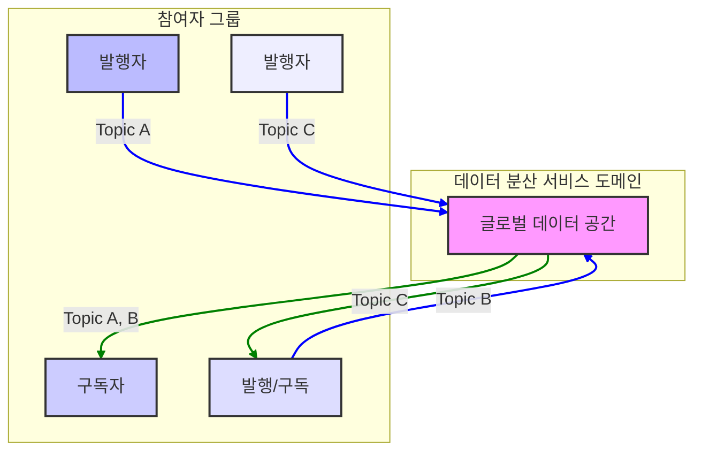

# DDS 보안
[DDS 보안](./index.md)

데이터 분산 서비스(Data Distribution Service, DDS)는 Object Management Group(OMG)이 제정한 실시간 시스템을 위한 기계 대 기계(M2M) 통신 미들웨어 표준이다.1 이 기술은 발행-구독(publish-subscribe) 패턴을 사용하여 신뢰성 높고, 고성능이며, 상호 운용 가능한 실시간 데이터 교환을 목표로 한다.1 DDS는 항공우주, 국방, 항공 교통 관제, 자율주행차, 의료 기기, 로봇 공학, 발전, 시뮬레이션 및 테스트, 스마트 그리드 관리, 운송 시스템 등 미션 크리티컬하고 안전이 중요한 산업 전반에 걸쳐 핵심적인 역할을 수행하고 있다.1 이러한 시스템에서 데이터 통신의 신뢰성, 성능, 그리고 보안은 타협할 수 없는 필수 요건이다.

DDS의 근본적인 아키텍처는 중앙 서버나 브로커 없이 각 애플리케이션(참여자)이 서로를 동적으로 발견하고 직접 통신하는 탈중앙화된 피어-투-피어(peer-to-peer) 방식에 기반한다.3 이러한 구조는 뛰어난 확장성과 견고성을 제공하며 단일 장애점(single point of failure)을 제거하는 핵심적인 장점을 가진다. 그러나 동시에 이는 전통적인 보안 모델을 적용하기 어려운 독특한 과제를 제기한다. 발행자는 자신의 데이터를 누가 구독하는지, 구독자는 데이터가 어디로부터 오는지에 대한 사전 정보 없이 통신이 이루어지기 때문에 1, 참여자의 신원을 확인하고 데이터 접근 권한을 통제하며 통신 내용의 기밀성과 무결성을 보장하는 것은 매우 복잡한 문제가 된다.

기존의 중앙 집중식 보안 모델, 예를 들어 TLS(Transport Layer Security)를 통해 서버와의 연결을 보호하는 방식은 DDS의 동적이고 분산된 환경에는 부적합하다. 이러한 근본적인 문제를 해결하기 위해 OMG는 DDS의 데이터 중심 철학을 그대로 유지하면서 강력한 보안 기능을 추가하는 `DDS-SECURITY` 표준을 제정했다. 본 보고서는 DDS가 직면한 고유한 보안 위협 환경을 분석하고, OMG의 DDS-Security 표준이 제시하는 공식적인 프레임워크를 심층적으로 해부한다. 나아가 인증, 접근 제어, 암호화 등 핵심 보안 기능의 실제 구현 방식을 구체적인 예시와 함께 상세히 설명하고, 주요 벤더들의 구현 현황을 비교 분석할 것이다. 또한, MQTT와 같은 다른 프로토콜과의 보안 모델 비교를 통해 DDS 보안의 특징을 명확히 하고, 최종적으로 DDS 기반 시스템을 안전하게 구축하고 운영하기 위한 전략적 권고안을 제시하고자 한다.

DDS-Security 표준의 필요성을 이해하기 위해서는 먼저 DDS 프로토콜의 고유한 아키텍처가 만들어내는 위협 표면(threat surface)을 분석해야 한다.

DDS의 핵심 개념은 '글로벌 데이터 공간(Global Data Space)'이다.3 이는 물리적으로 분산된 노드들이 마치 하나의 거대한 공유 데이터베이스에 접근하는 것처럼 데이터를 읽고 쓸 수 있게 하는 추상화된 공간이다. 이 공간은 중앙 브로커 없이 완전히 분산된 방식으로 구현되며, 참여자들은 동적 발견(dynamic discovery) 메커니즘을 통해 서로를 자동으로 찾아내고 통신을 시작한다.5 이러한 탈중앙화 아키텍처는 시스템의 확장성과 장애 복원력을 극대화하지만, 보안의 관점에서는 근본적인 복잡성을 야기한다.

중앙에 신뢰를 보증하는 게이트키퍼가 없다는 것은, 신뢰 관계가 단순히 특정 서버에 대한 보안 연결을 통해 확립될 수 없음을 의미한다. MQTT와 같이 브로커에 TLS 연결을 맺는 것만으로 기본적인 보안이 확보되는 모델과 달리, DDS에서는 모든 참여자가 네트워크에서 마주치는 다른 모든 잠재적 피어(peer)의 신원을 독립적으로 검증하고, 허가된 행위인지 스스로 판단할 수 있어야 한다. 발행-구독 모델의 핵심 장점인 애플리케이션 간의 디커플링(decoupling) 1 역시 보안의 관점에서는 도전 과제이다. 발행자는 자신의 데이터를 누가 수신하는지 알 필요가 없고, 구독자는 데이터의 출처를 알 필요가 없기 때문에, 악의적인 참여자가 민감한 데이터에 무단으로 접근하거나 위조된 데이터를 시스템에 주입하는 것을 막기 위한 강력한 신원 확인 및 권한 부여 프레임워크가 필수적이다. 이러한 DDS의 구조적 특성, 즉 탈중앙화와 동적 발견이라는 가장 큰 장점이 동시에 가장 큰 보안적 취약점으로 작용하는 역설적인 상황이 발생한다. 이 고유한 문제를 해결하기 위해 DDS-Security 표준은 각 참여자가 자신의 신분증(신원 인증서)과 비자(권한 문서)를 소지하고, 중앙 기관 없이도 상호 검증할 수 있는 분산된 공개 키 기반 구조(PKI) 모델을 채택하게 되었다.

DDS 시스템이 직면할 수 있는 위협은 STRIDE 모델을 사용하여 체계적으로 분석할 수 있다.6

- **스푸핑 (Spoofing, 위장)**: 인가되지 않은 참여자가 DDS 도메인에 참여하거나, 합법적인 참여자를 사칭하여 더 높은 권한을 획득하려는 시도이다. 예를 들어, 공격자가 제어 명령을 내리는 합법적인 제어기인 것처럼 위장하여 시스템에 악의적인 명령을 주입할 수 있다.
- **탬퍼링 (Tampering, 변조)**: 공격자가 전송 중인 데이터를 악의적으로 수정하는 행위이다. 이는 토픽 내의 사용자 데이터를 변경하는 것뿐만 아니라, RTPS 제어 메시지를 조작하여 서비스 장애를 유발하는 것을 포함한다. 예를 들어, 신뢰할 수 있는 통신을 위해 사용되는 `HEARTBEAT` 메시지의 시퀀스 번호를 조작하여 합법적인 데이터 수신을 방해하는 공격이 가능하다.7
- **부인 방지 (Repudiation)**: 참여자가 메시지를 보내거나 받았다는 사실을 부인하는 것이다. DDS-Security 표준은 디지털 서명을 통해 메시지의 출처를 증명함으로써 이러한 위협에 대응하는 메커니즘을 제공한다.8
- **정보 유출 (Information Disclosure)**: 인가되지 않은 참여자가 민감한 정보를 담고 있는 토픽을 구독하거나 6, 암호화되지 않은 네트워크 트래픽을 도청하여 데이터를 탈취하는 행위이다. 또한, 보안이 적용되지 않은 동적 발견 과정에서 시스템의 전체 토폴로지, IP 주소, 토픽 이름 등 내부 네트워크 아키텍처 정보가 유출될 수 있다.10
- **서비스 거부 (Denial of Service, DoS)**: 네트워크에 비정상적인 패킷을 대량으로 전송하거나, 유효하지만 악의적인 제어 메시지를 보내 합법적인 참여자 간의 통신을 방해하는 공격이다. 앞서 언급된 `HEARTBEAT` 메시지 공격은 특정 참여자의 데이터 수신을 마비시키는 DoS 공격의 한 형태이다.7
- **권한 상승 (Elevation of Privilege)**: 인증은 받았지만 낮은 권한을 가진 참여자가 자신이 인가받지 않은 토픽에 데이터를 발행하거나 구독하려는 시도이다. 이는 허용되지 않은 도메인에 접근하거나, 토픽 수준의 접근 규칙을 위반하는 형태로 나타날 수 있다.6

이론적인 위협 모델 외에도 실제 세계에서 발견된 취약점들은 DDS 보안의 중요성을 명확히 보여준다. 보안 연구 기업 Trend Micro는 6개의 주요 DDS 구현체에서 13개의 새로운 CVE(Common Vulnerabilities and Exposures)를 발견했다고 보고했으며, 이는 표준을 준수하는 구현체라 할지라도 악용 가능한 결함이 존재할 수 있음을 시사한다.10

특히 심각한 문제 중 하나는 DDS 시스템이 의도치 않게 공용 인터넷에 노출되는 경우이다. DDS는 본질적으로 폐쇄된 신뢰 네트워크 내에서 운영되도록 설계되었으나, 설정 오류로 인해 외부에서 접근 가능한 상태로 방치될 경우 심각한 위협에 직면하게 된다.10

또한, DDS는 ROS 2(Robot Operating System 2)와 같은 상위 프레임워크의 기본 미들웨어로 채택되는 등 소프트웨어 공급망(supply chain)의 가장 기초적인 구성 요소로 자리 잡고 있다.2 이는 DDS 자체가 공격자들에게 매우 매력적인 목표가 된다는 것을 의미한다. 공급망의 초기 단계에 위치한 DDS 라이브러리에 취약점이 존재하거나 악성 코드가 삽입될 경우, 이를 기반으로 하는 수많은 상위 시스템 전체가 위험에 노출될 수 있다.

이러한 복잡한 위협에 대응하기 위해 OMG는 `DDS-SECURITY`라는 공식 보안 표준을 제정했다.11 이 표준은 DDS의 핵심 아키텍처를 변경하지 않으면서 정보 보증(Information Assurance)을 제공하는 것을 목표로 한다.

DDS-Security 표준의 핵심 철학은 유연성과 상호 운용성의 균형을 맞추는 것이다. 표준은 서비스 플러그인 인터페이스(Service Plugin Interfaces, SPIs)라는 추상화된 아키텍처를 정의한다.12 이를 통해 DDS 벤더나 최종 사용자는 필요에 따라 특정 보안 메커니즘을 직접 구현하거나 교체할 수 있다. 예를 들어, 정부 기관의 요구사항을 충족하기 위해 FIPS 인증 암호화 모듈을 사용하거나, 하드웨어 보안 모듈(HSM)과 연동하는 커스텀 플러그인을 개발할 수 있다.8

동시에, 표준은 '내장(built-in)' 플러그인 세트를 정의하고, 표준을 준수하는 모든 DDS 구현체가 이를 의무적으로 지원하도록 규정한다.13 이는 매우 중요한 결정으로, 별도의 설정 없이도 서로 다른 벤더의 DDS 제품 간에 안전한 통신이 가능하도록 보장하는 역할을 한다. 이러한 접근 방식은 과거 미들웨어 시장에서 고질적인 문제였던 파편화와 상호 운용성 부재를 해결하려는 의도에서 비롯되었다. 즉, DDS-Security 표준은 특정 요구사항을 위한 커스터마이징의 문을 열어두면서도, 기본적인 상호 운용성을 보장하는 실용적인 절충안을 제시한다. ROS 2와 같은 대규모 오픈소스 프로젝트가 DDS-Security를 핵심 보안 기능으로 채택할 수 있었던 것도 바로 이러한 설계 덕분이다. 개발자들은 특정 벤더에 종속되지 않고도 기본적인 보안 기능이 여러 구현체에서 동일하게 작동할 것이라는 신뢰를 가질 수 있다.14

DDS-Security 표준은 시스템에 포괄적인 보안을 제공하기 위해 상호 연동하는 5개의 SPI를 정의한다.12

- **인증 서비스 플러그인 (Authentication Service Plugin)**: 보안의 가장 기초가 되는 신뢰의 근원이다. 도메인에 참여하려는 애플리케이션의 신원을 확인하는 역할을 한다. 내장 플러그인인 `DDS:Auth:PKI-DH`는 공개 키 기반 구조(PKI)를 사용하여 참가자들의 신원을 검증하고, 디피-헬만(Diffie-Hellman) 키 교환 알고리즘을 통해 통신 세션에 사용할 공유 비밀 키를 안전하게 생성한다.14
- **접근 제어 서비스 플러그인 (Access Control Service Plugin)**: 정책 집행자 역할을 한다. 인증된 참여자가 구체적으로 어떤 작업을 수행할 수 있는지를 결정하고 강제한다. 예를 들어, 특정 도메인에 참여할 권한, 특정 토픽이나 파티션에 데이터를 발행하거나 구독할 권한 등을 제어한다. 내장 플러그인인 `DDS:Access:Permissions`는 디지털 서명된 XML 형식의 정책 파일을 사용하여 이러한 규칙을 정의한다.14
- **암호화 서비스 플러그인 (Cryptographic Service Plugin)**: 데이터의 기밀성(confidentiality)과 무결성(integrity)을 보장하는 엔진이다. 암호화, 복호화, 디지털 서명 생성 및 검증, 해싱 등 모든 암호화 관련 연산을 수행한다. 내장 플러그인인 `DDS:Crypto:AES-GCM-GMAC`는 인증 암호화(authenticated encryption)를 지원하는 AES-GCM 알고리즘을 사용한다.14
- **로깅 서비스 플러그인 (Logging Service Plugin)**: 시스템의 감사관이다. 인증 실패, 접근 거부 등 보안과 관련된 모든 중요한 이벤트를 기록하기 위한 표준화된 인터페이스를 제공한다. 로그는 로컬 파일에 저장하거나, 보안이 적용된 별도의 DDS 토픽을 통해 중앙 관리 시스템으로 안전하게 전송될 수 있다.8
- **데이터 태깅 서비스 플러그인 (Data Tagging Service Plugin)**: 데이터 분류자 역할을 한다. 데이터 샘플에 '기밀 등급'과 같은 보안 관련 메타데이터(태그)를 첨부하는 방법을 제공한다. 이 태그 정보는 접근 제어 플러그인이 정책을 결정하는 데 활용될 수 있다.8 예를 들어, 'SECRET' 등급의 태그가 붙은 데이터는 동일한 등급의 인가를 받은 참여자만 접근할 수 있도록 규칙을 설정할 수 있다. 다만, 이 플러그인은 다른 플러그인에 비해 벤더 구현이 보편적이지는 않다.16

DDS 보안 모델의 핵심은 '누가 통신에 참여할 수 있는가(인증)'와 '참여자가 무엇을 할 수 있는가(접근 제어)'를 명확히 정의하고 강제하는 것이다. 이 두 가지 요소는 신뢰할 수 없는 분산 환경에서 안전한 데이터 교환을 가능하게 하는 기둥 역할을 한다.

DDS의 탈중앙화된 환경에서 신뢰를 구축하기 위해 DDS-Security는 공개 키 기반 구조(PKI)를 근간으로 사용한다. 이는 각 참여자가 자신의 신원을 증명하고 상대방의 신원을 검증할 수 있는 체계적인 방법을 제공한다.

- **공개 키 기반 구조(PKI)의 역할**: 모든 보안의 시작은 신뢰할 수 있는 제3자, 즉 인증 기관(Certificate Authority, CA)에서 비롯된다. 시스템 관리자는 하나 이상의 CA를 설정하고, 이 CA의 공개 키 인증서는 보안 도메인에 참여하는 모든 참여자에게 배포되어 신뢰의 출발점(root of trust) 역할을 한다.
- **필수 구성 요소**:
  - **신원 CA 인증서 (Identity CA Certificate)**: 모든 참여자의 신원을 보증하는 최상위 CA의 인증서이다. 참여자들은 이 CA가 서명한 인증서만 신뢰하게 된다.16
  - **참여자 개인 키 및 신원 인증서 (Participant Private Key & Identity Certificate)**: 보안 도메인에 참여하고자 하는 각 애플리케이션은 고유한 개인 키/공개 키 쌍을 생성한다. 그리고 자신의 공개 키와 고유한 주체 이름(Subject Name, 예: `/CN=SensorApp/O=MyOrg`)을 담아 신원 CA에 인증서 서명을 요청한다. 발급된 신원 인증서는 해당 참여자의 '디지털 신분증' 역할을 한다.14
- **보안 핸드셰이크 과정**: 두 참여자가 처음 발견되었을 때, 내장된 `DDS:Auth:PKI-DH` 플러그인을 통해 다음과 같은 상호 인증 과정이 진행된다.
  1. 각 참여자는 상대방에게 자신의 신원 인증서를 제시한다.
  2. 각 참여자는 수신한 인증서가 자신이 신뢰하는 신원 CA에 의해 서명되었는지 확인한다.
  3. 인증서가 유효하면, 디피-헬만(DH) 또는 타원 곡선 디피-헬만(ECDH)과 같은 키 교환 알고리즘을 사용하여 임시 세션 키로 사용될 공유 비밀(shared secret)을 안전하게 생성한다.
  4. 이 모든 과정이 성공적으로 완료되어야만 두 참여자 간의 신뢰 관계가 수립되고, 이후의 암호화 및 접근 제어 단계로 넘어갈 수 있다.

인증이 '누구인가'를 확인하는 과정이라면, 접근 제어는 '무엇을 할 수 있는가'를 통제하는 과정이다. 이는 DDS의 데이터 중심 보안 철학이 가장 잘 드러나는 부분으로, 단순히 네트워크 연결 허용 여부를 넘어 어떤 데이터를 읽고 쓸 수 있는지까지 세밀하게 제어한다.

- **이중 문서 모델 (Dual-Document Model)**: 접근 제어 정책은 두 종류의 XML 문서와 이를 신뢰하기 위한 별도의 CA를 통해 정의된다.

  - **권한 CA 인증서 (Permissions CA Certificate)**: 거버넌스 및 권한 문서의 진위와 무결성을 보증하기 위해 사용되는 CA의 인증서이다. 이 CA는 신원 CA와 동일할 수도 있고, 정책 관리를 위해 별도로 운영될 수도 있다.16
  - **거버넌스 문서 (Governance Document)**: DDS 도메인 전체에 적용될 포괄적인 보안 정책을 정의하는 XML 파일이다. 어떤 도메인 ID에 보안을 적용할지, 동적 발견(discovery) 과정과 사용자 데이터 전송에 어떤 수준의 보호(예: 서명만 할지, 암호화까지 할지)를 적용할지, 미인증 참여자의 참여를 허용할지 여부 등을 명시한다. 이 문서는 권한 CA에 의해 디지털 서명되어야 한다.9
  - **권한 문서 (Permissions Document)**: 각 개별 참여자(신원 인증서의 주체 이름으로 식별)에게 부여되는 구체적인 권한을 정의하는 XML 파일이다. '최소 권한의 원칙'을 구현하는 핵심적인 문서로, 특정 토픽에 대한 발행(publish) 또는 구독(subscribe) 권한을 명시적으로 부여하거나 거부하는 규칙을 담는다. 이 문서 역시 권한 CA에 의해 서명되어야 한다.9

- **접근 규칙 구성**: 권한 문서 내에서 `<grant>` 태그를 사용하여 규칙을 정의한다. 각 grant는 특정 주체 이름(`<subject_name>`)에 적용되며, 하나 이상의 허용(`allow_rule`) 또는 거부(`deny_rule`) 규칙을 포함할 수 있다.16 규칙 내에서는 

  `<publish>`와 `<subscribe>` 태그를 사용하여 특정 토픽(`<topic>`) 및 파티션(`<partition>`)에 대한 권한을 상세하게 지정할 수 있다. 토픽 이름에는 `*`나 `?`와 같은 와일드카드 문자를 사용하여 유연한 매칭 규칙을 만들 수 있다.6

다음 표는 거버넌스 및 권한 문서의 핵심 XML 태그를 요약하여 시스템 설계자가 보안 정책을 더 쉽게 이해하고 구성할 수 있도록 돕는다.

**표 1: 거버넌스 문서 핵심 XML 태그**

| 태그 이름                              | 설명                                                         | 허용 값                   | 예시 사용법                                                  |
| -------------------------------------- | ------------------------------------------------------------ | ------------------------- | ------------------------------------------------------------ |
| `<domain_rule>`                        | 특정 도메인 또는 도메인 그룹에 적용될 보안 규칙을 정의하는 컨테이너. | -                         | `<domain_rule name="MySecureDomainRule">...</domain_rule>`   |
| `<domains>`                            | 규칙이 적용될 DDS 도메인 ID를 지정. 단일 ID 또는 범위를 사용할 수 있음. | 숫자 ID, ID 범위          | `<domains><id>0</id><id_range><min>10</min><max>20</max></id_range></domains>` |
| `<allow_unauthenticated_participants>` | 인증에 실패한 참여자와의 매칭을 허용할지 여부. `true`로 설정해도 암호화된 토픽 통신은 불가능. | `true`, `false`           | `<allow_unauthenticated_participants>false</allow_unauthenticated_participants>` |
| `<enable_join_access_control>`         | 참여자가 도메인에 참여할 때 권한 문서 기반의 접근 제어를 활성화할지 여부. | `true`, `false`           | `<enable_join_access_control>true</enable_join_access_control>` |
| `discovery_protection_kind`            | 동적 발견(Discovery) RTPS 메시지에 적용할 보호 수준.         | `NONE`, `SIGN`, `ENCRYPT` | `<discovery_protection_kind>SIGN</discovery_protection_kind>` |
| `liveliness_protection_kind`           | 생존성(Liveliness) 확인 RTPS 메시지에 적용할 보호 수준.      | `NONE`, `SIGN`, `ENCRYPT` | `<liveliness_protection_kind>SIGN</liveliness_protection_kind>` |
| `rtps_protection_kind`                 | 전체 RTPS 메시지에 적용할 보호 수준.                         | `NONE`, `SIGN`, `ENCRYPT` | `<rtps_protection_kind>SIGN</rtps_protection_kind>`          |
| `data_protection_kind`                 | 사용자 데이터(토픽)에 적용할 보호 수준. 토픽별로 재정의 가능. | `NONE`, `SIGN`, `ENCRYPT` | `<data_protection_kind>ENCRYPT</data_protection_kind>`       |

**표 2: 권한 문서 핵심 XML 태그**

| 태그 이름        | 계층 구조                                                    | 설명                                                         | 속성/자식 태그                | 예시 사용법                                                  |
| ---------------- | ------------------------------------------------------------ | ------------------------------------------------------------ | ----------------------------- | ------------------------------------------------------------ |
| `<grant>`        | `permissions/grant`                                          | 특정 주체에게 권한을 부여하는 최상위 컨테이너.               | `name` (규칙 이름)            | `<grant name="SensorAppGrant">...</grant>`                   |
| `<subject_name>` | `grant/subject_name`                                         | 이 권한 규칙이 적용될 참여자의 신원 인증서 주체 이름.        | -                             | `<subject_name>/CN=SensorApp/O=MyOrg</subject_name>`         |
| `<validity>`     | `grant/validity`                                             | 이 권한의 유효 기간을 지정.                                  | `<not_before>`, `<not_after>` | `<validity><not_before>...</not_before></validity>`          |
| `<allow_rule>`   | `grant/allow_rule`                                           | 명시적으로 허용되는 작업을 정의.                             | -                             | `<allow_rule>...</allow_rule>`                               |
| `<deny_rule>`    | `grant/deny_rule`                                            | 명시적으로 거부되는 작업을 정의. `allow_rule`보다 우선순위가 높음. | -                             | `<deny_rule>...</deny_rule>`                                 |
| `<publish>`      | `allow_rule/publish` 또는 `deny_rule/publish`                | 발행 권한에 대한 규칙을 정의.                                | `<topics>`, `<partitions>`    | `<publish><topics><topic>Sensor*</topic></topics></publish>` |
| `<subscribe>`    | `allow_rule/subscribe` 또는 `deny_rule/subscribe`            | 구독 권한에 대한 규칙을 정의.                                | `<topics>`, `<partitions>`    | `<subscribe><topics><topic>Commands</topic></topics></subscribe>` |
| `<topic>`        | `publish/topics/topic` 또는 `subscribe/topics/topic`         | 규칙이 적용될 토픽 이름을 지정. 와일드카드 사용 가능.        | -                             | `<topic>TelemetryData.*</topic>`                             |
| `<partition>`    | `publish/partitions/partition` 또는 `subscribe/partitions/partition` | 규칙이 적용될 파티션 이름을 지정. 와일드카드 사용 가능.      | -                             | `<partition>Region1</partition>`                             |

인증과 접근 제어를 통해 합법적인 참여자만이 허가된 작업을 수행하도록 보장했다면, 다음 단계는 이들 간에 교환되는 데이터 자체를 보호하는 것이다. DDS-Security는 네트워크 상에서 전송되는 모든 메시지를 도청과 변조로부터 보호하기 위한 강력한 암호화 메커니즘을 제공한다.

DDS-Security의 내장 플러그인은 현대적이고 검증된 암호화 기술들을 채택하여 데이터 보호를 수행한다.

- **기밀성과 무결성**: 내장 암호화 플러그인은 **AES-GCM(Advanced Encryption Standard in Galois/Counter Mode)**을 기본 알고리즘으로 사용한다.14 AES-GCM은 데이터를 암호화하여 기밀성을 보장하는 동시에, 각 메시지에 대한 인증 태그(GMAC - Galois Message Authentication Code)를 생성하여 데이터의 무결성과 인증을 함께 제공한다. 이는 암호화와 메시지 인증을 별도로 수행하는 것보다 효율적이며, 암호화된 데이터가 중간에 변조되지 않았음을 수신자가 확신할 수 있게 해준다.
- **키 교환**: 참여자 간 상호 인증 과정에서 세션 키를 생성하기 위해 **임시 디피-헬만(Ephemeral Diffie-Hellman, DH)** 또는 **타원 곡선 디피-헬만(Elliptic Curve Diffie-Hellman, ECDH)** 알고리즘이 사용된다.20 '임시(Ephemeral)'라는 용어는 매 통신 세션마다 새로운 키 쌍을 생성하여 사용한다는 의미이다. 이는 **완전 순방향 비밀성(Perfect Forward Secrecy, PFS)**을 보장하는 중요한 특징이다. 만약 공격자가 어떤 참여자의 장기 개인 키(private key)를 탈취하더라도, 과거에 이루어졌던 통신 세션의 암호화 키를 계산해낼 수 없으므로 이전 통신 내용의 기밀성이 유지된다.
- **디지털 서명**: 거버넌스 및 권한 문서와 같이 시스템의 보안 정책을 정의하는 중요한 파일들은 배포되기 전에 신뢰할 수 있는 권한 CA에 의해 디지털 서명된다. 이를 위해 **RSA**나 **DSA**와 같은 공개 키 서명 알고리즘이 사용된다.8 참여자는 이 서명을 검증함으로써 해당 정책 파일이 위변조되지 않았으며 신뢰할 수 있는 출처로부터 왔음을 확인할 수 있다.

DDS-Security는 DDS의 실제 통신을 담당하는 와이어 프로토콜인 RTPS 11에 보안 정보를 담을 수 있도록 프로토콜 자체를 수정하고 확장한다. 이는 단순히 데이터를 암호화하는 것을 넘어, 프로토콜의 모든 단계에서 보안을 적용하기 위함이다.

- **발견(Discovery) 정보 보호**: 새로운 참여자가 도메인에 참여하거나 토픽을 발행/구독할 때, 관련된 정보(참여자 정보, DataWriter/DataReader 정보 등)는 RTPS 발견 메시지를 통해 네트워크에 전파된다. 보안이 적용되지 않으면 공격자는 이 정보를 도청하여 시스템의 전체 구조를 파악하거나, 가짜 참여자 정보를 주입하여 혼란을 야기할 수 있다. 거버넌스 문서의 `discovery_protection_kind` 설정을 `SIGN` 또는 `ENCRYPT`로 지정하면 이러한 발견 메시지들이 서명되거나 암호화되어 보호된다.16
- **사용자 데이터 보호**: 토픽을 통해 전달되는 실제 사용자 데이터의 보호 수준은 거버넌스 문서의 `data_protection_kind` 설정을 통해 제어된다. 이 설정은 토픽별로 재정의될 수 있다. 예를 들어, 민감한 제어 명령을 전달하는 토픽은 `ENCRYPT`로 설정하여 기밀성과 무결성을 모두 보장하고, 덜 중요한 상태 정보를 전달하는 토픽은 `SIGN`으로 설정하여 무결성만 보장하거나, 심지어 `NONE`으로 설정하여 오버헤드를 최소화할 수 있다.9

이러한 데이터 중심적 접근 방식은 DDS 보안의 핵심적인 차별점이다. 전통적인 TLS와 같은 전송 계층 보안은 두 엔드포인트 간의 모든 통신 채널을 일괄적으로 암호화한다.8 반면 DDS는 보안 정책을 데이터 자체, 즉 토픽에 연결한다. 시스템 설계자는 하나의 참여자가 발행하는 여러 토픽에 대해 각기 다른 보안 수준을 적용할 수 있다. 이는 리소스가 제한적이거나 처리량이 매우 높은 실시간 시스템에서 불필요한 암호화/복호화에 따른 CPU 부하를 피할 수 있게 해주는 매우 중요한 성능 최적화 기능이다.8 이처럼 보안 정책을 데이터의 의미(토픽)에 따라 다르게 적용하는 능력은 DDS의 데이터 중심 철학 23이 보안 영역까지 확장된 결과이며, 전송 계층 보안 모델에 비해 훨씬 더 정교하고 효율적인 제어를 가능하게 한다.

- **RTPS 서브메시지 보호**: 보안을 적용하기 위해 RTPS 메시지 구조에는 `CryptoHeader`, `CryptoContent`, `CryptoFooter`와 같은 새로운 보안 관련 필드들이 추가된다. 이 필드들은 메시지 인증 코드(MAC), 암호화에 사용된 초기화 벡터(IV) 등 암호화 관련 정보를 운반하는 데 사용된다.6
- **발신지 인증 (Origin Authentication)**: 고급 보안 기능으로, 합법적인 구독자가 발행자를 사칭하는 것을 방지하기 위해 사용된다. 일반적인 메시지 서명은 해당 메시지가 그룹 내의 누군가(동일한 세션 키를 공유하는)에 의해 생성되었음을 보증하지만, 정확히 누가 보냈는지는 보증하지 못할 수 있다. 발신지 인증은 수신자별로 고유한 키를 사용하여 추가적인 MAC을 생성함으로써, 메시지가 특정 발신자로부터 왔음을 수신자가 검증할 수 있도록 한다. 이는 매우 높은 수준의 보안을 요구하는 시스템에서 사용되며, 모든 DDS 구현체에서 지원되지는 않는다.9

DDS-Security 표준은 청사진을 제공하지만, 실제 구현은 벤더마다 그 성숙도와 기능 범위에서 차이를 보인다. 시스템 설계자는 "표준 준수"라는 표면적인 문구 이면에 있는 각 벤더 구현의 미묘한 차이, 완성도, 품질을 신중하게 평가해야 한다.

RTI Connext DDS Secure는 가장 성숙하고 널리 사용되는 상용 DDS 보안 솔루션 중 하나로, 포괄적인 문서와 지원을 제공한다.6

- **특징**: OMG 표준에 정의된 5개의 보안 플러그인을 모두 완벽하게 지원하며, 사용자가 특정 요구사항에 맞춰 보안 메커니즘을 확장할 수 있도록 커스텀 플러그인 개발을 위한 SDK를 제공한다.8
- **고급 기능**: 표준을 넘어서는 독자적인 보안 강화 기능을 제공한다. 대표적인 예가 '하드닝(hardening)' 기능으로, DDS 인증 핸드셰이크가 시작되기 전 단계에서 사전 공유 키(pre-shared secret)를 사용하여 네트워크 접근을 제어한다. 이를 통해 인가되지 않은 장치가 DoS 공격을 시도하는 것 자체를 네트워크 수준에서 차단할 수 있다.20
- **구성**: 표준적인 PKI 아티팩트(인증서, 거버넌스/권한 파일)와 DDS의 QoS(Quality of Service) 속성을 조합하여 보안을 구성한다.9

eProsima Fast DDS는 대표적인 오픈소스 구현체로, 특히 ROS 2의 기본 미들웨어로 채택되어 널리 알려져 있다.25

- **특징**: 인증, 접근 제어, 암호화, 로깅 등 핵심적인 보안 플러그인을 충실히 구현하고 있다.29 다만, 문서에 따르면 데이터 태깅 플러그인은 아직 구현되지 않은 상태이다.31

- **구성**: 보안 기능은 컴파일 시점에 `-DSECURITY=ON` 옵션을 통해 활성화해야 한다. 실제 설정은 참여자(Participant)의 속성(properties)과 표준 PKI 파일들을 통해 이루어진다.21 ROS 2 환경에서는 

  `ROS_SECURITY_ROOT`와 같은 환경 변수를 설정하여 보안 관련 파일들의 위치를 지정하는 방식으로 구성된다.15

OpenDDS 역시 널리 사용되는 주요 오픈소스 구현체 중 하나이다.

- **구현 상태**: OpenDDS 문서는 구현 상태를 투명하게 공개하는 점에서 주목할 만하다. 예를 들어, 데이터 태깅이나 발신지 인증과 같은 일부 고급 기능은 현재 지원되지 않는다고 명시하고 있다.16 이는 사용자에게 "표준 준수"라는 것이 모든 기능을 100% 구현했다는 의미는 아닐 수 있음을 명확히 보여준다.

DDS-Security 표준의 내장 플러그인은 벤더 간 상호 운용성을 목표로 설계되었지만, 실제 환경에서는 여전히 문제가 발생할 수 있다. 서로 다른 벤더의 구현체 간에 보안 통신을 설정하려 할 때 연결이 실패하는 사례가 보고된 바 있다 (예: Fast DDS와 Connext 간의 보안 통신 문제).32

이러한 문제의 원인은 다양할 수 있다. 표준 사양에 대한 미묘한 해석 차이, 지원하는 암호화 알고리즘 목록의 불일치, 또는 각 구현체의 버그 등이 원인이 될 수 있다. 이는 강력한 표준의 존재가 벤더 평가와 철저한 상호 운용성 테스트의 필요성을 없애주지 않는다는 점을 시사한다. RTI가 제공하는 추가적인 하드닝 기능 20, eProsima의 ROS 2 생태계와의 긴밀한 통합 27, OpenDDS의 투명한 기능 구현 현황 문서 16 등은 각 벤더가 표준을 기반으로 각기 다른 강점을 가지고 있음을 보여준다. 따라서 시스템 설계자는 단순히 "DDS-Security 준수"라는 문구만으로 두 제품이 완벽하게 호환되거나 동등하게 안전하다고 가정해서는 안 된다. 벤더 선택 자체가 시스템의 보안 태세에 중요한 영향을 미치며, 제품의 성숙도, 보안 개발 수명 주기(SDL), 문서화된 구현 상태 등을 종합적으로 평가하는 과정이 필수적이다.

DDS 보안 모델의 특징을 더 명확히 이해하기 위해, 산업용 사물 인터넷(IIoT) 분야에서 널리 사용되는 또 다른 프로토콜인 MQTT의 보안 모델과 비교하는 것은 매우 유용하다.

- **DDS**: 앞서 설명했듯이, DDS는 중앙 브로커가 없는 탈중앙화된 피어-투-피어 아키텍처를 가진다.4 보안의 주체는 각 참여자 자신이며, 신뢰 관계는 참여자들 간에 직접 수립된다.
- **MQTT**: MQTT는 클라이언트-서버 구조를 따르는 중앙 집중형 아키텍처를 가진다.4 모든 메시지는 중앙의 MQTT 브로커를 통해 전달되며, 이 브로커는 통신의 중심 허브이자 보안 정책을 강제하는 자연스러운 지점이 된다.

- **DDS**: 데이터 중심(Data-Centric) 보안 모델을 채택한다. 보안 정책은 전송 채널이 아닌 데이터 자체, 즉 토픽에 연결된다.24 이를 통해 매우 세분화된 접근 제어가 가능하다.
- **MQTT**: 메시지 중심(Message-Centric)이며, 보안은 주로 전송 계층에서 확보된다. 일반적으로 클라이언트와 브로커 간의 연결을 TLS(Transport Layer Security)로 암호화하여 보안을 구현한다.33 브로커는 자체적으로 토픽에 대한 접근 제어 목록(ACL)을 가질 수 있지만, MQTT 프로토콜 자체는 메시지 페이로드의 내용을 알지 못하며 이를 불투명하게(opaque) 취급한다.4

다음 표는 DDS와 MQTT의 보안 모델을 주요 기능별로 직접 비교하여 그 차이점을 명확히 보여준다. 시스템 설계자는 이 표를 통해 자신의 시스템 요구사항에 어떤 프로토콜이 더 적합한지 신속하게 판단할 수 있다. 예를 들어, "특정 장치가 특정 데이터 스트림에 쓰기 권한을 갖도록 세밀하게 제어해야 한다"는 요구사항이 있다면, 데이터 중심의 세분화된 접근 제어를 제공하는 DDS가 더 적합한 선택이 될 것이다.

**표 3: DDS vs. MQTT 보안 모델 비교**

| 보안 차원          | 데이터 분산 서비스 (DDS)                                     | 메시지 큐잉 텔레메트리 전송 (MQTT)                           |
| ------------------ | ------------------------------------------------------------ | ------------------------------------------------------------ |
| **아키텍처**       | 탈중앙화, 브로커리스, 피어-투-피어                           | 중앙 집중형, 브로커 기반, 클라이언트-서버                    |
| **인증**           | 강력한 PKI 기반 상호 인증 (X.509 인증서). 각 참여자가 서로를 직접 검증. 14 | 주로 사용자 이름/비밀번호 방식. TLS를 통해 보호되지 않으면 취약. 클라이언트가 브로커를 인증. 33 |
| **인가/접근 제어** | 표준화된 세분화된 모델. 서명된 거버넌스/권한 XML 파일로 정책 정의. 토픽/파티션별 발행/구독 제어. 16 | 비표준. 브로커 구현에 따라 다름. 일반적으로 토픽별 ACL(Access Control List)로 제어. |
| **암호화**         | 프로토콜 내장. 토픽별로 암호화(기밀성) 또는 서명(무결성) 선택 가능 (AES-GCM). 9 | 프로토콜 자체에 암호화 기능 없음. 전송 계층 보안(TLS)에 전적으로 의존. 33 |
| **데이터 무결성**  | 프로토콜 내장. 모든 보안 메시지에 메시지 인증 코드(MAC) 포함. 데이터 변조 탐지. 8 | TLS 사용 시 보장됨. TLS를 사용하지 않으면 무결성 보장 없음.  |
| **세분성**         | 데이터 중심. 토픽 수준에서 보안 정책(암호화, 접근 제어) 적용. 매우 높은 세분성 제공. 24 | 연결 중심. TLS는 연결 전체에 동일한 보안 수준 적용. 브로커 ACL은 토픽 수준 제어를 제공하나, 데이터 내용 기반 제어는 불가. |

본 보고서의 분석 내용을 종합하여, DDS 기반 시스템의 보안을 강화하기 위한 실질적인 권고안과 향후 전망을 제시한다.

- **PKI 관리 체계 수립**: DDS 보안의 가장 복잡한 운영 측면은 인증 기관(CA)을 관리하고 각 참여자에게 인증서와 키를 안전하게 배포하는 것이다. 이 과정을 자동화하고 관리하기 위한 도구를 도입하고 명확한 프로세스를 수립하는 것이 매우 중요하다.14
- **최소 권한 원칙의 철저한 적용**: 시스템을 설계할 때, 처음에는 가장 제한적인 거버넌스 및 권한 정책으로 시작하고, 애플리케이션의 기능에 명시적으로 필요한 권한만 하나씩 허용하는 방식을 채택해야 한다.
- **네트워크 분리 및 경계 방어**: DDS-Security가 강력한 애플리케이션 계층 보안을 제공하더라도, 네트워크 수준의 통제는 여전히 중요하다. 방화벽, VLAN 등을 사용하여 네트워크를 물리적/논리적으로 분리하고, 인가되지 않은 장치가 DDS 참여자를 발견하려는 시도 자체를 차단해야 한다.10 특히, DDS 참여자가 공용 인터넷에 직접 노출되지 않도록 하는 것은 기본적인 보안 수칙이다.
- **보안 구성 감사**: 거버넌스 및 권한 파일은 시스템의 보안 정책을 정의하는 핵심적인 자산이다. 설정 오류나 과도하게 허용적인 규칙이 있는지 정기적으로 감사하고 검토해야 한다.
- **벤더 평가 및 지속적인 모니터링**: 보안 관련 실적이 검증된 신뢰할 수 있는 벤더를 선택해야 한다. 선택한 DDS 구현체에 대한 새로운 CVE 정보를 지속적으로 모니터링하고, 보안 패치가 발표되면 신속하게 적용해야 한다.10 또한, DDS-Security의 로깅 플러그인을 활성화하여 보안 관련 이벤트를 중앙에서 수집하고 분석하는 체계를 갖추어야 한다.12

DDS-Security 표준은 지속적으로 발전하고 있으며, v1.1에서 v1.2로의 개정은 표준이 실제 환경의 요구사항을 반영하여 진화하고 있음을 보여준다.13 앞으로 DDS가 자율주행 시스템, 원격 의료, 스마트 팩토리, 국방 지휘통제체계 등 더욱 중요하고 민감한 분야에 깊숙이 적용됨에 따라, 그 보안의 중요성은 기하급수적으로 증가할 것이다.

결론적으로, DDS-Security는 단순한 암호화 프로토콜이 아니다. 이는 탈중앙화된 실시간 시스템이라는 새로운 패러다임에서 신뢰를 구축하고 데이터 중심의 정교한 제어를 가능하게 하는 포괄적인 프레임워크이다. 미래의 지능형 분산 시스템이 안전하고 신뢰성 있게 작동하기 위해서는, DDS-Security와 같은 강력하고 데이터 중심적인 보안 모델의 이해와 올바른 적용이 그 어느 때보다 중요해질 것이다.

1. Data Distribution Service - Wikipedia, accessed July 5, 2025, https://en.wikipedia.org/wiki/Data_Distribution_Service
2. Analyzing the Data Distribution Service (DDS) Protocol for Critical Industries - Trend Micro, accessed July 5, 2025, https://www.trendmicro.com/vinfo/us/security/news/cybercrime-and-digital-threats/analyzing-the-data-distribution-service-dds-protocol-for-critical-industries
3. 1. Foundations - The Data Distribution Service Tutorial, accessed July 5, 2025, https://download.zettascale.online/www/docs/Vortex/html/ospl/DDSTutorial/foundations.html
4. Bridging OpenDDS® and MQTT Messaging - Object Computing, Inc., accessed July 5, 2025, https://objectcomputing.com/resources/publications/mnb/2022/06/01/bridging-opendds-and-mqtt-messaging
5. Why Choose DDS? - DDS Foundation, accessed July 5, 2025, https://www.dds-foundation.org/why-choose-dds/
6. RTI Security Plugins User's Manual 7.5.0 documentation, accessed July 5, 2025, https://community.rti.com/static/documentation/connext-dds/current/doc/manuals/connext_dds_secure/users_manual/index.html
7. An investigation into some security issues in the DDS messaging protocol, accessed July 5, 2025, https://d2vkrkwbbxbylk.cloudfront.net/sites/default/files/an_investigation_into_some_security_issues_in_the_dds_messaging.pdf
8. RTI Connext DDS Secure - HubSpot, accessed July 5, 2025, https://cdn2.hubspot.net/hubfs/1754418/RTI_Oct2016/PDF/RTI_DDS_Secure.pdf?t=1485482280047
9. 1. Overview - RTI Security Plugins User's Manual 7.5.0 ..., accessed July 5, 2025, https://community.rti.com/static/documentation/connext-dds/current/doc/manuals/connext_dds_secure/users_manual/p1_welcome/overview.html
10. A Security Analysis of the Data Distribution Service (DDS) Protocol | Trend Micro, accessed July 5, 2025, https://documents.trendmicro.com/assets/white_papers/wp-a-security-analysis-of-the-data-distribution-service-dds-protocol.pdf
11. What's in the DDS Standard? - DDS Foundation, accessed July 5, 2025, https://www.dds-foundation.org/omg-dds-standard/
12. OMG: DDS Security (DDS-SECURITY) - OMG Wiki, accessed July 5, 2025, https://www.omgwiki.org/ddsf/doku.php?id=ddsf:public:guidebook:06_append:01_family_of_standards:01_core:dds_security
13. About the DDS Security Specification Version 1.1 - Object Management Group, accessed July 5, 2025, https://www.omg.org/spec/DDS-SECURITY/1.1/About-DDS-SECURITY
14. ROS 2 DDS-Security integration - ROS2 Design, accessed July 5, 2025, https://design.ros2.org/articles/ros2_dds_security.html
15. DDS Security Specification - ROS General - Open Robotics Discourse, accessed July 5, 2025, https://discourse.ros.org/t/dds-security-specification/1015
16. DDS Security - OpenDDS 3.32.0, accessed July 5, 2025, https://opendds.readthedocs.io/en/latest-release/devguide/dds_security.html
17. RTI Security Plugins User's Manual, accessed July 5, 2025, https://community.rti.com/static/documentation/connext-dds/6.0.1/doc/manuals/connext_dds/dds_security/RTI_SecurityPlugins_UsersManual.pdf
18. 8.2. Access control plugin: DDS:Access:Permissions - 3.2.2 - Fast DDS, accessed July 5, 2025, https://fast-dds.docs.eprosima.com/en/latest/fastdds/security/access_control_plugin/access_control_plugin.html
19. OpenDDS/DDSPermissionsManager: The DDS Permissions Manager is a web service and UI for creating permissions files for DDS Security. - GitHub, accessed July 5, 2025, https://github.com/OpenDDS/DDSPermissionsManager
20. Hardening Secure Data Distribution Service (DDS) Deployments: Enforcing Security Policies at the Network Layer - RTI Community, accessed July 5, 2025, https://community.rti.com/howto/hardening-secure-data-distribution-service-dds-deployments-enforcing-security-policies-network
21. 12.4. Security Plugins Settings - 3.2.2 - Fast DDS, accessed July 5, 2025, https://fast-dds.docs.eprosima.com/en/stable/fastdds/property_policies/security.html
22. Attack Simulation on Data Distribution Service-based Infrastructure System - SciTePress, accessed July 5, 2025, https://www.scitepress.org/Papers/2023/119562/119562.pdf
23. OMG Data-Distribution Service (DDS): Architectural Overview, accessed July 5, 2025, https://archive.ll.mit.edu/HPEC/agendas/proc04/abstracts/pardo-castellote_gerardo.pdf
24. Navigating IIoT Protocols: Comparing DDS and MQTT - RTI, accessed July 5, 2025, https://www.rti.com/blog/comparing-dds-and-mqtt
25. 15. Typical Use-Cases - 3.2.2 - Fast DDS - eProsima, accessed July 5, 2025, https://fast-dds.docs.eprosima.com/en/stable/fastdds/use_cases/use_cases.html
26. eProsima Fast DDS, accessed July 5, 2025, https://fast-dds.docs.eprosima.com/
27. Fast DDS Documentation, accessed July 5, 2025, https://media.readthedocs.org/pdf/eprosima-fast-rtps/stable/eprosima-fast-rtps.pdf
28. eProsima/Fast-DDS: The most complete DDS - Proven: Plenty of success cases. Looking for commercial support? Contact info@eprosima.com - GitHub, accessed July 5, 2025, https://github.com/eProsima/Fast-DDS
29. 19.7. Security Frequently Asked Questions - 3.2.2 - Fast DDS - eProsima, accessed July 5, 2025, https://fast-dds.docs.eprosima.com/en/v3.2.2/fastdds/faq/security/security.html
30. 3.12. Secure communications with ROS 2 Router - Vulcanexus 1.0.0 documentation, accessed July 5, 2025, https://docs.vulcanexus.org/en/iron/rst/tutorials/cloud/secure_router/secure_router.html
31. 8. Security - 3.2.2 - Fast DDS - eProsima, accessed July 5, 2025, https://fast-dds.docs.eprosima.com/en/v3.2.2/fastdds/security/security.html
32. Secure DDS interoperability | Connection issues with RTI Connext [3539] / Issue #250 / eProsima/Fast-DDS - GitHub, accessed July 5, 2025, https://github.com/eProsima/Fast-RTPS/issues/250
33. DDS vs. MQTT vs. VSL for IoT - Chair of Network Architectures and Services, accessed July 5, 2025, https://www.net.in.tum.de/fileadmin/TUM/NET/NET-2019-10-1/NET-2019-10-1_01.pdf
34. About the DDS Security Specification Version 1.2 - Object Management Group, accessed July 5, 2025, https://www.omg.org/spec/DDS-SECURITY/1.2/About-DDS-SECURITY

